# Documentação IoTDoc - Módulo 4 - Inteli


## Grupo Hidra

### 👨‍🎓 Integrantes: 
- <a href="https://www.linkedin.com/in/arthur-bretas-b2a6a82b9/">Arthur Bretas</a>
- <a href="https://www.linkedin.com/in/vinicius-testa-passos/">Vinicius Testa</a>
- <a href="https://www.linkedin.com/in/calebe-matias/">Calebe Matias</a> 
- <a href="https://www.linkedin.com/in/daviversan/">Davi Versan</a> 
- <a href="https://www.linkedin.com/in/vinicius-ibiapina/">Vinicius Ibiapina</a>
- <a href="https://www.linkedin.com/in/lucas-nunes-matheus/">Lucas Matheus Nunes</a>


## Sumário

[1. Introdução](#c1)
 - [1.1 Objetivos](#c6)
 - [1.2 Proposta da solução](#c7)
 - [1.3 Justificativa da solução](#c8)

[2. Metodologia](#c2)

- [3.1 Domínio de Fundamentos de Negócio](#c9)

- [3.1.1 Contexto da Indústria](#c10)
- [3.1.1.1 5 Forças de Porter](#c11)
- [3.1.2 Análise SWOT](#c12)
- [3.1.4 Value Proposition Canvas](#c13)
- [3.1.5 Matriz de Riscos](#c14)
- [3.1.6 Política de Privacidade de acordo com a LGPD](#c15)
- [3.1.7 Bill of Material (BOM)](#c17)
- [3.2 Domínio de Fundamentos de Experiência de Usuário](#c18)

[3. Desenvolvimento e Resultados](#c3)

- [3.2.2 Jornada do Usuário e Storyboard](#c19)
- [3.2.3 Storyboard](#c20)
- [3.3 Solução Técnica](#c21)
- [3.3.4 Arquitetura da Solução](#c22)
- [3.4.6 Testes de Usabilidade](#c23)
- [3.4.1 Protótipo Inicial do Projeto usando o Simulador Wokwi](#c24)
- [3.4.2 Protótipo Físico do Projeto (offline)](#c25)
- [3.4.4 Protótipo Físico do Projeto (online)](#c26)


[4. Conclusões e Recomendações](#c4)

[5. Referências](#c5)

<br>


# <a name="c1"></a>1. Introdução

&nbsp;&nbsp;&nbsp;&nbsp;&nbsp;&nbsp;O Instituto Apontar é uma instituição de ensino localizada no Rio de Janeiro, de porte médio, que atua na área de educação especializada para crianças com altas habilidades. Reconhecido na região por seu compromisso com a qualidade do ensino, o instituto transforma a vida das famílias, muitas vezes ajudando a identificar o potencial de crianças que se sentem deslocadas no ensino tradicional. Dado o grande número de crianças que frequentam o espaço, é fundamental contar com um sistema de segurança eficiente e de alta qualidade.
&nbsp;&nbsp;&nbsp;&nbsp;&nbsp;&nbsp;Este projeto propõe o desenvolvimento de uma solução IoT para controle de acesso do Instituto Apontar, utilizando sensores biométricos. O sistema permitirá o acesso ao prédio, respeitando horários pré-definidos para cada perfil de usuário, como colaboradores, alunos e visitantes. Além disso, a plataforma web A-Portal será capaz de registrar dados de presenças, faltas e atrasos, oferecendo uma visão detalhada das atividades de cada indivíduo e facilitando o acompanhamento por parte da gestão.


### <a name="c6"></a>1. Objetivos


&nbsp;&nbsp;&nbsp;&nbsp;&nbsp;&nbsp;Atualmente, o instituto enfrenta dificuldades em monitorar a entrada e saída de alunos e funcionários, o que compromete a segurança de todos no local. Além disso, a administração enfrenta uma carência no controle dos horários de chegada e saída das pessoas no local, o que dificulta a identificação de atrasos e a marcação de presença, que ainda é feita manualmente. Esse processo manual não só demanda tempo como também ocupa funcionários que poderiam ser alocados em setores mais relevantes para o instituto. A seguir estão listados os objetivos específicos do projeto:

1. Automatizar o controle de acesso: Desenvolver um sistema que permita a identificação e o registro de entradas e saídas de colaboradores, alunos e visitantes de forma segura.

2. Integrar sensores biométricos: Implementar dispositivos biométricos conectados via WiFi para garantir a autenticação dos usuários.

3. Registrar presenças e ausências: Automatizar o registro de presenças, faltas e atrasos, facilitando o acompanhamento individual e coletivo das atividades.

4. Promover conectividade e escalabilidade: Construir um sistema baseado em IoT que seja escalável e possa ser integrado a outros dispositivos e plataformas no futuro.

5. Aumentar a eficiência da gestão: Reduzir a necessidade de processos manuais para controle de acesso e monitoramento, otimizando o tempo e os recursos da organização.

6. Garantir a segurança dos dados: Implementar mecanismos que assegurem a proteção e confidencialidade das informações pessoais e biométricas dos usuários.

### <a name="c7"></a>1. Proposta da solução


&nbsp;&nbsp;&nbsp;&nbsp;&nbsp;&nbsp;A equipe propõe uma solução para o controle de entradas e saídas de colaboradores, alunos e visitantes por meio de um sistema automatizado integrado a sensores biométricos. Esses sensores, conectados via WiFi, permitirão que o acesso ao prédio seja feito de forma autônoma, respeitando os horários pré-definidos para cada usuário. Além disso, a plataforma será capaz de registrar automaticamente as presenças, faltas e atrasos de alunos e colaboradores, facilitando o acompanhamento de suas atividades.

&nbsp;&nbsp;&nbsp;&nbsp;&nbsp;&nbsp;Além do mais, uma dashboard intuitiva será desenvolvida para que professores e membros da administração possam visualizar, de forma simples, as informações registradas pelo sistema. Isso incluirá um histórico de acessos, que contribuirá para a eficiência do controle de presença e pontos. A solução também considera a acessibilidade, permitindo que o acesso ao prédio seja realizado por outros meios, além da biometria, para atender a diferentes necessidades.


### <a name="c8"></a>1.3 Justificativa

&nbsp;&nbsp;&nbsp;&nbsp;&nbsp;&nbsp;A proposta de utilizar biometria no controle de acesso oferece um método seguro e confiável, pois entrega automação juntamente com segurança, uma vez que cada usuário terá seu acesso único e intransferível. Esse sistema, já amplamente adotado em áreas como o sistema eleitoral brasileiro e academias, é rápido e conveniente para o cadastro e uso diário. A biometria permite mais controle e agilidade na entrada e saída do prédio, atendendo às necessidades de segurança do instituto. Além disso, o sistema elimina a possibilidade de uma pessoa se passar por outra, garantindo maior controle de acesso.

&nbsp;&nbsp;&nbsp;&nbsp;&nbsp;&nbsp;A implementação de uma dashboard para o acesso dos funcionários traz eficiência na gestão das informações de entrada e saída, pois possibilita uma visualização centralizada e em tempo real dos dados. Isso permite que a administração monitore facilmente os acessos e tome decisões informadas com rapidez. Além disso, o sistema automatizado de registro de presença dos alunos facilita a verificação de faltas, presenças confirmadas e atrasos, tornando o processo menos suscetível a erros e economizando tempo. Essa automação libera os funcionários de tarefas repetitivas, permitindo que eles se concentrem em atividades mais estratégicas para o instituto.


# <a name="c2"></a>2. Metodologia 

&nbsp;&nbsp;&nbsp;&nbsp;Uma metodologia é um conjunto estruturado de práticas, princípios e diretrizes que orientam o planejamento, desenvolvimento e implementação de projetos ou sistemas. No caso de projetos de software e arquitetura de sistemas, uma metodologia serve como um roteiro para garantir que as etapas do desenvolvimento sejam seguidas de forma organizada, consistente e alinhada com os objetivos do cliente ou usuário final. Por meio de uma metodologia, é possível reduzir a complexidade do projeto, identificar e mitigar riscos e promover uma maior qualidade nos resultados entregues.

&nbsp;&nbsp;&nbsp;&nbsp;No caso do presente projeto, optamos por utilizar a metodologia RM-ODP (Reference Model of Open Distributed Processing).Esse framework é amplamente utilizado para descrever, analisar e desenvolver sistemas que operam em ambientes distribuídos, garantindo interoperabilidade e integração entre componentes independentes. O RM-ODP organiza o desenvolvimento em cinco pontos de vista complementares: empresarial, informacional, computacional, de engenharia e tecnológico, permitindo que equipes multidisciplinares abordem os desafios do sistema sob diferentes perspectivas, mantendo alinhamento com os objetivos do cliente e a arquitetura geral do projeto.

&nbsp;&nbsp;&nbsp;&nbsp;Essa metodologia é especialmente relevante no contexto de sistemas que precisam operar além dos limites de uma única organização, como em soluções IoT, ambientes corporativos interconectados e ecossistemas de TI modernos, promovendo eficiência e escalabilidade sem comprometer a flexibilidade ou a compatibilidade entre tecnologias variadas.

&nbsp;&nbsp;&nbsp;&nbsp;Como mencionado anteriormente, essa metodologia é composta por 5 stakeholders ou viewpoints, que possuem um conjunto de conceitos, estruturas e regras, que se comunicam por uma linguagem adequada para especificar o sistema dentro do ponto de vista específico. O conjunto das especificações, elaboradas nos requisitos não funcionais, devem definir um sistema coerente e deve existir um conjunto de elementos nos pontos de vista que apresentem os relacionamentos entre as especificações. A seguir há uma breve descrição de cada um deles:

1. Ponto de Vista de Organização (negócio):
- Define o contexto (organizacional, de negócio e social) em que o sistema vai ser projetado e implantado.
- Tem foco nos objetivos, regras de negócio e políticas que irão receber o suporte do sistema a ser desenvolvido.
- A ênfase é nas unidades de negócio e nas unidades sociais.

2. Ponto de vista de informação
- Tem foco na semântica e no processamento da informação compartilhada e manipulada na organização de interesse.
- A especificação da informação fornece um modelo comum que pode ser referenciada por todas as partes da organização.
- Garante que os stakeholders tenham acesso as mesmas informações por meio dos dados.-

3. Ponto de vista de computação (software)
- O objetivo do ponto de vista de computação é definir a funcionalidade do sistema e a arquitetura que realiza essa funcionalidade.
- A funcionalidade é definida através dos serviços e como esses serviços são realizados internamente.
- O modelo se baseia em objetos, com interfaces bem definidas.

4. Ponto de Vista de Engenharia (hardware)
- Tem foco em definir a infraestrutura necessária para fornecer suporte à distribuição.
- Essa infraestrutura deve fornecer um conjunto consistente de serviços de comunicação e outros serviços de suporte para uso das aplicações.
- O conjunto de serviços deve fornecer transparência, ou seja, a solução deve ser independente da alocação dos objetos.

5. Ponto de Vista de Tecnologia
- Representa os componentes de hardware e software que compõem o sistema, assim como a tecnologia de comunicação utilizada para conectar esses componentes, garantindo a interoperabilidade e o desempenho adequado.
- Tem foco na seleção de tecnologia para implementação.
- Deve considerar as restrições do mundo real, como manutenção do hardware, disponibilidade do software, custos de armazenamento etc
- Prioriza a escolha das tecnologias mais adequadas para a implementação, levando em conta aspectos como escalabilidade, segurança, compatibilidade e desempenho, visando a melhor solução técnica para atender aos requisitos do sistema

&nbsp;&nbsp;&nbsp;&nbsp;No contexto do atual projeto, as etapas da metodologia RM-ODP foram adaptadas com base na norma ISO 10746 e é representada por uma estrutura em blocos que contempla a Tecnologia na base, a arquitetura um nível acima, requisitos funcionais e não funcionais acima deste e as regras de negócio sustentadas no topo. Ela avalia as limitações práticas, incluindo manutenção de hardware, disponibilidade e suporte de software, custos de armazenamento, e outros fatores que possam impactar a operação e sustentabilidade do sistema a longo prazo.


<div align="center">
<sub>Figura 1 - Metodologia RM-ODP</sub>
<br />
<br />
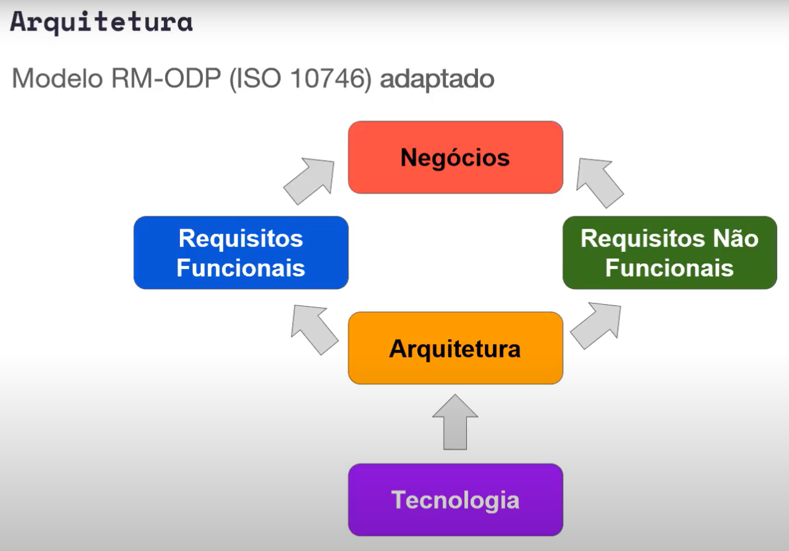
<br />
<br />
<sup>Fonte: Material produzido pelos autores (2024)</sup>
</div>

&nbsp;&nbsp;&nbsp;&nbsp;Em síntese, a estruturação do projeto foi guiada por uma abordagem top-down, na qual, em colaboração com o Instituto Apontar, foram inicialmente definidos os componentes das regras de negócio. Esse direcionamento permitiu ao grupo avançar de maneira organizada na definição dos requisitos funcionais e não funcionais, assegurando que cada detalhe fosse contemplado, incluindo a criação de casos de teste para garantir a qualidade do produto. A modelagem da arquitetura do sistema, com uma integração entre o dispositivo IoT e a solução web, permitiu visualizar de forma clara o escopo técnico do projeto. Finalmente, a escolha das tecnologias garantiu alinhamento com os objetivos da solução, fornecendo uma base tecnológica coerente para as próximas fases de desenvolvimento.

# <a name="c3"></a>3. Desenvolvimento e Resultados 

# <a name="c9"></a>3.1. Domínio de Fundamentos de Negócio

_Link para os templates de negócios: https://drive.google.com/drive/folders/1lTqisJ_gxxtc5J5aXM8ula2kQ4MsII_M?usp=sharing_

# <a name="c10"></a>3.1.1. Contexto da Indústria


&nbsp;&nbsp;&nbsp;&nbsp;O contexto de indústria em uma análise de negócios refere-se à compreensão do ambiente setorial no qual uma organização opera. Isso inclui a avaliação de fatores externos e internos que influenciam diretamente os negócios, como tendências de mercado, dinâmica competitiva, regulamentações, avanços tecnológicos e necessidades dos consumidores.

&nbsp;&nbsp;&nbsp;&nbsp;Analisar o contexto da indústria permite identificar oportunidades e ameaças específicas ao setor, além de revelar fatores críticos de sucesso e benchmarks relevantes. Essa visão é importante para alinhar estratégias organizacionais às demandas do mercado, garantindo que produtos, serviços e operações estejam competitivos e adequados às expectativas dos stakeholders.

&nbsp;&nbsp;&nbsp;&nbsp;Em resumo, o contexto de indústria fornece a base para uma análise estratégica sólida, ajudando na tomada de decisões informadas e na adaptação da organização às mudanças constantes no ambiente de negócios.

&nbsp;&nbsp;&nbsp;&nbsp;O Instituto Apontar é uma organização sem fins lucrativos que busca transformar vidas de crianças e adolescentes de baixa renda com traços de altas habilidades /  superdotação, a partir da assistência social em um ambiente acolhedor com foco na formação ética, cultural e acadêmica. A instituição atua na rede municipal de ensino do Rio de Janeiro, estando presente em mais de 100 escolas e tendo identificado mais de 60 mil jovens com  de AH/SD.

&nbsp;&nbsp;&nbsp;&nbsp;Outras organizações relevantes que atuam nessa área são:
- Instituto Alpha Lumen: O Instituto Alpha Lumen é uma ONG que busca soluções de impacto social por meio de ações educativas, desenvolvendo inúmeros projetos de ação e inspiração junto à comunidade. Entre eles, destaca-se o Projeto Escola – trabalhando com jovens e crianças com talentos acima da média para formar lideranças capazes de refletir a construção da própria história, impactar positivamente seu entorno e alcançar o mundo.
- Instituto Ponte: O Instituto Ponte é uma OSCIP (Organização da Sociedade Civil de Interesse Público) fundada em setembro de 2014 com o propósito de:  Ser a Ponte para a ascensão social em uma geração, por meio da educação de qualidade, para jovens em vulnerabilidade social.O Instituto conecta solidariedade a jovens talentosos de baixa renda e transforma contribuição em educação
- Instituto Rogerio Steinberg: O Instituto Rogerio Steinberg (IRS) é uma organização sem fins lucrativos que, desde 1998, atende crianças e jovens socialmente vulneráveis com Altas Habilidades Superdotação (AH/SD), executando atividades de educação suplementar (culturais e educacionais), buscando despertar e desenvolver talentos, muitas vezes ignorados. Baseado na crença de que talentos podem ser encontrados em qualquer classe social, o IRS entende que a geração de oportunidades e a valorização do esforço pessoal são fundamentais para o desenvolvimento do talento e, consequentemente, contribuem para a transformação social de seus beneficiários. 

&nbsp;&nbsp;&nbsp;&nbsp;O modelo de negócio adotado pelo Instituto Apontar se baseia em uma junção de alocação de recursos de vertente social e investimentos de instituições parceiras. Os meios de contribuição voluntária se concentram em:

- Doação direta: É possível apoiar de forma recorrente ou pontual, via transferência, pix, boleto ou cartão.
- Doação incentivada: Através de projetos culturais inscritos nas leis de incentivo do ISS e da Rouanet. Pessoas físicas também podem destinar parte do imposto de renda devido.
- Voluntariado e Pro Bono: É possível apoiar o instituto com ações voluntárias e conhecimento, participando de momentos únicos com os atendidos e equipe. Além de oferecer serviços a valores sociais ou pro bono.

&nbsp;&nbsp;&nbsp;&nbsp;Os principais investidores são classificados nas categorias “Verba direta” e “Incentivado”, destacando-se o Instituto Stone, Fundação Behring, Visagio, Brookfield e Globo. A ONG ainda conta com uma rede de parceiros estratégicos, que podem contribuir com ações de divulgação, recursos financeiros, serviços etc. O dinheiro arrecadado é destinado à preparação dos cursos, remuneração dos profissionais de educação e apoio psicopedagógico, manutenção da infraestrutura e criação de novos programas. Atualmente, o Instituto Apontar oferece dois principais programas:

- Programa Arcos: Alunos do 4º e 5º anos matriculados nas escolas públicas municipais da região passam pelo processo de identificação do Instituto e, uma vez selecionados, participam de atividades que contribuem para o desenvolvimento de suas competências individuais na sede da ONG, na Lapa. Desde a sua entrada no Instituto até a sua formatura escolar, os atendidos também recebem acompanhamento psicossocial
- Programa A+: Presente em 100% das Coordenadorias Regionais de Educação do Rio de Janeiro, atende alunos matriculados do 6º ano ao 9º ano nas escolas municipais. Durante 3 vezes na semana, são oferecidas atividades que promovem o enriquecimento acadêmico. Além disso, os atendidos ampliam o seu repertório cultural por meio de passeios, visitas a museus e atividades de campo. Todos, incluindo seus familiares, são acompanhados pela equipe psicossocial.

&nbsp;&nbsp;&nbsp;&nbsp;De acordo com o panorama atual, as tendências do setor indicam uma alta probabilidade de o Instituto Apontar expandir suas operações para outros bairros do Rio de Janeiro e eventualmente ter sua influência presente em todo o estado. É possível que no futuro, assim como algumas das outras organizações concorrentes citadas, o instituto possa atuar em escala nacional e oferecer programas com outras entidades de ensino que não estejam ligadas apenas às redes municipais. Além disso, o emprego de tecnologias da informação e o ensino de programação para os jovens identificados é uma possibilidade factual que deve ser tornar cada vez mais presente nos currículos ofertados.

Portanto, Para expandir a análise setorial e a visão estratégica do Instituto, utilizaremos o modelo das 5 Forças de Porter:

# <a name="c11"></a>3.1.1.1 5 forças de Porter

&nbsp;&nbsp;&nbsp;&nbsp;&nbsp;&nbsp;As cinco forças de Porter, elaboradas por Michael Porter, permite a compreensão da competição em uma indústria ou setor. Elas incluem o poder de barganha dos fornecedores e compradores, a rivalidade entre concorrentes existentes, a ameaça de novos entrantes e a ameaça de produtos ou serviços substitutos. Essa análise é essencial para empresas identificarem oportunidades e ameaças, capacitando-as a desenvolver estratégias que as mantenham competitivas no mercado. A figura 1 situa as 5 forças de porter do Instituto Apontar<a href="https://rockcontent.com/br/blog/5-forcas-de-porter/">(x)</a>.

<div align="center">
<sub>Figura 1 - 5 Forças de Porter</sub>
<br />
<br />
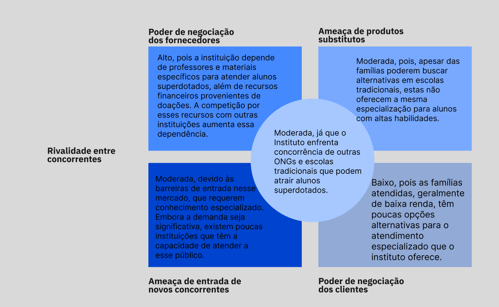
<br />
<br />
<sup>Fonte: Material produzido pelos autores (2024)</sup>
</div>

&nbsp;&nbsp;&nbsp;&nbsp;&nbsp;&nbsp;A Figura 1 ilustra as cinco forças de Porter aplicadas ao contexto do Instituto Apontar, oferecendo uma visão das dinâmicas competitivas do setor. Cada uma dessas forças influencia a capacidade da organização de se manter competitiva e identificar potenciais desafios e oportunidades. A partir dessa representação visual, podemos detalhar cada uma das forças, começando pela Ameaça de Novos Entrantes.

*Ameaça de Novos Entrantes:*

&nbsp;&nbsp;&nbsp;&nbsp;&nbsp;&nbsp;Moderada. Esse mercado de ensino é específico e exige um conhecimento especializado, o que cria barreiras de entrada, pois novas instituições precisam de experiência e competência para atender a esse público, que atende majoritariamente um crianças superdotadas de baixa renda. Apesar dessas barreiras, existe uma boa demanda por esse tipo de ensino. De acordo com o INEP, o número de alunos com altas habilidades matriculados em escolas públicas e particulares soma 26,8 mil, mas pesquisadores sugerem que esse número pode ser ainda maior<a href="https://revistapesquisa.fapesp.br/numero-de-pessoas-superdotadas-e-subnotificado-no-brasil/" target="_blank">(1)</a>. A Organização Mundial da Saúde (OMS) estima que cerca de 5% da população possui algum tipo de habilidade ou superdotação. Considerando os mais de 47 milhões de alunos da educação básica no Brasil, segundo o Ministério da Educação (MEC), aproximadamente 2,3 milhões de estudantes poderiam compor esse grupo<a href="https://agenciabrasil.ebc.com.br/radioagencia-nacional/educacao/audio/2022-06/oms-aponta-que-5-da-populacao-e-superdotada-e-maioria-e-invisivel" target="_blank">(2)</a>. Dessa forma, considerando o potencial para identificar mais alunos com altas habilidades, o mercado pode se expandir, atraindo novos players interessados em atender a essa demanda crescente. Portanto, há uma demanda de alunos que necessitam desse acompanhamento especializado. Entretanto, ainda são poucas as organizações capazes de atender a todo esse público.

*Poder de Barganha dos Fornecedores:*

&nbsp;&nbsp;&nbsp;&nbsp;&nbsp;&nbsp;Alto, pois o instituto depende de professores, recursos tecnológicos e materiais didáticos bem específicos. A falta de professores e materiais especializados no atendimento a estudantes superdotados limita as opções do instituto e aumenta sua dependência. Além disso, como o financiamento do instituto depende principalmente de doações, os doadores atuam como fornecedores de recursos financeiros e têm um alto poder de barganha. Isso ocorre porque há diversas outras instituições que também buscam esses recursos, criando uma competição por doações. A capacidade do Instituto Apontar de atrair e manter esses doadores é essencial para sua sustentabilidade, e o poder de influência dos doadores pode impactar diretamente as decisões institucionais e operacionais.

*Poder de Barganha dos Clientes:*

&nbsp;&nbsp;&nbsp;&nbsp;&nbsp;&nbsp;Baixo, pois as famílias atendidas pelo Instituto Apontar são de baixa renda e, portanto, geralmente não têm muitas opções de escolha. Essas famílias dependem dos serviços especializados oferecidos pelo instituto, o que reduz seu poder de influência e escolha. Como o Instituto Apontar oferece um serviço único e especializado, com foco em crianças com altas habilidades, ele atende a uma necessidade que dificilmente é suprida por outras instituições, consolidando sua importância para essas famílias.

*Ameaça de Produtos ou Serviços Substitutos:*

&nbsp;&nbsp;&nbsp;&nbsp;&nbsp;&nbsp;Moderada, pois as famílias de crianças com altas habilidades podem buscar alternativas, como escolas tradicionais, que não oferecem a mesma especialização, temendo que o ambiente do Instituto possa ser desafiador ou inadequado socialmente. No entanto, essas opções alternativas não possuem o mesmo foco em crianças de altas habilidades que o Apontar, o que fortalece sua posição no mercado. A personalização e o atendimento especializado oferecido pelo instituto tornam-no menos suscetível a substitutos diretos, já que é capaz de atender de forma mais completa às necessidades específicas desse público.

*Rivalidade entre os Concorrentes:*

&nbsp;&nbsp;&nbsp;&nbsp;&nbsp;&nbsp;Moderada, pois além de outras ONGs ou escolas especializadas em altas habilidades, o Instituto Apontar também compete indiretamente com escolas e institutos que não possuem foco exclusivo nesse público, mas que ainda assim podem atrair alunos com altas habilidades. Embora a especialização limite a quantidade de concorrentes diretos, outras instituições educacionais na região ainda podem oferecer alternativas, mesmo sem a mesma especialidade.

&nbsp;&nbsp;&nbsp;&nbsp;&nbsp;&nbsp;
A análise das Cinco Forças de Porter aplicada ao Instituto Apontar evidencia um ambiente de competitividade moderada, com rivalidade tanto com escolas e ONGs especializadas quanto com instituições tradicionais. Embora o instituto enfrente uma ameaça moderada de novos entrantes, devido ao potencial de crescimento do mercado e à presença de concorrentes indiretos, ele se beneficia de barreiras de entrada significativas, pois o setor exige conhecimento especializado. Essa análise destaca a importância de estratégias sólidas para que o Instituto Apontar continue fortalecendo sua posição em um mercado onde o atendimento personalizado e especializado é altamente valorizado. Ao focar em parcerias estratégicas, inovação tecnológica e na manutenção de uma rede de doadores estável, o instituto pode consolidar ainda mais sua relevância e impacto no setor educacional.

# <a name="c12"></a>3.1.2. Análise SWOT	

## Introdução

&nbsp;&nbsp;&nbsp;&nbsp;&nbsp;&nbsp;A **Matriz SWOT** é uma ferramenta estratégica amplamente utilizada para identificar e avaliar os pontos fortes (**Strengths**), pontos fracos (**Weaknesses**), oportunidades (**Opportunities**) e ameaças (**Threats**) de uma organização. No caso do **Instituto Apontar**, uma ONG dedicada ao apoio de alunos com **altas habilidades e superdotação** da rede pública do Rio de Janeiro, essa análise é essencial para entender melhor seu desempenho e as possíveis direções para otimização de suas operações.

&nbsp;&nbsp;&nbsp;&nbsp;&nbsp;&nbsp;Nesta análise, destacamos os fatores internos e externos que influenciam o desempenho do Instituto, e como ele pode explorar essas forças e oportunidades para mitigar fraquezas e ameaças. A análise é fundamentada em pesquisas e informações fornecidas sobre o Instituto, complementadas por estudos de fontes relevantes.

<div align="center">

  <sup>Figura 2 - Matriz SWOT</sup>

  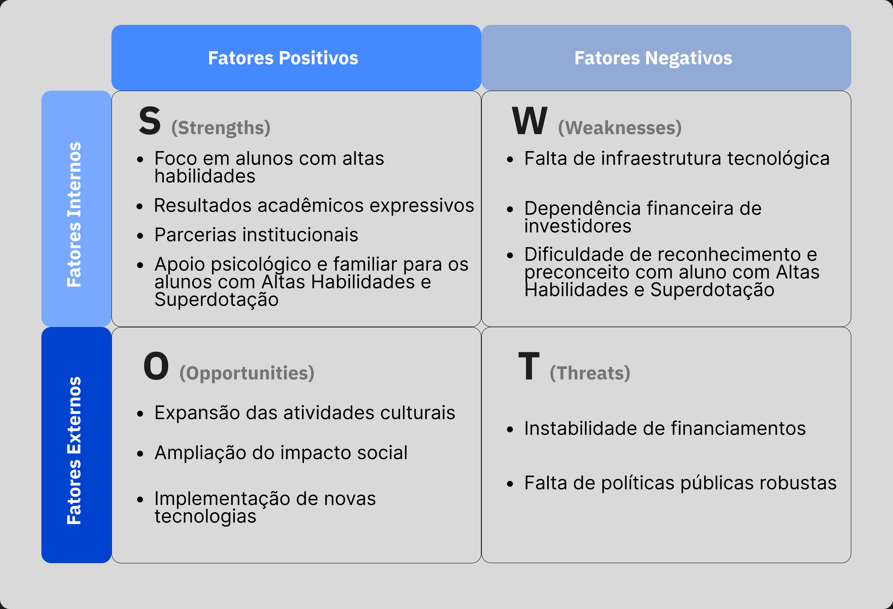

  <sup>Fonte: Material produzido pelos autores (2024)</sup>

</div>

---

### Forças (Strengths)

#### 1. Foco em Alunos com Altas Habilidades
&nbsp;&nbsp;&nbsp;&nbsp;&nbsp;&nbsp;O **Instituto Apontar** se especializa no atendimento de alunos com altas habilidades, um público frequentemente negligenciado na educação regular. Isso o posiciona como uma referência nesse campo, ao oferecer suporte educacional e psicológico especializado, garantindo o desenvolvimento adequado dos alunos atendidos.

- **Fonte**: ["Altas habilidades: instituição oferece apoio a alunos de baixa renda"](https://www.lupadobem.com).

#### 2. Resultados Acadêmicos Expressivos
&nbsp;&nbsp;&nbsp;&nbsp;&nbsp;&nbsp;Os alunos do Instituto frequentemente se destacam em competições acadêmicas e vestibulares. O sucesso dos alunos em olimpíadas científicas e em exames vestibulares é uma prova concreta da eficácia das abordagens pedagógicas e do suporte oferecido.

- **Fonte**: ["Resultados expressivos de alunos em vestibulares e competições"](https://diariodorio.com).

#### 3. Parcerias Institucionais
&nbsp;&nbsp;&nbsp;&nbsp;&nbsp;&nbsp;O Instituto Apontar mantém parcerias valiosas com entidades como a **Secretaria Municipal de Educação do Rio de Janeiro** e a **StoneCo**, permitindo maior captação de recursos e a ampliação do impacto social de suas atividades.

- **Fonte**: ["Parceria entre a Secretaria Municipal de Educação e Stone Impacta"](https://diariodorio.com).

#### 4. Apoio Psicológico e Familiar
&nbsp;&nbsp;&nbsp;&nbsp;&nbsp;&nbsp;Além das atividades acadêmicas, o Instituto se diferencia pelo apoio psicológico e emocional oferecido aos alunos e suas famílias, contribuindo para um ambiente de suporte integral ao desenvolvimento das crianças.

- **Fonte**: ["Apoio psicológico às famílias como parte essencial do processo educativo"](https://www.lupadobem.com).

---

### Fraquezas (Weaknesses)

#### 1. Falta de Infraestrutura Tecnológica
&nbsp;&nbsp;&nbsp;&nbsp;&nbsp;&nbsp;Apesar dos ótimos resultados acadêmicos, o Instituto ainda carece de infraestrutura tecnológica adequada, como os equipamentos necessários para implementar sistemas de controle de acesso por biometria, o que poderia facilitar o monitoramento das atividades diárias.

- **Fonte**: ["Projeto de controle de acesso do Instituto Apontar"](https://www.lupadobem.com).

#### 2. Dependência de Doações
&nbsp;&nbsp;&nbsp;&nbsp;&nbsp;&nbsp;A sustentabilidade financeira do Instituto é altamente dependente de doações de parceiros e empresas. Essa dependência torna o Instituto vulnerável a crises econômicas e mudanças nas políticas de financiamento.

- **Fonte**: ["Dependência de financiamento externo"](https://diariodorio.com).

#### 3. Dificuldade de Reconhecimento e Preconceito
&nbsp;&nbsp;&nbsp;&nbsp;&nbsp;&nbsp;A falta de entendimento sobre o que são altas habilidades leva a mal-entendidos nas escolas, onde esses alunos muitas vezes são estigmatizados, o que limita sua identificação e o suporte adequado.

- **Fonte**: ["Estigmatização de alunos com altas habilidades"](https://diariodorio.com).

---

### Oportunidades (Opportunities)

#### 1. Expansão das Atividades Culturais
&nbsp;&nbsp;&nbsp;&nbsp;&nbsp;&nbsp;O Instituto pode ampliar suas atividades culturais, promovendo mais visitas a museus e parcerias com instituições culturais para enriquecer a experiência educacional dos alunos.

- **Fonte**: ["Programas culturais do Instituto Apontar"](https://diariodorio.com).

#### 2. Ampliação do Impacto Social
&nbsp;&nbsp;&nbsp;&nbsp;&nbsp;&nbsp;Com novas parcerias e um aumento na captação de recursos, o Instituto tem a oportunidade de expandir o número de alunos atendidos, ampliando seu impacto social e beneficiando mais crianças da rede pública.

- **Fonte**: ["Crescimento do número de alunos atendidos pelo Instituto"](https://diariodorio.com).

#### 3. Implementação de Novas Tecnologias
&nbsp;&nbsp;&nbsp;&nbsp;&nbsp;&nbsp;A adoção de novas tecnologias, como sistemas de controle de acesso por biometria, pode modernizar a gestão do Instituto, facilitando o acompanhamento dos alunos e colaboradores.

- **Fonte**: ["Projeto de modernização do controle de acesso"](https://www.lupadobem.com).

---

### Ameaças (Threats)

#### 1. Instabilidade de Financiamentos
&nbsp;&nbsp;&nbsp;&nbsp;&nbsp;&nbsp;A forte dependência de doações coloca o Instituto em risco durante crises econômicas ou mudanças de prioridades entre os doadores, o que pode afetar a sustentabilidade de suas operações.

- **Fonte**: ["Dependência de financiamento externo e riscos associados"](https://diariodorio.com).

#### 2. Falta de Políticas Públicas Robustas
&nbsp;&nbsp;&nbsp;&nbsp;&nbsp;&nbsp;A ausência de políticas educacionais que contemplem de forma abrangente os alunos com altas habilidades dificulta o avanço do Instituto e a plena realização de seu potencial de impacto social.

- **Fonte**: ["Desafios enfrentados pela ONG na identificação de alunos com altas habilidades"](https://diariodorio.com).

---

## Conclusão

&nbsp;&nbsp;&nbsp;&nbsp;&nbsp;&nbsp;A análise SWOT do **Instituto Apontar** revela um cenário com oportunidades e forças significativas, como a especialização em alunos com altas habilidades e as parcerias institucionais que possibilitam a expansão de seus programas. No entanto, o Instituto enfrenta desafios relacionados à infraestrutura tecnológica e à dependência de doações externas. Para mitigar esses riscos, o Instituto deve buscar a diversificação de suas fontes de financiamento e a modernização de suas operações por meio da adoção de novas tecnologias.

--- 


### 3.1.3. Descrição da Solução a ser Desenvolvida 
&nbsp;&nbsp;&nbsp;&nbsp;A descrição detalhada da solução abrange os principais aspectos técnicos e funcionais do sistema a ser desenvolvido, destacando como ele será estruturado para atender aos objetivos estabelecidos. Serão apresentadas as tecnologias empregadas, os fluxos operacionais, os principais componentes do sistema e as funcionalidades esperadas, garantindo uma visão clara e objetiva do que será implementado.

&nbsp;&nbsp;&nbsp;&nbsp;Essa etapa é essencial para alinhar expectativas, definir escopos e estabelecer os parâmetros que guiarão o desenvolvimento, assegurando que o resultado final esteja em conformidade com as demandas e requisitos do projeto.

&nbsp;&nbsp;&nbsp;&nbsp;O problema a ser resolvido envolve a melhoria no controle de acesso e frequência às instalações do Instituto Apontar, com o objetivo de implementar um sistema de controle de acesso para entrada dos atendidos e colaboradores, após o cadastro dos horários disponíveis para sua entrada. Além disso, o Instituto solicita a inclusão de um sensor biométrico, que deverá ser integrado a esse sistema de controle.

&nbsp;&nbsp;&nbsp;&nbsp;A solução proposta consiste em um sistema integrado a leitores de digitais, utilizando tecnologia de Internet das Coisas (IoT), que será capaz de atualizar automaticamente uma planilha Google com os outputs esperados. Esse sistema será uma plataforma web nomeada "A-Portal", na qual será possível gerar as planilhas, caso desejado, e rastrear cada aluno e suas informações de presença e frequência. Essa aplicação estará conectada a um banco de dados que será atualizado em tempo real, garantindo que as informações sobre acesso e frequência estejam sempre disponíveis.

&nbsp;&nbsp;&nbsp;&nbsp;A implementação envolve a instalação de um leitor biométrico próximo às portas de acesso do Instituto. O sensor realizará o cadastro da pessoa (caso seja a primeira vez) por um funcionário do instituto e, nos acessos subsequentes, registrará dados como identificação do indivíduo, horário de entrada, frequência e o período de permanência nas instalações. Todas essas informações serão enviadas para o banco de dados e poderão ser visualizadas no "A-Portal", ou gerar planilhas na aplicação web, se desejado.

&nbsp;&nbsp;&nbsp;&nbsp;Com essa solução, espera-se fornecer registros detalhados de entrada e saída de cada pessoa, além de permitir a identificação automática dos atendidos e proporcionar uma visualização precisa desses dados para os responsáveis pela manutenção e organização.

&nbsp;&nbsp;&nbsp;&nbsp;O critério de sucesso para essa solução será baseado na eficácia do sistema em identificar e registrar individualmente cada pessoa cadastrada. A métrica utilizada para avaliar o sucesso será a capacidade da solução de fornecer esses dados ao banco de dados, visualizar dentro da aplicação web 'A-Portal' e retornar em formato de planilha de forma clara e acessível aos stakeholders.

# <a name="c13"></a>3.1.4. Value Proposition Canvas

&nbsp;&nbsp;&nbsp;&nbsp;&nbsp;&nbsp;O Value Proposition Canvas ou Canvas de Proposta de Valor é uma ferramenta retirada de parte do Business Model Canvas. O Value Proposition Canvas de acordo com o grupo G4 Educação é "...uma ferramenta para entender se um produto ou serviço terá aderência do mercado. Ou seja, o objetivo é compreender se uma vez que uma empresa iniciar suas atividades, ela vai encontrar clientes querendo consumir o seu produto ou serviço." [[x]](#6-referências).

&nbsp;&nbsp;&nbsp;&nbsp;&nbsp;&nbsp;A análise foi realizado visando entender o produto inicial proposto pelo grupo e como ele se encaixa no mercado. A análise foi feita com base nas informações fornecidas pelo grupo e em pesquisas realizadas pelos autores e pode ser encontrado na Figura X.

<br/>

<div align="center">

  <sup>Figura 3 - Value Proposition Canva</sup>
  
  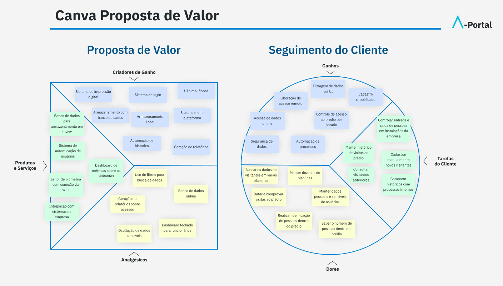
  
  <sup>Fonte: Material produzido pelos autores (2024)</sup>
  
</div>

<br/>

#### 3.1.4.1 Seguimento do Cliente

- <b>Tarefas do Cliente:</b>

> Descrevem as ações que as pessoam executam no seu trabalho ou na sua vida pessoal. Cada uma dessas tarefas descreve uma ação ou processo que o cliente realiza para atingir um objetivo específico, relacionado ao controle de acesso e gestão de visitas.  [[x]](#6-referências).

&nbsp;&nbsp;&nbsp;&nbsp; a. Controlar e monitorar o fluxo de entrada e saída de pessoas nas dependências: Refere-se à tarefa de gerenciar quem entra e sai de uma determinada instalação, garantindo a segurança e a organização do local. <br>

&nbsp;&nbsp;&nbsp;&nbsp; b. Cadastrar manualmente visitantes e colaboradores: Envolve o trabalho administrativo de registrar dados de pessoas que acessam o local, o que é uma ação necessária para garantir controle e segurança. Os colaboradores do Instituto precisam cadastrar de forma manual os alunos e os outros colaboradores, o que implica os riscos de registro incorreto ou incompleto das informações de cadastro. <br>

&nbsp;&nbsp;&nbsp;&nbsp; c. Consultar rapidamente registros anteriores de visitantes: Refere-se à necessidade de acessar informações passadas de forma eficiente, uma tarefa importante para a administração ou auditoria de acessos: Trata-se de integrar informações de acesso com outros processos da empresa, como segurança, gestão de recursos ou conformidade com regulamentações. O instituto precisa de uma forma rápida de consultar os registros de presença dos alunos - incluindo horário de entrada e de saída -, seja para escolas/secretaria de educação, investidores ou pais de alunos interessados em saber sobre a presença dos alunos.<br>

&nbsp;&nbsp;&nbsp;&nbsp; d. Comparar e integrar os registros de acessos com os processos administrativos internos: Trata-se de integrar informações de acesso com outros processos da empresa, como segurança, gestão de recursos ou conformidade com regulamentações. Integrar o sistema que estamos desenvolvendo (o qual irá coletar dados) com as ferramentas utilizadas pelo parceiro, como por exemplo Google Workspace ou Google Planilhas (conforme comentado no kick-off).. <br>

&nbsp;&nbsp;&nbsp;&nbsp; e. Manter um histórico organizado e atualizado de visitas às instalações: Essa tarefa envolve a responsabilidade de manter registros completos e organizados, o que facilita futuras consultas. <br>

<br/>

- <b>Dores:</b>

> Também chamadas de Pain Points, são todas as dores antes, durante ou depois dos trabalhos realizados [[x]](#6-referências).

&nbsp;&nbsp;&nbsp;&nbsp; a. Dificuldade de encontrar registros de visitantes em várias planilhas dispersas: Esta dor reflete a dificuldade em localizar informações quando os dados estão armazenados de forma desorganizada ou fragmentada em várias planilhas. Isso pode aumentar o tempo necessário para encontrar um registro e causar frustração ao cliente. <br>

&nbsp;&nbsp;&nbsp;&nbsp; b. Gestão complexa de dados pessoais sensíveis de visitantes e colaboradores: A responsabilidade de gerenciar informações confidenciais, como dados pessoais, pode ser desafiadora, especialmente devido às regulamentações de proteção de dados. Erros nessa gestão podem causar problemas legais e prejudicar a confiança dos visitantes e colaboradores. <br>

&nbsp;&nbsp;&nbsp;&nbsp; c. Datar e comprovar visitas ao prédio: Esta dor refere-se à dificuldade de registrar corretamente as datas e horários das visitas e de comprovar que uma visita realmente aconteceu. A falta de um sistema eficaz de controle pode tornar esse processo impreciso. <br>

&nbsp;&nbsp;&nbsp;&nbsp; d. Comprovação de acessos ao prédio pode ser imprecisa ou faltar documentação: Quando o sistema de controle de acesso não é confiável ou organizado, pode ser difícil provar quem entrou ou saiu de um prédio, o que pode gerar riscos de segurança ou problemas de responsabilidade. <br>

&nbsp;&nbsp;&nbsp;&nbsp; e. Necessidade de identificar as pessoas em tempo real dentro do prédio: A dificuldade em monitorar ou identificar rapidamente as pessoas que estão no prédio pode causar problemas de segurança ou de administração. Isso se torna extremamente importante em casos de emergência ou quando é necessário ter controle sobre o movimento das pessoas dentro do espaço. <br>

<br/>

- <b>Ganhos:</b>

> Descrevem os resultados ou benefícios esperados na execução das ações [[x]](#6-referências).

&nbsp;&nbsp;&nbsp;&nbsp; a. Filtragem de dados via UI: Esse ganho refere-se à facilidade de usar uma interface gráfica para filtrar e encontrar informações de maneira rápida e eficiente. Isso melhora a experiência do cliente ao lidar com grandes volumes de dados. <br>

&nbsp;&nbsp;&nbsp;&nbsp; b. Personalização de Acessos para diferentes grupos de usuário: A capacidade de configurar diferentes níveis de acesso para grupos específicos (visitantes, colaboradores, terceirizados) permite maior controle e segurança. Isso otimiza o fluxo de pessoas e protege áreas sensíveis. <br>

&nbsp;&nbsp;&nbsp;&nbsp; c. Controle de acesso ao prédio por horário: Este ganho se refere à possibilidade de definir horários específicos para liberar ou restringir o acesso ao prédio, o que aumenta a segurança e permite uma gestão mais eficiente do fluxo de pessoas. <br>

&nbsp;&nbsp;&nbsp;&nbsp; d. Liberação de acesso remoto: A capacidade de liberar ou restringir o acesso ao prédio remotamente facilita a gestão em situações emergenciais ou quando o responsável pelo controle de acesso não está fisicamente presente. <br>

&nbsp;&nbsp;&nbsp;&nbsp; e. Cadastro simplificado: Um sistema que simplifica o processo de cadastro de visitantes e colaboradores economiza tempo e reduz erros humanos, tornando a operação mais eficiente. <br>

&nbsp;&nbsp;&nbsp;&nbsp; f. Melhor fluxo de pessoas em horários de pico: Este ganho refere-se à melhoria na organização e gestão do movimento de pessoas durante horários de maior movimentação, minimizando congestionamentos e esperas. <br>

&nbsp;&nbsp;&nbsp;&nbsp; g. Acesso de dados online: A possibilidade de acessar os registros e dados pela internet oferece conveniência e agilidade, permitindo a consulta e gestão de informações de qualquer lugar, a qualquer momento. <br>

&nbsp;&nbsp;&nbsp;&nbsp; h. Segurança de dados: O aumento da segurança no armazenamento e gerenciamento de dados sensíveis (como informações pessoais de visitantes e colaboradores) protege contra acessos não autorizados e possíveis vazamentos de informações. <br>

&nbsp;&nbsp;&nbsp;&nbsp; i. Automação de processos: Automação dos processos manuais, como cadastro e controle de acessos, reduz erros, economiza tempo e torna o sistema mais eficiente e preciso. <br>

&nbsp;&nbsp;&nbsp;&nbsp; j. Monitoramento em tempo real: A capacidade de acompanhar quem está no prédio em tempo real aumenta a segurança, permitindo respostas rápidas em caso de emergências ou irregularidades. <br>

#### 3.1.4.2 Criadores de Ganho

- <b>Produtos e Serviços:</b>

> Descrevem quais dores e de que forma são aliviadas através dos produtos ou serviços ofertados [[x]](#6-referências).

&nbsp;&nbsp;&nbsp;&nbsp; a. Banco de dados seguro com armazenamento em nuvem: Esse produto resolve o problema de gestão complexa e dispersa de dados (como no caso de registros espalhados em várias planilhas) ao centralizar e proteger as informações em um banco de dados seguro <br>

&nbsp;&nbsp;&nbsp;&nbsp; b. Dashboard para monitoramento e métricas em tempo real de acessos: Esse serviço permite que os usuários acompanhem em tempo real o fluxo de pessoas dentro do prédio, oferecendo uma visão clara e atualizada da situação <br>

&nbsp;&nbsp;&nbsp;&nbsp; c. Sistema de autenticação de usuários: Um sistema robusto de autenticação garante que apenas pessoas autorizadas tenham acesso às instalações. Ele resolve o problema da comprovação de acessos e minimiza a falta de documentação de quem entra no prédio, garantindo maior segurança e controle. <br>

&nbsp;&nbsp;&nbsp;&nbsp; d. Acesso por grupos de usuários diferentes: Ao permitir a personalização de acessos para diferentes grupos, como visitantes, colaboradores e prestadores de serviços, esse produto resolve a dificuldade de gerenciar múltiplos tipos de acessos e integrações. <br>

&nbsp;&nbsp;&nbsp;&nbsp; e. Leitor de biometria com conexão via WiFi:  Um leitor biométrico conectado via WiFi permite autenticações seguras e automáticas, aliviando a necessidade de cadastro manual repetitivo e aumentando a precisão na identificação de pessoas. <br>

&nbsp;&nbsp;&nbsp;&nbsp; f. Integração direta com os sistemas administrativos do Instituto: A integração com os sistemas administrativos internos permite que os registros de acessos sejam automaticamente comparados e sincronizados com outros processos administrativos. Isso resolve a dor de comparar manualmente registros de acessos com processos internos e elimina a necessidade de controles paralelos, melhorando a eficiência e a organização. <br>

<br/>

- <b>Analgésicos:</b>

> Descrevem quais os resultados obtidos e benefícios aos usuários através da utilização dos produtos e serviços [[x]](#6-referências).

&nbsp;&nbsp;&nbsp;&nbsp; a. Busca de dados mais rápida e eficiente por meio de filtros inteligentes: Este analgésico melhora a eficiência na busca por informações ao permitir o uso de filtros avançados. Ele alivia a dor de ter que procurar dados em várias planilhas ou sistemas dispersos, facilitando o acesso rápido e organizado a registros de visitantes e colaboradores. <br>

&nbsp;&nbsp;&nbsp;&nbsp; b. Banco de dados online integrado, acessível remotamente e de forma segura: Ter um banco de dados acessível remotamente alivia a dor da falta de flexibilidade e segurança no acesso aos dados. Ele oferece conveniência, segurança e mobilidade para os usuários, que podem consultar e gerenciar dados de qualquer lugar, garantindo a proteção das informações sensíveis. <br>

&nbsp;&nbsp;&nbsp;&nbsp; c. Relatórios automáticos e detalhados sobre acessos e presenças: A geração automática de relatórios detalhados alivia a dor de ter que compilar manualmente informações de acessos, economizando tempo e esforço <br>

&nbsp;&nbsp;&nbsp;&nbsp; d. Painel de controle exclusivo para a equipe de funcionários: Um painel exclusivo para a equipe melhora o controle e a organização, aliviando a dor de gerenciar múltiplos acessos. Esse analgésico oferece uma interface dedicada para que os funcionários possam monitorar, gerenciar e ajustar as permissões de acesso de maneira eficiente. <br>

&nbsp;&nbsp;&nbsp;&nbsp; e. Proteção de dados sensíveis com políticas de ocultação e acesso restrito: Este analgésico trata a dor da insegurança em relação ao gerenciamento de dados pessoais sensíveis. Com políticas de ocultação e restrição de acesso, ele garante que apenas pessoas autorizadas possam visualizar informações confidenciais, atendendo às exigências de proteção de dados e privacidade. <br>
<br/>

- <b>Criadores de Ganho:</b>

> São todos os produtos ou serviços ofericidos que auxiliam os usuários a executarem seus trabalhos... [[x]](#6-referências)

&nbsp;&nbsp;&nbsp;&nbsp; a. Sistema de impressão digital: Este criador de ganho permite um método de autenticação mais rápido e seguro, melhorando a experiência do usuário ao automatizar e agilizar o processo de identificação e acesso às instalações. <br>

&nbsp;&nbsp;&nbsp;&nbsp; b. Sistema de login: Um sistema de login simplificado e seguro facilita o acesso dos usuários ao sistema, gerando ganhos em termos de praticidade e segurança, permitindo que o usuário se autentique facilmente e com segurança. <br>

&nbsp;&nbsp;&nbsp;&nbsp; c. UI simplificada: Uma interface de usuário simplificada cria um ganho em termos de usabilidade, tornando o sistema mais intuitivo e fácil de operar. <br>

&nbsp;&nbsp;&nbsp;&nbsp; d. Armazenamento com banco de dados: O uso de um banco de dados garante que grandes volumes de informações sejam armazenados de forma organizada, segura e acessível, permitindo consultas rápidas e eficientes. <br>

&nbsp;&nbsp;&nbsp;&nbsp; e. Armazenamento Local: Para algumas situações, o armazenamento local pode ser uma opção de contingência ou para dados que precisam ser acessados rapidamente, criando um ganho ao oferecer uma alternativa de armazenamento offline. <br>

&nbsp;&nbsp;&nbsp;&nbsp; f. Sistema multi-plataforma: Este criador de ganho permite que o sistema seja acessado em diferentes dispositivos e plataformas, como desktops, tablets e smartphones, aumentando a flexibilidade e conveniência para os usuários que precisam acessar o sistema de qualquer lugar. <br>

&nbsp;&nbsp;&nbsp;&nbsp; g. Geração de relatórios: A automação na geração de relatórios fornece um grande ganho ao reduzir o tempo e o esforço necessários para compilar e analisar dados.  <br>

&nbsp;&nbsp;&nbsp;&nbsp; h. Automação de histórico: A automação do histórico de acessos ou de visitantes cria um ganho ao garantir que os registros estejam sempre atualizados, sem necessidade de intervenção manual <br>

<br/>

# <a name="c14"></a>3.1.5. Matriz de Riscos


## Introdução

&nbsp;&nbsp;&nbsp;&nbsp;A **Matriz de Risco e Oportunidades** é uma ferramenta utilizada para identificar e avaliar os fatores que podem impactar o sucesso de um projeto, tanto positiva quanto negativamente. No contexto do **Instituto Apontar**, a matriz auxilia na visualização dos riscos associados à implementação de novas tecnologias para o controle de acesso, bem como das oportunidades que podem ser exploradas. Essa análise serve para apoiar a tomada de decisões e garantir que o projeto se desenvolva com uma compreensão clara dos desafios e vantagens que podem surgir.

&nbsp;&nbsp;&nbsp;&nbsp;A matriz foi elaborada com base na probabilidade de ocorrência dos riscos e oportunidades, assim como no impacto que cada evento pode gerar no andamento do projeto. A seguir, apresentamos a matriz de risco e oportunidades, uma ferramenta que facilita a compreensão dos diferentes níveis. Os riscos e as oportunidades são classificados em três categorias: baixo(representado em verde), médio (em amarelo) e alto (em vermelho). Essa matriz ajuda a identificar, avaliar e gerenciar potenciais ameaças e oportunidades de forma estruturada e visual, permitindo uma tomada de decisão mais eficaz.
---
<br/>

<div align="center">

  <sup>Figura 4 - Matriz de Riscos e de Oportunidades.</sup>
  
  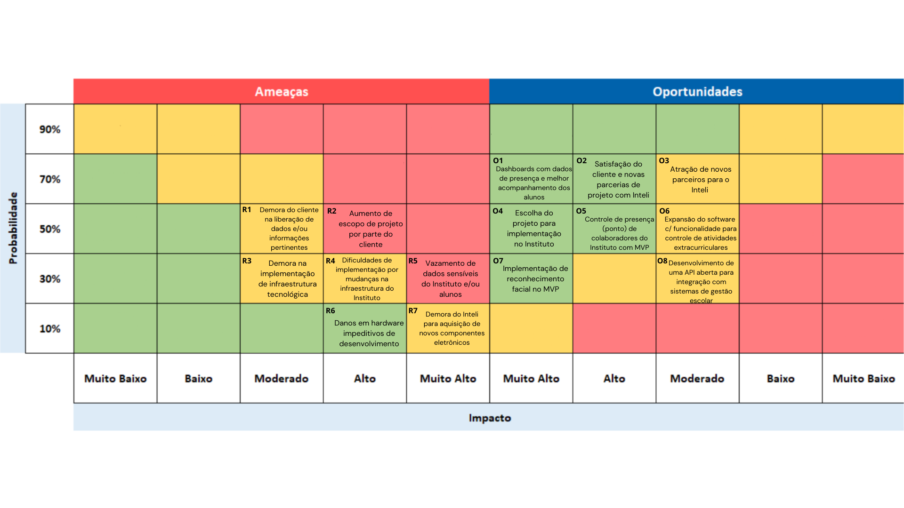

  <sup>Fonte: Material produzido pelos autores (2024).</sup>

</div>

<br/>

&nbsp;&nbsp;&nbsp;&nbsp;&nbsp;&nbsp;De forma complementar, cada risco e oportunidade mapeados são analisados mais profundamente no Quadro 1 - Quadro de Riscos e Oportunidades a seguir.

<div align="center">

<sup>Quadro 1 - Quadro de Riscos e de Oportunidades.</sup>

| #     | Título                                                         | Descrição                                                                                         | Impacto       | Probabilidade | Plano de Ação                                                                                                      |
|-------|-----------------------------------------------------------------|---------------------------------------------------------------------------------------------------|---------------|---------------|--------------------------------------------------------------------------------------------------------------------|
| **R01** | Demora do cliente na liberação de dados e/ou informações pertinentes | O cliente pode atrasar o envio de dados e informações necessárias, afetando o cronograma do projeto. | Moderado      | 50%           | Estabelecer prazos claros e manter comunicação regular com o parceiro para garantir a entrega pontual de dados.     |
| **R02** | Aumento de escopo de projeto por parte do cliente              | O cliente pode solicitar mudanças que impactem prazos e custos.                                    | Alto          | 70%           | Negociar possíveis alterações de escopo nos momentos de Sprint Review, com base no TAPI e tempos disponíveis.                                                     |
| **R03** | Demora na implementação de infraestrutura tecnológica          | A infraestrutura necessária pode não estar pronta a tempo, causando atrasos na implementação do projeto IoT.  | Moderado      | 30%           | Fazer verificações constantes com o parceiro e realizar adaptações do dispositivo, se necessário.                                                   |
| **R04** | Dificuldades de implementação por mudanças na infraestrutura do Instituto | Mudanças inesperadas na infraestrutura podem dificultar a implementação do projeto.                | Muito Alto    | 30%           | Solicitar informações sobre mudanças na infraestrutura de forma contínua e realizar adaptações se necessário (Parceiro notificou sobre a possibilidade de reformas, durante kick-off).                                     |
| **R05** | Vazamento de dados sensíveis do Instituto e/ou alunos          | O sistema pode sofrer vazamentos de dados, expondo informações sensíveis.                          | Muito Alto    | 30%           | Implementar  criptografia na troca de informações entre dispositivos e solicitar autenticação para acesso ao sistema ou para configuração do dispositivo.                                          |
| **R06** | Danos em hardware impeditivos de desenvolvimento               | Equipamentos essenciais para o desenvolvimento podem ser danificados, atrasando o projeto.        | Alto          | 10%           | Garantir redundância de peças e manter um inventário de reposição dos componentes.                                                 |
| **R07** | Demora do Inteli para aquisição de novos componentes eletrônicos | Atrasos na aquisição de componentes eletrônicos podem comprometer o cronograma.                    | Moderado      | 10%           | Estabelecer contratos de fornecimento antecipados e manter estoque de componentes críticos.                        |
| **O01** | Dashboards com dados de presença e melhor acompanhamento dos alunos | Dashboards de acompanhamento de presença melhoram a gestão escolar e o planejamento.               | Moderado      | 70%           | Acompanhar o progresso do projeto de forma contínua e precisa, para desenvolvimento de features adicionais, considerando o prazo de 10 semanas definido.                      |
| **O02** | Satisfação do cliente e novas parcerias de projeto com o Inteli | O sucesso do projeto pode resultar em novas parcerias e projetos com o cliente.                    | Alto          | 70%           | Manter comunicação clara e realizar validações precisas de avanços e próximos passos no desenvolvimento do projeto, durante as Sprint Reviews.              |
| **O03** | Atração de novos parceiros para o Inteli                       | O sucesso do projeto pode atrair novos parceiros interessados em soluções de IoT.                  | Alto          | 70%           | Criar apresentações de resultados e explorar novas oportunidades de negócios.                                      |
| **O04** | Escolha do projeto para implementação no Instituto             | A implementação do projeto no Instituto será um piloto que pode trazer ganhos reais em relação ao controle de acesso e de frequência dos alunos. | Alto          | 50%           | Trabalhar em conjunto com o Instituto para garantir que a implementação seja bem-sucedida e atenda às expectativas, realizando validações constantes em relação a expectativas e necessidades, nos momentos de Sprint Review. |
| **O05** | Controle de presença (ponto) de colaboradores do Instituto com MVP | O MVP pode ser expandido para incluir o controle de ponto dos colaboradores do Instituto.           | Moderado      | 50%           | Desenvolver funcionalidades específicas para o controle de ponto dos colaboradores.                                |
| **O06** | Expansão do software com funcionalidade para controle de atividades extracurriculares | O sistema pode ser expandido para monitorar atividades extracurriculares dos alunos.               | Moderado      | 50%           | Avaliar viabilidade técnica e desenvolver novas funcionalidades para o controle de atividades e solicitar dados sobre essas atividades ao parceiro.                     |
| **O07** | Implementação de reconhecimento facial no MVP                  | A adição de reconhecimento facial pode aumentar a segurança e precisão do sistema.                 | Alto          | 30%           | Realizar estudo de viabilidade técnica e de prazo para adicionar reconhecimento facial.                            |
| **O08** | Desenvolvimento de uma API aberta para integração com sistemas de gestão escolar | Criar uma API aberta pode permitir integração com outros sistemas de gestão escolar.               | Baixo         | 30%           | Discutir com corpo docente a viabilidade da publicação do projeto open-source e desenvolver de forma modular o sistema para facilitar integrações com sistemas de terceiros.         |

<sup>Fonte: Material produzido pelos autores (2024).</sup>
</div>

<br>
<br>

## Conclusão

&nbsp;&nbsp;&nbsp;&nbsp;A **Matriz de Risco e Oportunidades** proporciona uma visão clara dos possíveis desafios e benefícios que podem surgir no desenvolvimento do sistema de controle de acesso do **Instituto Apontar**. Ao antecipar os riscos, a equipe pode desenvolver estratégias de mitigação para minimizar os impactos negativos, enquanto as oportunidades identificadas ajudam a direcionar os esforços para maximizar os resultados positivos.

&nbsp;&nbsp;&nbsp;&nbsp;A análise da matriz é fundamental para garantir que o projeto não apenas seja entregue no prazo e dentro do escopo, mas que também adicione valor real à instituição, seus alunos e colaboradores.

--- 

# <a name="c15"></a>3.1.6. Política de Privacidade de acordo com a LGPD
	

#### 3.1.6.1 Informações gerais sobre a empresa / organização

&nbsp;&nbsp;&nbsp; O Instituto Apontar é uma instituição focada na educação de crianças com altas habilidades e baixa renda na região do Rio de Janeiro que,
segundo o seu site, atua a partir da promoção do fortalecimento de vínculos. O objetivo de nosso projeto é que o Instituto seja atendido com uma ferramenta
de gerenciamento de entradas e saídas dos alunos por meio da impressão digital. Para isso, coletaremos e trataremos dados pessoais com responsabilidade, de 
acordo com as leis vigentes, especialmente a Lei Geral de Proteção de Dados (LGPD), Lei nº 13.709/2018​.

#### 3.1.6.2 Informações sobre o tratamento de dados
&nbsp;&nbsp;&nbsp; Como foi anunciado verbalmente na reunião com o parceiro no dia 18 de Outubro de 2024, às 09h00 da manhã, o tratamento dos dados pessoais no Instituto Apontar 
segue as diretrizes estabelecidas pela LGPD e ocorre com base no consentimento informado dos pais ou responsáveis. Os dados serão utilizados exclusivamente para 
as finalidades descritas nesta política, com garantia de segurança e transparência.


#### 3.1.6.3 Quais são os dados coletados
&nbsp;&nbsp;&nbsp; Os dados pessoais coletados incluem:
- Nome do aluno e possivelmente dos pais/responsáveis;
- Informações de contato, como telefone e endereço;
- Dados escolares, como série, turma e número de faltas;
- Dados biométricos (impressão digital) para controle de acesso e frequência dos alunos.
- Horários de entrada e saída dos alunos.

#### 3.1.6.4 Onde os dados são coletados 
&nbsp;&nbsp;&nbsp; Os dados serão coletados diretamente pelo leitor biométrico na entrada da instituição, bem como por meio da possível disponibização das planilhas que atualmente são
utilizadas pelo instituto para controle de presença dos alunos.

#### 3.1.6.5 Para quais finalidades os dados serão utilizadas
&nbsp;&nbsp;&nbsp; Os dados coletados serão utilizados para gerar relatórios de frequência e controle de acesso dos alunos, bem como para comunicação com os pais sobre a frequência e horários
de entrada e saída dos alunos, por parte do instituto. Futuramente, os dados biométricos poderão ser utilizados para controle de ponto dos colaboradores, como foi discutido
na reunião com o parceiro no dia 18 de Outubro de 2024.

#### 3.1.6.6 Onde os dados ficam armazenados 
&nbsp;&nbsp;&nbsp; Os dados serão armazenados em um banco de dados que será criado exclusivamente para o projeto, com acesso restrito aos colaboradores do Instituto Apontar. Também haverá a
possibilidade de exportar os dados para planilhas em formato CSV, portanto os dados poderão ser armazenados localmente nos computadores dos colaboradores.

#### 3.1.6.7 Qual o período de armazenamento dos dados (retenção)
&nbsp;&nbsp;&nbsp; Não há um período de armazenamento definido, uma vez que os dados serão utilizados para controle de acesso e frequência dos alunos, e a frequência será consultada sempre que
a coordenação do instituto precisar. Os dados biométricos serão armazenados enquanto o aluno estiver matriculado no instituto, e serão excluídos após a saída do aluno.

#### 3.1.6.8 Uso de cookies e/ou tecnologias semelhantes
&nbsp;&nbsp;&nbsp; No momento, não utilizamos cookies ou tecnologias semelhantes para a coleta de dados no A-Portal.

#### 3.1.6.9 Com quem esses dados são compartilhados (parceiros, fornecedores, subcontratados)
&nbsp;&nbsp;&nbsp; Os dados coletados não serão compartilhados com terceiros, exceto em casos de solicitação judicial ou para cumprimento de obrigações legais. Os dados biométricos não serão
compartilhados com nenhuma outra instituição ou empresa.

#### 3.1.6.10 Informações sobre medidas de segurança adotadas pela empresa
&nbsp;&nbsp;&nbsp; Os dados coletados serão armazenados em um banco de dados seguro, com acesso restrito aos colaboradores do Instituto Apontar. A partir do momento em que dados dos alunos são
exportados para outros formatos de arquivo e salvos localmente nos computadores dos colaboradores, a segurança dos dados passa a ser de responsabilidade do Instituto Apontar.
Como foi discutido na reunião com o parceiro, o Instituto já possui um Termo de Consentimento para coleta de dados dos alunos e dos pais/responsáveis que abarca a coleta dos
dados biométricos.

#### 3.1.6.11 Orientações sobre como a empresa/organização atende aos direitos dos usuários
&nbsp;&nbsp;&nbsp; Em conformidade com a LGPD, os titulares dos dados têm garantido o direito de acessar, corrigir, eliminar e se opor ao tratamento de seus dados. O Instituto Apontar disponibiliza 
canais de comunicação com os pais dos alunos para que os titulares possam exercer seus direitos, que serão atendidos de forma gratuita e ágil​.

#### 3.1.6.12 Informações sobre como o titular de dados pode solicitar e exercer os seus direitos
&nbsp;&nbsp;&nbsp; Os titulares dos dados podem solicitar o acesso, correção, eliminação e oposição ao tratamento de seus dados pessoais por meio do e-mail e pelo telefone da institutição.

#### 3.1.6.13 Informações de contato do Data Protection Officer (DPO) ou encarregado de proteção de dados da organização
&nbsp;&nbsp;&nbsp; Para dúvidas ou solicitações relacionadas ao tratamento de dados, o titular pode entrar em contato com o encarregado de proteção de dados (DPO) do Instituto Apontar, via e-mail: 
```contato@institutoapontar.org.br``` ou via telefone: ```+55 21 2512-5267```.

&nbsp;&nbsp;&nbsp; Para ter acesso à Política de Privacidade no formato proposto pela Nuvemshop, acesse o link: [Política de Privacidade](https://docs.google.com/document/d/18kop_K1ofiD7nDGSM_62PgOJf5PgQRqk1d_ENEvhGIE/edit?usp=sharing)


# <a name="c17"></a>3.1.7. Bill of Material (BOM)


&nbsp;&nbsp;&nbsp;&nbsp;BOM (Bill of Material) pode ser definido como uma lista completa de materiais, que detalha todos os itens necessários para construir, fabricar ou reparar um produto. A BOM é usada em diversas indústrias, como eletrônica, manufatura e software, para garantir que todas as partes corretas estão disponíveis para a montagem, planejamento de produção e controle de estoque. No contexto do atual projeto, esse documento contempla: O nome e quantidade de cada componente, referência dos componentes na PCI, códigos dos componentes e seus respectivos valores.

<br/>

<div align="center">

  <sup>Figura 5 - Bill of Materials</sup>
  
  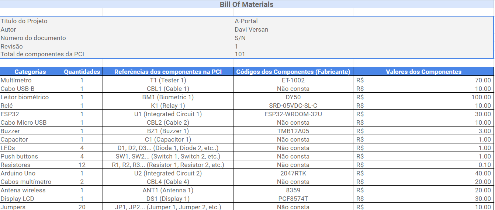
  
  <sup>Fonte: Material produzido pelos autores (2024)</sup>
  
</div>

<br/>

&nbsp;&nbsp;&nbsp;&nbsp;Para a criação desse documento foi utilizado o template padrão fornecido pelo Inteli, no qual os campos foram preenchidos com estimativas calculadas pelo grupo em relação à quantidade de componentes a serem usados. As referências dos componentes na PCI (designators) foram estabelecidas seguindo padrões da eletrônica. No campo específico para essa informação, os componentes que não possuem códigos do fabricante foram marcados como "não consta". Por fim, os valores dos componentes foram baseados em uma média do mercado retirada de lojas da internet, sendo que os preços se referem a uma unidade de cada componente.

# <a name="c18"></a>3.2. Domínio de Fundamentos de Experiência de Usuário 

### 3.2.1. Personas	

&nbsp;&nbsp;&nbsp;&nbsp;As personas são representações fictícias de usuários ideais baseadas em pesquisas, fundamentais para guiar estratégias no desenvolvimento de um produto. Elas permitem que empresas e equipes compreendam profundamente as necessidades, comportamentos e objetivos de seus clientes, facilitando a criação de experiências mais personalizadas e eficazes. Ao alinhar produtos e serviços à produção das personas, as organizações podem melhorar a conformidade do projeto com as expectativas do cliente, tornando-se mais próximas de um mercado cada vez mais orientado pelo consumidor.

&nbsp;&nbsp;&nbsp;&nbsp;Primeiramente, nossa primeira persona é a Rosileuda Fernandes, ou "Rosi," é uma professora de Matemática de 28 anos no Rio de Janeiro, conhecida por seu gosto por futebol e sua presença no Instagram. Ela enfrenta desafios com atividades administrativas que tomam tempo e causam estresse, especialmente o controle de presença dos alunos, que atualmente é feito manualmente. Rosi busca uma solução que permita visualizar rapidamente a frequência dos alunos sem o trabalho repetitivo de registrar cada presença, otimizando seu tempo para focar no ensino e em seu desenvolvimento pessoal e profissional. Segue na imagem abaixo a persona da professora Rosileuda:

<div align="center">
<sub>Figura 5 - Persona professora</sub>
<br />
<br />

<br />
<br />
<sup>Fonte: Material produzido pelos autores (2024)</sup>
</div>

&nbsp;&nbsp;&nbsp;&nbsp;Nossa segunda persona é Pedro Henrique, um jovem de 14 anos, estudante do 9º ano do ensino fundamental no Rio de Janeiro. Ele é apaixonado por robótica e programação e sonha em se tornar desenvolvedor de jogos. Pedro busca uma rotina mais autônoma no Instituto Apontar, onde participa de atividades após a escola. Entre suas principais metas, está a de poder entrar e sair do Instituto de maneira eficiente e sem depender de outras pessoas, garantindo mais independência e facilitando a confirmação de sua presença aos pais. Ele precisa de uma solução que simplifique o acesso ao Instituto, proporcionando segurança, praticidade e tranquilidade tanto para ele quanto para sua família. Segue abaixo a persona de Pedro:

<div align="center">
<sub>Figura 6 - Persona aluno</sub>
<br />
<br />
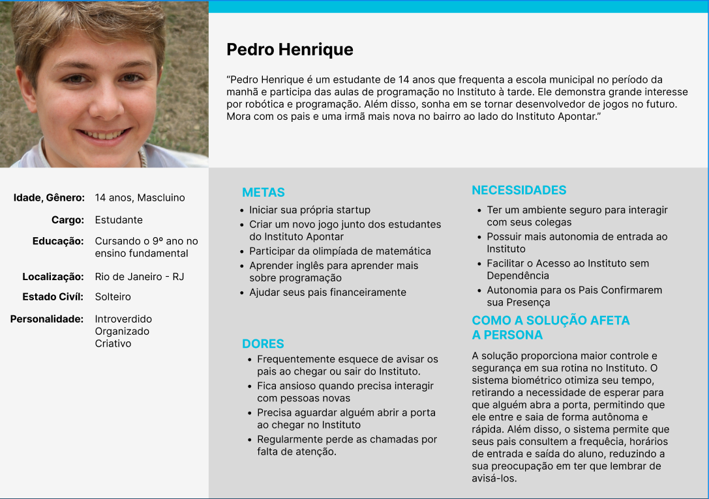
<br />
<br />
<sup>Fonte: Material produzido pelos autores (2024)</sup>
</div>

&nbsp;&nbsp;&nbsp;&nbsp;Nossa terceira persona é Wandderson Leal, um jovem de 25 anos, casado, que atua como secretário no Instituto Apontar e é formado como Técnico em Assistente de Escritório pela FAETEC. Apaixonado por jogos de tabuleiro e praia, Wandderson busca melhorar suas habilidades com as tecnologias utilizadas no instituto, o que representa um grande desafio, já que ele não se considera experiente em tecnologia e costuma esquecer senhas. Seus principais objetivos incluem aprender a utilizar as ferramentas do Instituto de forma mais eficiente e monitorar o acesso de alunos e visitantes no prédio, garantindo uma gestão organizada e segura do fluxo de pessoas. Segue abaixo a persona de Wandderson:

<div align="center">
<sub>Figura 7 - Persona auxiliar administrativo</sub>
<br />
<br />

<br />
<br />
<sup>Fonte: Material produzido pelos autores (2024)</sup>
</div>

&nbsp;&nbsp;&nbsp;&nbsp;Em resumo, as personas de Rosi, Pedro e Wandderson refletem a diversidade de perfis e necessidades dentro do Instituto Apontar. Rosi, como professora, busca otimizar seu tempo com tecnologias que facilitem o controle de presença dos alunos, permitindo que ela se dedique mais ao ensino. Pedro, um estudante motivado pela tecnologia, anseia por autonomia no acesso ao Instituto, reduzindo a dependência de terceiros e proporcionando mais segurança aos seus pais. Já Wandderson, o secretário, deseja desenvolver suas habilidades com as ferramentas tecnológicas do Instituto para monitorar o fluxo de alunos e visitantes de forma eficiente. Essas personas mostram como uma solução digital bem implementada pode atender a necessidades variadas, trazendo agilidade, segurança e inovação ao dia a dia de todos no Instituto.

# <a name="c19"></a>3.2.2. Jornada do Usuário e Storyboard


#### 3.2.2.1 Jornada do Usuário

&emsp;&emsp;O Mapa de Jornada do Usuário é uma ferramenta de User Experience e Design que permite visualizar e entender todo o percurso de interação de um usuário com um produto ou serviço, desde o primeiro contato até a fidelização. Esse mapeamento destaca as fases e etapas da jornada, identificando emoções, desafios, motivações e oportunidades de melhoria. Com o usuário como protagonista, o objetivo é aprofundar a compreensão da experiência, detectar pontos críticos e implementar melhorias que aumentem a satisfação e o engajamento com a solução<a href= "https://www.nngroup.com/articles/journey-mapping-101/" >(7)</a>. No contexto do projeto em parceria com o Instituto Apontar, nossa solução consistirá em um dispositivo IoT que irá realizar a leitura biométrica digital dos alunos da instituição para controle de acesso e frequência. Nesse sentido, os dados coletados serão armazenados e poderão ser consultados através do "A-Portal", uma aplicação web para consulta e exportação dos dados de frequência dos alunos.<br/>
&emsp;&emsp;Portanto, a seguir estão dispostos os mapas de Jornada de Usuário das 3 personas construídas para o projeto:

#### i. Jornada do Professor  

&emsp;&emsp;Rosileuda Fernandes, ou "Rosi", é uma professora de Matemática de 28 anos no Rio de Janeiro, que trabalha atualmente no Instituto Apontar. Até o ano passado, Rosi enfrentava desafios com o controle de presença dos alunos, que lhe tomava tempo e causava estresse, visto que anteriormente era feito de forma manual. Agora, com o sistema "A-Portal", Rosi tem uma solução que a permite visualizar rapidamente a frequência dos alunos sem o trabalho de procurar em planilhas o registro de cada presença.<br/>
&emsp;&emsp;Nesse sentido, a figura a seguir representa a jornada da professora Rosileuda como usuária do novo sistema "A-Portal":

<div align="center">
<sup>Figura 8 - Mapa de Jornada do Professor.</sup>
<br />
<br />
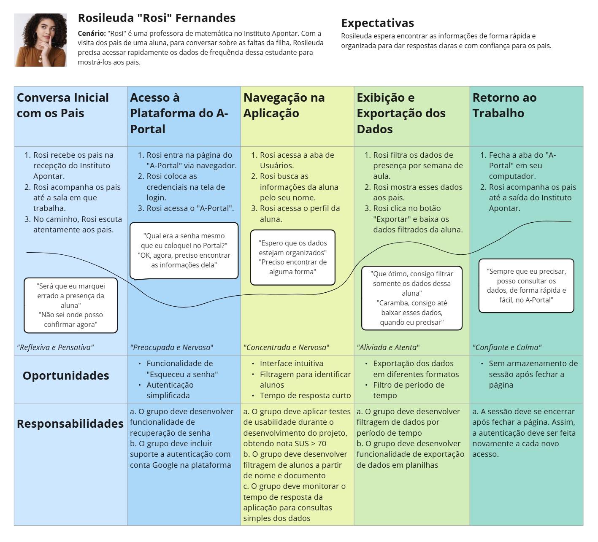
<br />
<br />
<sub>Fonte: Material produzido pelos autores(2024).</sub>
</div>
<br/>

&emsp;&emsp;Ao analisar a jornada da professora Rosileuda ao utilizar o sistema "A-Portal", é possível reconhecer algumas oportunidades.<br/>
&emsp;&emsp;Como o Instituto Apontar é uma Organização Não-Governamental, a qual mantém as suas operações através de doações e parcerias, presume-se que a instituição recebe constantemente visitas de investidores e potenciais doadores, além disso, como uma instituição de ensino, também é esperada a presença de pais e de orgãos reguladores de Educação. Dessa forma, percebe-se a necessidade do acesso e da visualização dos dados dos alunos, sobretudo, as informações de frequência, a fim de realizar reportes a outras instituições e/ou orientar conversas com pais e alunos.<br/>
&emsp;&emsp;De forma mais específica, considerando o contexto de apresentação institucional de dados consolidados, para investidores ou órgãos de Educação, ou até mesmo de exibição dos dados de frequência para os responsáveis dos estudantes, nota-se as seguintes oportunidades:<br/>

- O sistema deve possuir um baixo tempo de resposta para consultas, a fim de tornar rápido o acesso aos dados;
- O sistema deve possuir filtros diversos, para encontrar alunos e para selecionar dados de forma cronológica;
- O sistema deve suportar a exportação dos dados, para fins como os descritos acima;
- O sistema deve possuir armazenamento de sessão restrito, o qual solicita autenticação a cada novo acesso, a fim de proteger os dados dos estudantes.
 
&emsp;&emsp;Portanto, considerando o contexto mencionado - já validado com o parceiro -, a construção da jornada do usuário gerou insights produtivos para o desenvolvimento do projeto, de forma a tornar a futura experiência com a aplicação a mais satisfatória possível.

#### ii. Jornada do Funcionário Administrativo  

&nbsp;&nbsp;&nbsp;&nbsp;Wandderson Leal é um administrador responsável pela segurança
 e controle de acesso no
instituto, e sua jornada foi mapeada para entender melhor sua experiência ao interagir 
com nossa futura plataforma de gestão de acesso. O objetivo dessa jornada é identificar 
as emoções e ações de Wanderson em cada fase do uso, desde a preocupação inicial com o
fluxo e a segurança de visitantes e alunos (ou seja, identificação da dor) até a
satisfação com a eficiência e controle garantidos pela plataforma.
A jornada de Wandderson é dividida em cinco fases:

- Desmotivação com trabalhos manuais: Wandderson inicia frustrado e sobrecarregado ao 
lidar com a tarefa manual de controlar o acesso ao instituto, precisando verificar 
pessoalmente cada visitante e monitorar a porta de entrada de acesso ao Apontar.

- Início da automação: Wandderson escuta sobre a possibilidade de uma
 solução automatizada de controle de acesso e se sente curioso, embora preocupado com 
 a adaptação ao novo sistema. Ele explora as funcionalidades e começa a perceber 
 o potencial de economia de tempo e esforço.

- Implementação do sistema: Com o sistema de controle de acesso instalado, Wanderson 
inicia seu uso com um pouco de dificuldade, mas nota a otimização no gerenciamento de acesso. Ele começa 
a incentivar outros funcionários a utilizarem o sistema, motivado pelo aumento na eficiência.

- Processo adaptado: À medida que se acostuma ao sistema, Wandderson realiza o cadastro
 de novos visitantes com rapidez e se sente seguro com a proteção do sistema. A automação
  da entrada e saída permite que ele foque em outras tarefas importantes.

- Aprovação: Por fim, Wanderson se sente satisfeito com a plataforma, que elimina
 preocupações com o controle de acesso manual. Ele recomenda a automação para outras
  áreas do instituto, satisfeito com o aumento na praticidade e na eficiência.

&nbsp;&nbsp;&nbsp;&nbsp;A jornada mapeia a transição emocional de frustração para
satisfação, mostrando como a plataforma facilita a rotina de Wanderson e oferece
segurança no acesso. A plataforma também apresenta oportunidades de personalização,
como a adaptação de funcionalidades específicas para agilizar ainda mais o controle de
visitantes. A imagem a seguir representa a jornada do usuário; no mapa, destacamos
uma alumas oportunidades e responsabilidades.

### Oportunidades:

- Explorar a Frustração Inicial: Utilizar a frustração inicial de Wandderson para destacar os benefícios da automação. Mostrar como a plataforma pode reduzir o trabalho manual e tornar as tarefas menos exaustivas e mais seguras. Isso ajuda a criar uma visão positiva da automação desde o início.

- Facilitar a Curiosidade e Exploração: Usar a curiosidade natural de Wandderson para incentivá-lo a experimentar as funcionalidades do sistema. Durante a fase de onboarding, apresentar de forma clara como a automação pode resolver problemas comuns e oferecer materiais de suporte, como tutoriais, para ajudá-lo a se familiarizar rapidamente.

- Exemplos de Uso para Aumentar a Adoção: Após a implementação, mostrar exemplos de uso prático do sistema por outros funcionários. Isso pode ajudar Wandderson a visualizar os benefícios concretos e encorajá-lo a adotar a plataforma completamente, reforçando a utilidade da ferramenta no cotidiano.

- Relatórios Personalizados para Relevância: Oferecer relatórios personalizados de controle de acesso, permitindo que Wandderson visualize de forma detalhada o fluxo de pessoas no instituto. Essa personalização pode aumentar a relevância da plataforma no dia a dia, criando uma experiência adaptada às suas necessidades específicas.


### Responsabilidades:

- Apresentar uma Interface Amigável desde o Início: Garantir que a plataforma seja intuitiva e ofereça instruções claras sobre seus benefícios e funcionalidades desde o primeiro contato. Isso ajuda a reduzir a frustração inicial e facilita o processo de adaptação de Wanderson ao sistema.

- Criar um Processo de Onboarding Claro e Intuitivo: Desenvolver um processo de introdução ao sistema que seja fácil de seguir, permitindo que Wanderson entenda rapidamente como a plataforma funciona e como ela pode ser útil para seu trabalho. Isso inclui a criação de materiais de suporte, como tutoriais e FAQs.

- Assegurar a Facilidade de Uso Durante a Implementação: Certificar-se de que o sistema permanece fácil de usar, com uma interface clara e organizada, para que Wanderson não se sinta perdido ao navegar pelas funcionalidades. A simplicidade do design contribui para uma adoção mais fluida.

- Coletar Feedback para Melhorias Contínuas: Implementar estratégias para obter feedback regular de Wanderson sobre a plataforma. Isso ajuda a identificar necessidades específicas, permitindo ajustes e melhorias que tornam a ferramenta mais eficaz e adaptada ao seu contexto.

- Oportunidade: Explorar a frustração inicial de Wanderson para mostrar os benefícios da automação e como ela pode tornar seu trabalho menos exaustivo e mais seguro.
Responsabilidade: Garantir que a plataforma apresente uma interface amigável desde o início, fornecendo instruções claras sobre os benefícios e funcionamento do sistema.


&nbsp;&nbsp;&nbsp;&nbsp;A transição emocional de frustração para satisfação mostra o valor
da plataforma em aprimorar o controle de acesso e aumentar a segurança, proporcionando 
uma experiência positiva para Wandderson. A plataforma deve continuar evoluindo,
oferecendo novas funcionalidades e personalizações para mantê-lo engajado e
satisfeito. A jornada de Wandderson valida o impacto positivo da plataforma, destacando
áreas para seu desenvolvimento contínuo. A seguir ilustramos o desenvolvimento da jornada do Wandderson:


<div align="center">
<sub>Figura 9 - Jornada auxiliar administrativo</sub>
<br />
<br />
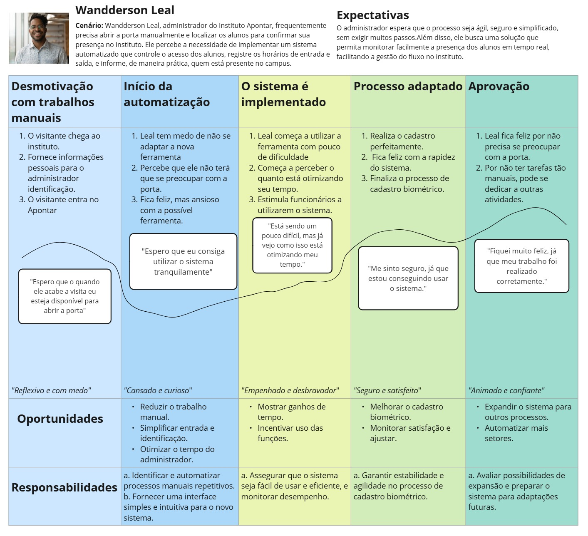
<br />
<br />
<sup>Fonte: Material produzido pelos autores (2024)</sup>
</div>

#### iii. Jornada do Aluno  

&emsp;&emsp;Pedro Henrique, 14 anos, estudante com traços de Altas Habilidades e Superdotação na área de matemática e programação, é aluno bolsista no Instituto Apontar. Estuda de manhã no colégio e à tarde tem aulas de computação no Inatituto. Pedro possui uma rotina corrida e, com frequência, chega atrasado ao Instituto, dificultando seu acesso rápido às salas de aula, como também, Pedro não tem certeza do registro correto da sua presença do dia. Agora, com a solução do A-Portal, Pedro pode acessar as dependências do Instituto de forma mais rápida, como também, tem a certeza do registro da sua presença do Instituto Apontar.<br/>
&emsp;&emsp;Pedro deseja entrar rapidamente na instituição para evitar atrasos adicionais, além da perda da chamada de sala e do registro de sua presença. Atualmente, o processo de acesso frequentemente exige a intervenção de um funcionário para liberar a porta, o que aumenta o seu tempo de espera e gera frustração.
Nesse sentido, a figura a seguir representa a jornada do aluno Pedro Henrique como usuário do novo sistema "A-Portal":

<div align="center">
<sub>Figura 10 - Jornada do Aluno</sub>
<br />
<br />
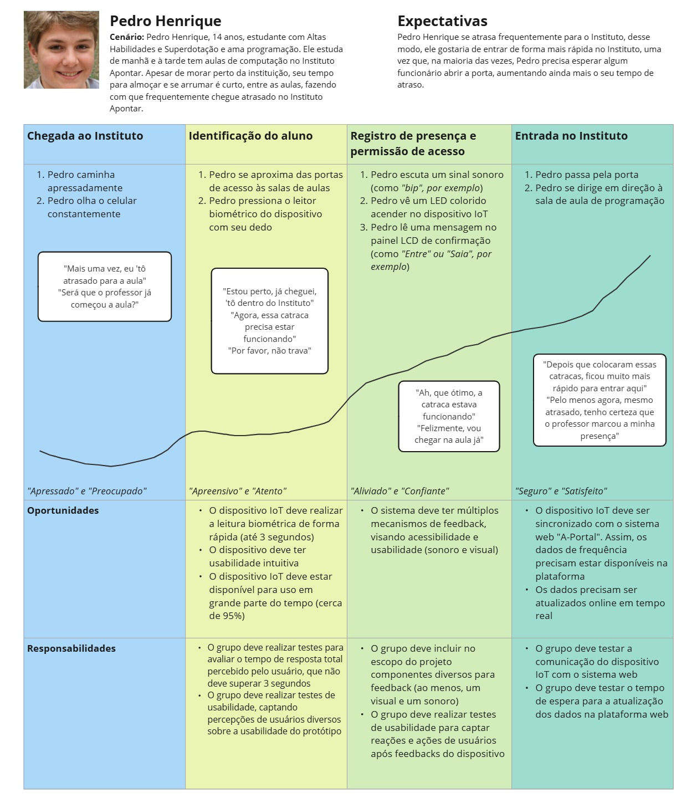
<br />
<br />
<sup>Fonte: Material produzido pelos autores (2024)</sup>
</div>

Oportunidades Identificadas
- Velocidade de Leitura: O dispositivo IoT deve realizar a leitura biométrica de forma rápida, idealmente em até 3 segundos, para que a experiência do aluno ao entrar no Instituto seja otimizada.
- Usabilidade: É essencial que o dispositivo seja intuitivo para facilitar a experiência do usuário, com avisos claros das funcionalidades de cada botão com etiquetas de descrição.
- Disponibilidade: O sistema IoT deve estar disponível e funcional em pelo menos 95% do tempo, reduzindo o tempo de espera e frustrações do usuário em acessar as dependências da instituição.
- Feedback Múltiplo: O sistema deve oferecer feedback tanto visual (LED e LCD), quanto sonoro, permitindo uma confirmação clara de acesso.
- Integração e Sincronização: Dados de frequência precisam ser registrados em tempo real e acessíveis pelo sistema A-Portal para maior precisão na presença dos alunos, no caso de uso de consulta da presença dos alunos através do sistema.

Responsabilidades do Grupo de Desenvolvimento
- Teste de Resposta: Realizar testes de tempo de resposta total percebido pelo usuário, ou "jetting", garantindo que o sistema não ultrapasse 3 segundos.
- Teste de Usabilidade: Testar o protótipo com usuários variados para capturar percepções e melhorar a interface (tanto física quanto digital). Nesse sentido, os testes devem ser realizados no mínimo uma vez a cada sprint, considerando a adição de novos componentes na interface, a partir do momento em que o sistema e o dispositivo estiverem funcionais.
- Feedback Iterativo: Desenvolver funcionalidades de feedback visual e sonoro para que o usuário perceba o status do processo que está realizando. Ademais, a verificação da eficácia dessas funcionalidades será realizada a partir do registro de percepções coletados no teste de usabilidade da solução.
- Testes de Integração: Garantir que o dispositivo IoT comunique-se eficazmente com o sistema web A-Portal, atualizando dados em tempo real. Nesse contexto, a realização de testes de sincronização é fundamental para verificar a integração.
- Testes de Confiabilidade: A equipe deve testar a estabilidade do sistema, assegurando que a funcionalidade de presença e permissões disponíveis em, ao menos, 95% do tempo. Dessa forma, os testes realizados para veriicar essa disponibilidade incluem o monitoramento do tempo de disponibilidade da aplicação e possíveis quedas no funcionamento do sistema.

&emsp;&emsp;Portanto, a partir da construção do Mapa da Jornada do Usuário do aluno, é possível reconhecer os pontos de contato do nosso usuário com a aplicação, identificar oportunidades e delegar responsabilidades. Por fim, a partir dos insights coletados a partir desse entregável, espera-se que a solução final ofereça uma experiência agradável aos usuários que forem alunos. 

# <a name="c20"></a>3.2.3. Storyboard

&nbsp;&nbsp;&nbsp;&nbsp;Um storyboard é uma ferramenta visual que mapeia o percurso de um usuário (persona) ao interagir com um produto ou serviço. É composto por uma sequência de quadros (como em uma história em quadrinhos) que ilustram etapas, cenários e contextos específicos, mostrando como e por que o usuário realiza certas ações. Esse tipo de storyboard destaca momentos-chave da experiência do usuário, ajudando a identificar necessidades, motivações e pontos de frustração. Ele auxilia na compreensão da jornada completa do usuário, oferecendo uma visão prática para o desenvolvimento de soluções mais intuitivas e centradas nas reais demandas dos usuários.

&nbsp;&nbsp;&nbsp;&nbsp;Neste contexto, os storyboards a seguir ilustram duas situações distintas que demonstram a eficácia da plataforma A-Portal. Na primeira, acompanhamos a jornada de um aluno que, ao chegar atrasado, tem sua presença automaticamente registrada pela plataforma através da catraca, promovendo tranquilidade e eficiência no controle de frequência. Na segunda, vemos a interação entre o pai de um aluno e a professora, onde o A-Portal facilita o acesso às informações de frequência, permitindo que o responsável compreenda a situação de maneira rápida e transparente. Esses cenários destacam o papel do A-Portal como uma ferramenta prática e confiável para toda a comunidade escolar.


## Storyboard 1:

### Persona: Rosileuda Fernandes (Professora) 

**Cenário:** Cenário: Pai do aluno e convidado pelo instituto para fazer um levantamento das faltas de um aluno. 
O professor rapidamente tem acesso ao seu relatorio atraves do A-Portal Web

<div align="center">
<sub>Figura 11 - Storyboard</sub>
<br />
<br />
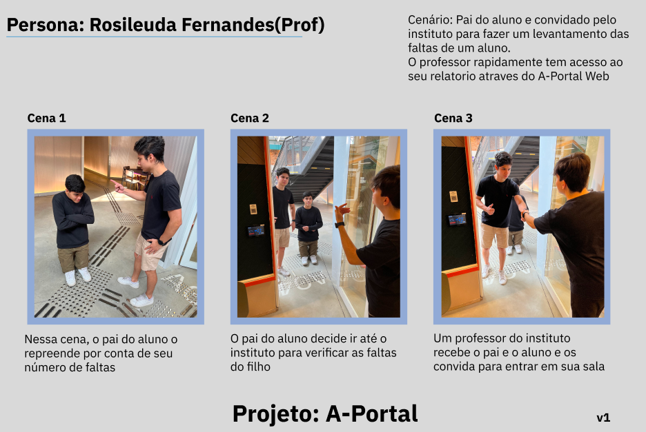
<br />
<br />
<sup>Fonte: Material produzido pelos autores (2024)</sup>
</div>

<div align="center">
<sub>Figura 12 - Storyboard</sub>
<br />
<br />
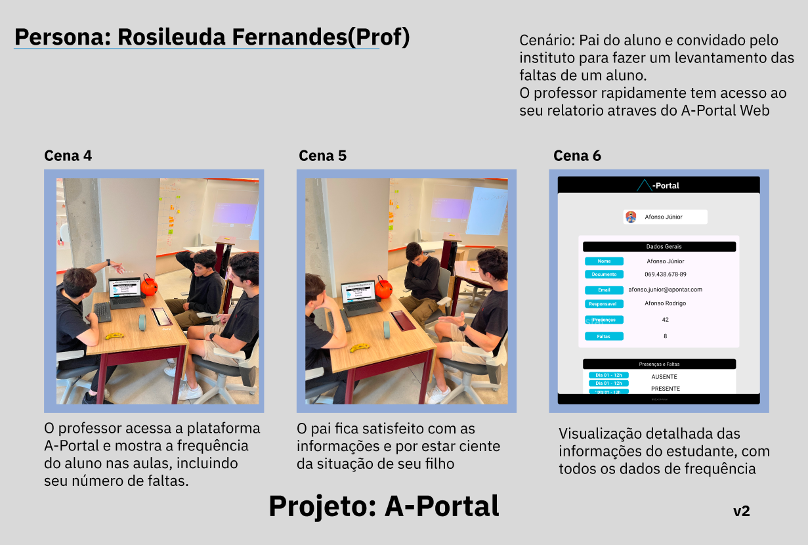
<br />
<br />
<sup>Fonte: Material produzido pelos autores (2024)</sup>
</div>

### Cena 1

&nbsp;&nbsp;&nbsp;&nbsp;Nesta cena inicial, o pai está repreendendo o aluno, demonstrando preocupação com a frequência escolar. Esse momento destaca o impacto que a falta de informações acessíveis e rápidas pode ter, criando tensão e incerteza.

---

### Cena 2

&nbsp;&nbsp;&nbsp;&nbsp;Para esclarecer a situação, o pai decide ir até o Instituto Apontar, buscando uma explicação e uma visão mais detalhada sobre as faltas do filho. Isso reflete a necessidade de uma comunicação transparente e acessível entre os responsáveis e a instituição.

---

### Cena 3

&nbsp;&nbsp;&nbsp;&nbsp;Ao chegar no instituto, o pai e o aluno são recebidos pela professora, que está pronta para fornecer informações sobre a frequência do aluno. A professora os convida a entrar em sua sala, sugerindo que o A-Portal pode ser acessado em um ambiente de fácil consulta, onde a privacidade dos dados dos alunos é mantida.

---

### Cena 4

&nbsp;&nbsp;&nbsp;&nbsp;A professora, utilizando a plataforma A-Portal, acessa rapidamente o relatório de frequência do aluno. Ela mostra ao pai o histórico de presença e o número de faltas, tudo através do sistema digital. Essa cena destaca a eficiência e a praticidade do A-Portal, permitindo que a professora forneça informações precisas sem precisar recorrer a registros físicos ou buscas demoradas.

---

### Cena 5

&nbsp;&nbsp;&nbsp;&nbsp;O pai, ao ver os dados detalhados na tela, sente-se satisfeito com as informações recebidas e aliviado ao compreender a situação do filho. Aqui, o storyboard destaca como o A-Portal não apenas facilita o trabalho da professora, mas também proporciona tranquilidade aos pais, promovendo uma relação mais transparente e informada.

---

## Storyboard 2:

### Persona: Pedro Henrique (Aluno)

**Cenário:** O aluno chega atrasado para a aula, mas já havia recebido presença devido à verificação da catraca.

<div align="center">
<sub>Figura 13- Storyboard</sub>
<br />
<br />
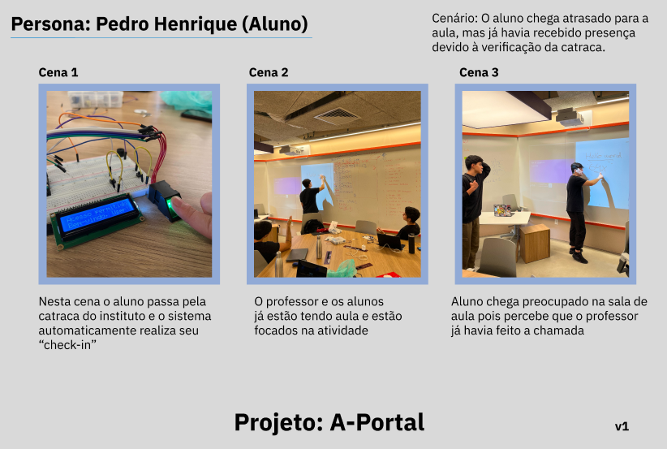
<br />
<br />
<sup>Fonte: Material produzido pelos autores (2024)</sup>
</div>

<div align="center">
<sub>Figura 14 - Storyboard</sub>
<br />
<br />
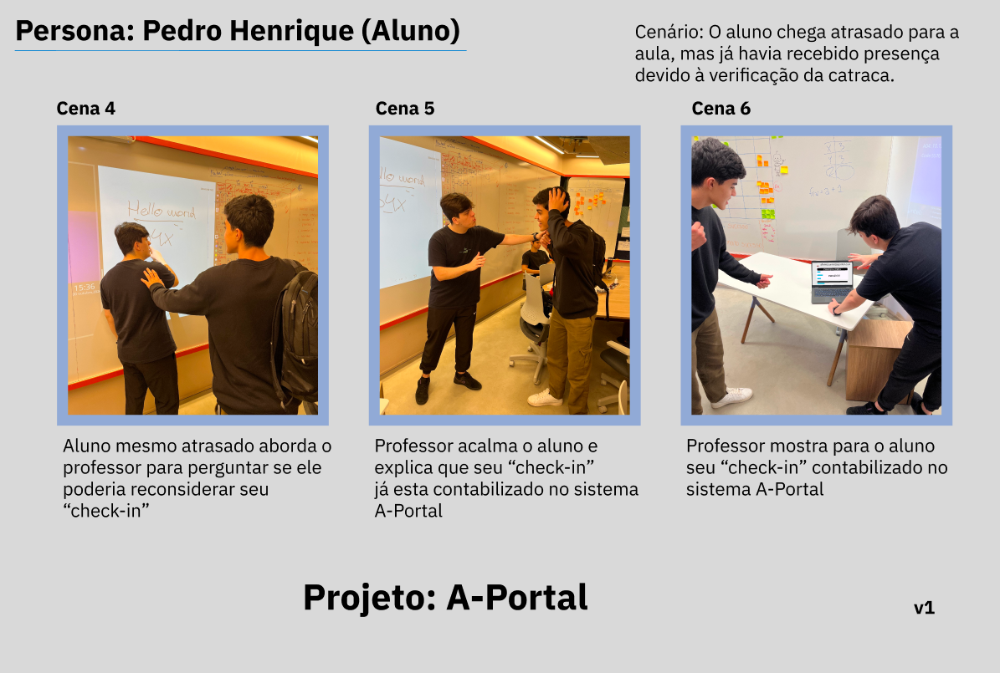
<br />
<br />
<sup>Fonte: Material produzido pelos autores (2024)</sup>
</div>

<div align="center">
<sub>Figura 15 - Visualização Detalhada do Sistema Web "A-Portal".</sub>
<br />
<br />
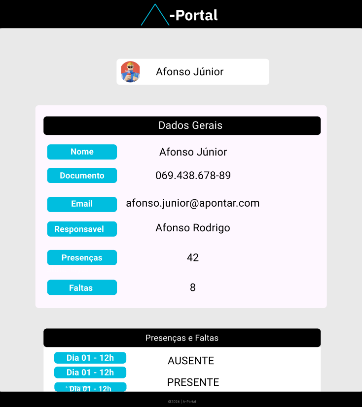
<br />
<br />
<sup>Fonte: Material produzido pelos autores (2024)</sup>
</div>

### Cena 1

&nbsp;&nbsp;&nbsp;&nbsp;Nesta cena, o aluno passa pela catraca do instituto, e o sistema automaticamente realiza seu “check-in”. Esse processo representa o registro de presença assim que o aluno entra no prédio, facilitando o controle e evitando que o aluno precise fazer o check-in manualmente na sala de aula.

---

### Cena 2

&nbsp;&nbsp;&nbsp;&nbsp;O professor e os alunos já estão em sala, envolvidos na atividade. Essa cena demonstra a continuidade da aula, onde o foco está no aprendizado e a presença já foi contabilizada previamente pelo sistema A-Portal.

---

### Cena 3

&nbsp;&nbsp;&nbsp;&nbsp;O aluno chega preocupado à sala de aula, percebendo que o professor já havia feito a chamada. Aqui, destacamos o impacto positivo do A-Portal em reduzir essa preocupação, pois o aluno já tem seu “check-in” registrado automaticamente, minimizando a ansiedade de perder a presença.

---

### Cena 4

&nbsp;&nbsp;&nbsp;&nbsp;Mesmo atrasado, o aluno aborda o professor para perguntar se ele poderia reconsiderar seu “check-in”. Esse momento mostra a necessidade de comunicação direta entre aluno e professor, reforçando a confiança no sistema automatizado do A-Portal.

---

### Cena 5

&nbsp;&nbsp;&nbsp;&nbsp;O professor acalma o aluno e explica que seu “check-in” já está contabilizado no sistema A-Portal. Essa cena demonstra como o sistema permite ao professor confirmar rapidamente a presença do aluno, promovendo confiança e transparência.

---

### Cena 6

&nbsp;&nbsp;&nbsp;&nbsp;Mais uma vez, o professor reforça ao aluno que seu “check-in” está devidamente registrado e contabilizado no sistema A-Portal. O aluno entende que o sistema já registrou sua presença, mesmo com o atraso, garantindo que o controle de frequência seja feito de maneira precisa e automática.

---

### Conclusão
&nbsp;&nbsp;&nbsp;&nbsp;Através dos dois storyboards, observamos como o A-Portal contribui de forma significativa para o ambiente educacional, beneficiando tanto professores quanto alunos. No primeiro cenário, o A-Portal facilita o controle de presença automatizado, promovendo uma experiência tranquila para os alunos e reduzindo a preocupação com a chamada. No segundo, a plataforma atua como um meio eficiente e transparente para comunicação entre pais e instituição, permitindo que a professora compartilhe informações detalhadas sobre a frequência do aluno de maneira rápida e confiável.

&nbsp;&nbsp;&nbsp;&nbsp;Esses casos demonstram como o A-Portal atende a diferentes necessidades dentro da instituição: desde o registro automático de presença até o fornecimento de dados precisos para pais e responsáveis. Em ambos os cenários, o A-Portal se destaca pela praticidade e agilidade, economizando tempo e promovendo um ambiente mais organizado e transparente. Com isso, a plataforma não só valoriza o papel dos professores, permitindo-lhes focar em suas tarefas pedagógicas, mas também fortalece a confiança entre alunos, responsáveis e a instituição, proporcionando uma experiência educacional mais moderna e eficaz para todos.

# <a name="c21"></a> 3.3. Solução Técnica


### 3.3.1. Requisitos Funcionais

&emsp;&emsp;Os requisitos funcionais descrevem as funcionalidades e comportamentos que o sistema deve possuir para atender às necessidades dos usuários e do negócio, especificando o que o sistema deve realizar, como operações, interações e tarefas essenciais. Nesse sentido, há um enfoque nas funcionalidades específicas do sistema, com as quais o usuário interage.<br/>
&emsp;&emsp;De forma específica, em parceria com o Instituto Apontar, os seguintes requisitos funcionais foram levantados a partir do kick-off com o parceiro e serão avaliados nas Sprint Reviews ao longo do módulo.

<div align="center">
<sup>Quadro 2 - Quadro de requisitos funcionais</sup>

| #    | **Requisitos Funcionais**                                                                                  | **Regra de Negócio**                                                                                                                                                     |
|------|------------------------------------------------------------------------------------------------------------|-------------------------------------------------------------------------------------------------------------------------------------------------------------------------|
| RF01 | O sistema deve suportar identificação por leitura biométrica digital.                              | O aluno deve registrar sua presença com identificação biométrica.                                                                                                        |
| RF02 | O sistema deve emitir sinais sonoros e visuais após a identificação.                                 | - Sinal sonoro 1 e mensagem visual em interface para sucesso.<br>- Sinal sonoro 2 e mensagem visual em interface para insucesso.<br>O aluno precisa saber se sua frequência foi registrada com sucesso ou não. |
| RF03 | O sistema deve permitir o cadastro de novas biometrias, associando-as a um usuário específico.      | O cadastro deve incluir informações como:<br>- Nome completo<br>- Número de matrícula, RG ou CPF (Identificador único)<br>- Biometria digital.                           |
| RF04 | Ao realizar a identificação, o sistema deve registrar informações de entrada/saída.                | As informações registradas serão:<br>- Nome completo<br>- Data<br>- Horário de entrada/saída.<br>O administrativo precisa ter o registro da presença e frequência dos alunos.            |
| RF05 | O sistema deve disponibilizar uma plataforma online para acesso e visualização das informações.     | O administrativo precisa ter uma interface acessível para visualizar e exportar as informações dos alunos.                                                               |
| RF06 | O sistema deve permitir a cada leitor biométrico realizar cadastros e leitura de biometrias.        | O cadastro e leitura precisam estar disponíveis em cada sensor, com modo "leitura"/"cadastro" ativado pelo sistema online e sinal sonoro/visual para troca de modo.        |
| RF07 | O sistema deve armazenar dados de forma segura e disponível continuamente.                         | As informações dos alunos devem estar disponíveis a qualquer momento e de qualquer lugar com internet.                                                                   |

<sub>Fonte: Material produzido pelos autores(2024).</sub>
</div>

&emsp;&emsp;Dessa forma, o levantamento realizado dos requisitos funcionais é fundamental para a construção da arquitetura da solução e para a posterior escolha de tecnologia no desenvolvimento do projeto. Finalmente, os critérios de sucesso da solução estão intimamente ligados aos requisitos funcionais descritos, de modo a entregar a solução mais adequada às necessidades e expectativas do parceiro.


### 3.3.2. Requisitos Não Funcionais


&nbsp;&nbsp;&nbsp;&nbsp;Requisitos não funcionais são os requisitos relacionados ao uso da aplicação em termos de desempenho, usabilidade, confiabilidade, segurança, disponibilidade, manutenção e tecnologias envolvidas. Estes requisitos dizem respeito a como as funcionalidades serão entregues ao usuário do software. Em resumo, os Requisitos não funcionais explicam as limitações e restrições do sistema a ser projetado.


&nbsp;&nbsp;&nbsp;&nbsp;Conforme a norma ISO/IEC 25010, os requisitos não funcionais de um sistema podem ser subdivididos nas seguintes categorias:
- **Segurança:** Grau em que o sistema se defende de ataques maliciosos e é capaz de proteger os dados e informações de acordo com os níveis de acesso dos usuários. Essa classificação possui as seguintes sub-características:
	- Confidencialidade: garante que os dados só podem ser acessados pelos usuários que possuem autorização;
 	- Integridade: capacidade de proteger as informações internas contra modificações mal-intencionadas;
  	- Não-repudiação:  eventos e ações devem ser registrados para que não possam ser negados posteriormente;
  	- Responsabilidade: Ações devem ser ligadas a atores específicos;
  	- Autenticidade: Identidades e recursos devem ser provados como pertencentes a indivíduos ou sistemas específicos;
  	- Resistência: capacidade do sistema de se manter funcional sob ataques maliciosos;
- **Manutenção:** Esta característica representa o grau de eficácia e eficiência com que um produto ou sistema pode ser modificado para melhorá-lo, corrigi-lo ou adaptá-lo às mudanças no ambiente e nos requisitos. Essa característica é composta pelas seguintes subcaracterísticas:
  	- Modularidade: Grau em que um sistema é composto de componentes discretos, de modo que uma alteração em um componente tenha impacto mínimo em outros componentes.
  	- Reusabilidade: Grau em que um sistema pode ser utilizado como funcionalidade de um sistema ou na construção de outros produtos
  	- Analisabilidade - Grau de eficácia com o qual é possível avaliar o impacto sobre um produto ou sistema de uma alteração pretendida em uma ou mais de suas peças, para diagnosticar um produto quanto a deficiências ou causas de falhas.
  	- Modificabilidade – Grau em que um produto ou sistema pode ser modificado sem introduzir defeitos ou degradar a qualidade do produto existente
  	- Testabilidade – Grau com o qual os critérios de teste podem ser estabelecidos para um sistema, produto ou componente e os testes podem ser realizados para determinar se esses critérios foram atendidos.
- **Portabilidade:** Grau em que um produto, sistema ou componente pode trocar informações com outros produtos, sistemas ou componentes e/ou executar as funções exigidas enquanto compartilha o mesmo ambiente e recursos comuns. Essa categoria é composta pelas seguintes subcaracterísticas:
	- Coexistência – Grau em que um produto pode desempenhar as funções exigidas de forma eficiente, ao mesmo tempo que compartilha um ambiente e recursos comuns com outros produtos, sem impacto prejudicial em qualquer outro produto.
 	- Interoperabilidade – Grau em que um sistema, produto ou componente pode trocar informações com outros produtos e utilizar simultaneamente as informações que foram trocadas.
- **Atuação:**  Esta categoria representa o grau em que um produto desempenha suas funções dentro de parâmetros de tempo e rendimento especificados e é eficiente no uso de recursos (como CPU, memória, armazenamento, dispositivos de rede, energia, materiais...) sob condições especificadas. Essa característica é composta pelas seguintes subcaracterísticas:
	- Utilização de recursos - Grau em que as quantidades e tipos de recursos utilizados por um produto ou sistema, no desempenho de suas funções, atendem aos requisitos.
 	- Capacidade – Grau em que os limites máximos de um parâmetro de produto ou sistema atendem aos requisitos.
- **Usabilidade:** Grau em que um produto ou sistema pode interagir com usuários específicos para trocar informações, por meio da interface do usuário, para concluir tarefas específicas em uma variedade de contextos de uso. Essa categoria é composta pelas seguintes subcaracterísticas:
	- Operabilidade – Grau em que um produto ou sistema possui atributos que facilitam sua operação e controle.
 	- Engajamento do usuário – Grau em que uma interface de usuário apresenta funções e informações de maneira convidativa e motivadora, incentivando a interação contínua.
	- Assistência ao usuário – Grau em que um produto pode ser usado por pessoas com diferentes características e capacidades para atingir objetivos específicos em um contexto de uso específico. 

| **RNF#** | **Descrição** | **Aspecto de qualidade** | 
|----------|----------|----------|
|RNF01|O leitor biométrico deve emitir um feeback tátil para o usuário quando utilizado - Uma resposta sensorial que pode ser física (vibração), visual (luz emitida por led) ou sonora em 85% dos casos de uso. Esse requisito completa a demanda de negócio de manter o usuário engajado e ciente de que a solução funciona. Essa função pode ser testada a partir da integração do leitor com um circuito conectado à protoboard e periféricos que emitam uma saída (como LEDs). Além disso, a plataforma online A-Portal deverá fornecer um feedback quando o cadastro da biometria der certo (notificação ou pop-up na tela) e disponibilizar um botão de ajuda com uma legenda clara, para chamar um colaborador do Instituto Apontar caso ocorra algum problema ou a pessoa ainda não tenha cadastro (característica de prevenção de erro ao usuário) |Usabilidade|
|RNF02|O dispositivo IoT deve ser de fácil instalação e modularizado para que possam ser implementados novos componentes caso necessário ou realizar trocas das peças em 85% de sua estrutura. Esse requisito atende às necessidades básicas do projeto e permite que ele seja melhorado de acordo com os interesses do parceiro e o planejamento do grupo. Essa função pode ser testada com a desmontagem e modificações na construção do dispositivo que alterem seu funcionamento. Nesse contexto, a fácil instalação e modularização condiz ao fato de se tratar de um dispositivo portátil que exige apenas uma superfície para instalação e alimentação de energia. |Manutenção|
|RNF03|A plataforma web deve funcionar em dispositivos desktop e mobile, com todas as suas funcionalidades em 85% do tempo. Esse requisito soluciona a necessidade de compatibilidade entre diferentes dispositivos, já que os usuários devem ser capazes de realizar o acesso através de diferentes aparelhos. Essa função pode ser testada a partir do desenvolvimento do site (A-Portal) e seu teste de uso em dispositivos desktop e celulares. |Portabilidade|
|RNF04|A segurança dos dados através de criptografia e protocolos de segurança deve impedir o vazamento de informações em 85% das vezes que houver comunicação com o banco de dados e o usuário. Essa função pode ser testada após o desenvolvimento da plataforma web e através do envio de informações ao banco de dados. Os dados coletados estarão protegidos por criptografia e todos os dados que estão sendo transferidos do dispositivo IoT para o sistema web, ou vice-versa, também estarão criptografados, utilizando protocolos de comunicação seguros, a fim de prevenir ataques e dificultar o acesso e a utilização desses dados por terceiros  |Segurança|
|RNF05| O sistema deve ser capaz de operar com todas as suas funcionalidades, sem gargalos, assegurando o número necessário de usuários (aproximadamente 500) em 85% do tempo. Esse requisito garante uma performance ideal para o número de usuários atual e possibilita um aumento de capacidade para novos cadastros. Essa função pode ser testada ao longo do desenvolvimento da plataforma web, em que o grupo irá monitorar sua performance conforme a população do banco de dados aumenta.|Eficiência de desempenho|
|RNF06| Os usuários deverão estar autenticados para acessar os dados, garantindo que apenas indivíduos autorizados possuam acesso.|Confidencialidade|
|RNF07| Esse requisito confere o grau em que um sistema, produto ou componente está operacional e acessível quando necessário para uso. Para plataforma web A-portal, o sistema deve funcionar em 85% do tempo; Para o dispositivo IoT, a disponibilidade do módulo IoT de verificar as biometrias e cadastrar novas biometrias deverá estar próxima de 85%. Dessa forma, em caso de interrupção ou falha, o sistema deve recuperar os dados diretamente afetados e restabelecer o estado desejado do sistema. Assim, o módulo IoT deve possuir a capacidade de manter a coleta adequada e armazenar os dados, mesmo se o acesso a internet cair, recuperando esses dados quando a internet voltar|Confiabilidade|

&nbsp;&nbsp;&nbsp;&nbsp;A seguir estão estabelecidos os casos de teste para cada requisito não-funcional determinado:


#### Caso de teste RNF01: 

**Resumo:** 

&nbsp;&nbsp;&nbsp;&nbsp;Este caso de teste tem como objetivo averiguar se o leitor biométrico é capaz de emitir um feedback tátil ao usuário assim que for acionado.

**Pré-condições:**
- O leitor biométrico deve estar conectado ao dispositivo IoT;
- O dispositivo IoT deve estar conectado a uma fonte de alimentação e conseguir se comunicar com um computador (via internet, cabo ou bluetooth)
- O dispositivo IoT deve possuir um componente que forneça feedback após o leitor ser acionado (Ex: um LED)

**Procedimento:**
1. O usuário deverá selecionar no computador se é ‘Cadastro’ ou ‘Identificação’ da digital;
2. Para que o teste possa ser realizado, o usuário deve pressionar seu dedo (de preferência o indicador ou polegar de qualquer uma das mãos) no leitor biométrico, de forma que sua digital possa ser verificada;
3. Se for ‘Identificação’, o leitor deverá escanear a digital do usuário e compará-la com as digitais do banco de dados;
4. Caso  o sistema encontre paridade entre a digital escaneada e alguma digital presente no banco de dados, o dispositivo IoT deverá emitir um feedback (Ex: Ligando um LED);
5. Caso não haja paridade entre digitais, o dispositivo deverá emitir um feedback diferente (Ex: Ligando um LED de outra cor);
Caso seja a primeira leitura (‘Cadastro’), o dispositivo deverá cadastrar a digital no banco de dados e emitir um feedback (Ex: Ligando um LED).


**Resultado esperado:** 

&nbsp;&nbsp;&nbsp;&nbsp;Espera-se que o leitor possa verificar a identidade do usuário através da leitura de sua digital em um tempo estimado de 3 segundos e emitir um feedback tátil (que pode ser visual, sonoro ou físico). Caso seja a primeira vez, o leitor deverá ser capaz de cadastrar a nova digital no banco de dados utilizado no projeto.

#### Caso de teste RNF02:
**Resumo:** 

&nbsp;&nbsp;&nbsp;&nbsp;Este caso de teste tem como objetivo verificar se o dispositivo IoT permite ser subdividido em componentes menores, que por sua vez, possam ser substituídos com relativa facilidade por outras peças que executem as mesmas funções ou introduzam novas funcionalidades

**Pré-condições:**
- O Dispositivo IoT deve estar ao menos parcialmente construído
- O dispositivo IoT deve conter componentes que executem funções diferentes (Ao menos duas)
- Um membro do grupo deve estar apto a retirar os componentes e montá-los novamente

**Procedimento:**
1. Retirar diferentes componentes do dispositivo IoT (Como um circuito de LEDs)
2. Adicionar componentes diferentes (Como buzzers)
3. Verificar se os componentes adicionados funcionam corretamente
4. Recolocar os antigos componentes e verificar se funcionam como esperado

**Resultado esperado:**

&nbsp;&nbsp;&nbsp;&nbsp;Espera-se que o dispositivo IoT demonstre elevada capacidade de modularização, ou seja, permita realocar seus componentes, substituí-los, adicionar ou alterá-los conforme as necessidades do projeto


#### Caso de teste RNF03:

**Resumo:** 

&nbsp;&nbsp;&nbsp;&nbsp;Este caso de teste tem como objetivo verificar se a plataforma web (A-Portal) funciona sem erros e com mesmo desempenho em dispositivos móveis e desktop.

**Pré-condições:**
- O grupo deve possuir uma arquitetura para a plataforma web (Esboço)
- Frameworks de desenvolvimento e linguagens devem estar definidas
- Ferramentas de teste para emulação de dispositivos e monitoramento de performance devem estar configuradas
- O app deve estar pelo menos parcialmente funcional

**Procedimento:**
1. Acessar a plataforma em diferentes dispositivos desktop (ex.: Windows e macOS) e navegadores (Chrome, Firefox).
2. Acessar a plataforma em diferentes dispositivos móveis, como Android e iOS, usando navegadores comuns para cada sistema (ex.: Chrome no Android, Safari no iOS).
3. Realizar uma série de ações principais, como login, navegação entre páginas, envio de formulários, e qualquer funcionalidade essencial da plataforma.
4. Monitorar a taxa de sucesso na execução de cada funcionalidade e registrar qualquer erro, problema de exibição ou mau funcionamento em cada dispositivo.

**Resultado esperado:**

&nbsp;&nbsp;&nbsp;&nbsp;Todas as funcionalidades da plataforma, incluindo login, navegação, envio de formulários, buscas, e interações específicas, devem estar totalmente operacionais e comportar-se de forma idêntica em dispositivos móveis (smartphones, tablets) e desktops, com falhas ou erros mínimos


#### Caso de teste RF04:

**Resumo:** 

&nbsp;&nbsp;&nbsp;&nbsp;Este caso de teste tem como objetivo verificar se os dados cadastrados no banco de dados estão seguros contra atores externos que não pertencem ao projeto.

**Pré-condições:** 
- O projeto deve possuir um banco de dados que receba novas informações
- A plataforma web (A-Portal) deve estar operacional
- O leitor biométrico deve ser capaz de realizar as funções de Cadastro e Identificação

**Procedimento:** 

1. Iniciar a captura de pacotes durante a comunicação entre o sistema e o banco de dados, simulando operações como leitura e gravação de dados de usuário.
2. Interceptar e registrar os pacotes de dados transmitidos e analisar se estão devidamente criptografados e ilegíveis.
3. Repetir a comunicação entre sistema e banco de dados por 1000 tentativas de operações, incluindo consulta e atualização de dados, para medir a taxa de segurança.
4. Analisar a criptografia para verificar a confidencialidade dos dados. Qualquer dado interceptado deve ser ilegível sem a chave de decriptação.
5. Monitorar o sistema quanto a qualquer ocorrência de vazamento de dados ou falha de criptografia.


**Resultado esperado:** 

&nbsp;&nbsp;&nbsp;&nbsp;Espera-se que através deste teste, o banco de dados esteja apto a receber dados do dispositivo IoT e da plataforma web (A-Portal) possa se comunicar de forma segura com os demais sistemas, assegurando que as informações estejam disponíveis apenas para os membros do projeto. Membros do grupo deverão se certificar de que os devidos protocolos de segurança e criptografia sejam acionados para bloquear quaisquer ações maliciosas e garantir acesso apenas para usuários autorizados. A plataforma A-Portal estará parcialmente segura (cerca de 90% dos casos) contra ataques de interceptação de pacotes, SQL Injection, Cross-site scripting, Cross-Site request Forgery e Phishing.

#### Caso de teste RF05:

**Resumo:** 

&nbsp;&nbsp;&nbsp;&nbsp;Este caso de teste tem como objetivo assegurar que o sistema funciona conforme esperado sem demonstrar falhas.

**Pré-requisitos:**
- O ambiente de teste deve estar configurado para simular múltiplos usuários e registrar o desempenho do sistema (usando ferramentas como JMeter, LoadRunner, ou Gatling).
- Definir métricas de desempenho aceitáveis, como tempo de resposta para as principais funcionalidades e taxa de uso da CPU e da memória.

**Procedimento:**
1. Configurar a ferramenta de teste de carga para simular a atividade de 500 usuários simultâneos, executando as principais funcionalidades do sistema, como consultas, inserções, atualizações, etc.
2. Executar o teste de carga durante um período contínuo (ex: 1 hora) para verificar o comportamento do sistema ao longo do tempo.
3. Medir e registrar o tempo de resposta das operações, a taxa de erro (se houver), e o uso de recursos do sistema (CPU, memória).
4. Verificar se o sistema mantém a funcionalidade sem quedas de desempenho (gargalos), com tempos de resposta dentro dos limites aceitáveis e sem erros críticos para os usuários.
5. Repetir o teste em diferentes horários e com diferentes cenários (ex.: picos de login simultâneos, alta taxa de consulta ao banco de dados).

**Resultado esperado:** 

&nbsp;&nbsp;&nbsp;&nbsp;O sistema deve operar sem gargalos em pelo menos 95% do tempo durante o teste. Os tempos de resposta devem permanecer dentro dos limites aceitáveis para todas as funcionalidades, e a taxa de erro deve ser baixa (idealmente < 1%).

#### Caso de teste RF06:
**Resumo:**

&nbsp;&nbsp;&nbsp;&nbsp;Este caso de teste tem como objetivo garantir que apenas usuários autenticados tenham acesso aos dados do sistema, mantendo a confidencialidade e restringindo o acesso a indivíduos autorizados.

**Pré-requisitos:**
- Configurar o ambiente de teste com diferentes perfis de usuário (autenticado e não autenticado). 
- Estabelecer um conjunto de dados para ser acessado, com permissão de visualização e modificação somente para usuários autenticados.

**Procedimento:**
1. Tentar acessar os dados sem autenticação e registrar as respostas do sistema.
2. Autenticar o usuário com credenciais válidas e acessar os dados, verificando se o acesso é permitido.
3. Autenticar o usuário com credenciais inválidas e tentar o acesso, registrando as respostas do sistema.
   
**Resultado esperado:**

&nbsp;&nbsp;&nbsp;&nbsp;Usuários não autenticados não devem conseguir acessar os dados, sendo redirecionados para a tela de login ou recebendo uma mensagem de acesso negado. Usuários autenticados devem acessar os dados conforme esperado, com segurança e sem falhas. Em termos mais específicos, uma alternativa ideal seria uma restrição para impedir tentativas sucessivas de login, como um bloqueio temporário após 5 tentativas mal-sucedidas. Esse bloqueio funcionaria de forma incremental, ou seja, a cada 5 tentativas mal-sucecidas o tempo de restrição é aumentado exponencialmente, calculado em segundos. Exemplo: Primeiro bloqueio: 5 segundos; Segundo Bloqueio: $` 5^2 = 25 `$ segundos; Terceiro bloqeio: $` 25^2 = 625 `$ segundos etc.

#### Caso de teste RF07:
**Resumo:**

&nbsp;&nbsp;&nbsp;&nbsp;Este caso de teste visa garantir a disponibilidade e confiabilidade do sistema em uma plataforma web e em um dispositivo IoT, assegurando que o sistema esteja operacional e acessível conforme necessário.

**Pré-requisitos:**
- O sistema deve estar configurado para monitoramento contínuo da disponibilidade. 
- Para a plataforma web, deve-se definir um limite de disponibilidade de 85%. 
- Para o dispositivo IoT, deve-se configurar para monitorar a disponibilidade em 85%, com capacidade de recuperação e armazenamento de dados offline.

**Procedimento:**
1. Monitorar o sistema web para verificar sua disponibilidade e registrar quaisquer interrupções.
2. Simular uma interrupção de internet para o dispositivo IoT e verificar se o sistema continua a coletar e armazenar dados localmente.
3. Restabelecer a conexão de internet e confirmar que os dados coletados offline são recuperados e sincronizados.
4. Medir a disponibilidade do sistema em intervalos definidos, avaliando a taxa de recuperação e operação do módulo IoT.
   
**Resultado esperado:**

&nbsp;&nbsp;&nbsp;&nbsp;A plataforma web deve estar disponível e acessível em pelo menos 85% do tempo operacional (período em que o website estiver conectado ao banco de dados e recebendo novas requisições). O dispositivo IoT deve manter a coleta e armazenamento de dados mesmo sem conexão e sincronizar automaticamente quando a internet é restaurada, com uma disponibilidade próxima a 90%. O sistema deve ser capaz de recuperar e restabelecer o estado desejado automaticamente após uma falha.


&nbsp;&nbsp;&nbsp;&nbsp;A definição dos requisitos não funcionais é importante para garantir que o sistema atenda às expectativas de desempenho, segurança, usabilidade, escalabilidade, entre outros aspectos essenciais para sua operação eficiente e segura. Através da documentação destes requisitos, foi possível delinear critérios que permitem que o sistema seja confiável e seguro, maximizando a experiência dos usuários e assegurando sua manutenabilidade em ambientes de produção. A implementação desses requisitos não funcionais, em conjunto com os requisitos funcionais, permitirá que o sistema entregue valor real aos usuários, ao mesmo tempo em que se alinha aos objetivos estratégicos do negócio.


### 3.3.4. Arquitetura da Solução

&nbsp;&nbsp;&nbsp;&nbsp;A arquitetura da solução é projetada para garantir eficiência, escalabilidade e integração em um ambiente distribuído. O sistema é baseado em uma abordagem modular e orientada a serviços, permitindo que diferentes componentes operem de forma autônoma e interoperável.

&nbsp;&nbsp;&nbsp;&nbsp;A solução consiste em um dispositivo de leitura biométrica, responsável pela coleta de dados de autenticação. Esse dispositivo comunica-se com uma camada central de processamento baseada em nuvem, que realiza a validação das informações, registra os acessos e envia notificações em tempo real. A camada de aplicação fornece uma interface intuitiva para usuários e administradores, permitindo a configuração de horários, geração de relatórios e monitoramento de acessos em tempo real.

&nbsp;&nbsp;&nbsp;&nbsp;Essa arquitetura combina tecnologias de IoT, plataformas em nuvem e protocolos de segurança avançados para proteger informações sensíveis. Sua estrutura escalável possibilita a expansão para novos dispositivos e funcionalidades, atendendo às demandas atuais e futuras do sistema.
**Introdução ao Diagrama de Arquitetura**

&nbsp;&nbsp;&nbsp;&nbsp;O diagrama apresentado ilustra a arquitetura de um sistema de controle de acesso baseado em uma aplicação web integrada com dispositivos de hardware. A solução combina componentes de software e hardware para gerenciar o acesso físico através de catracas controladas por microcontroladores ESP32 e sensores biométricos.


<div align= "center">
<sub> Figura 16 - Diagrama da Arquitetura</sub>
<br />
<br />
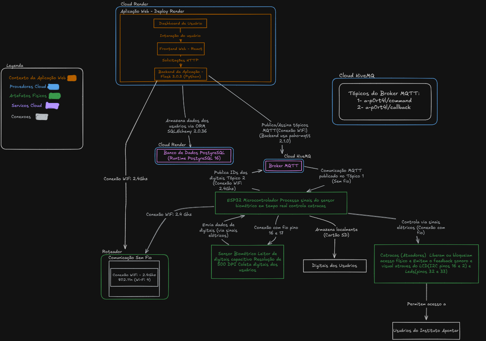
<br />
<br />
<sup>Fonte: Material produzido pelos autores(2024)</sup>
</div>

## Explicação do Diagrama de Arquitetura

### Assista à explicação em vídeo do diagrama de arquitetura e como ele suporta os Requisitos Funcionais [aqui](https://youtu.be/WuGr_YcANOA?feature=shared).

---

### Assista à explicação em vídeo do diagrama de arquitetura e como ele suporta os Requisitos Não Funcionais [aqui](https://youtu.be/OO6IEzx3nrw?feature=shared).

---
**Descrição Geral da Arquitetura:**

1. **Aplicação Web:**
   - **Frontend Web:** Interface acessível aos usuários por meio de navegadores, onde é possível interagir com o sistema, visualizar informações de acesso e gerenciar permissões.
   - **Backend da Aplicação:** Responsável por processar as solicitações do frontend, gerenciar a lógica de negócios e se comunicar com outros componentes, como o banco de dados e o broker MQTT.
   - **Dashboard de Usuário:** Fornece uma visão geral e detalhes específicos sobre o sistema, como status das catracas, logs de acesso e informações dos usuários.

2. **Comunicação via MQTT:**
   - **Broker MQTT:** Atua como intermediário na comunicação entre o backend e os dispositivos ESP32, permitindo a troca de mensagens de forma assíncrona e eficiente.
   - **Conexão WiFi:** Utilizada para estabelecer comunicação sem fio entre o backend, o broker MQTT e os ESP32, facilitando a integração e a escalabilidade do sistema.

3. **Dispositivos de Hardware:**
   - **Microcontrolador ESP32:**
     - Processa os sinais recebidos dos sensores biométricos em tempo real.
     - Controla as catracas, permitindo ou negando o acesso com base na validação das digitais.
     - Armazena localmente as digitais dos usuários para garantir segurança e rapidez no processamento.
     - Comunica-se com o broker MQTT para reportar eventos e receber comandos.
   - **Sensor Biométrico:**
     - Tipo: Leitor de digitais capacitivo com resolução de 500 DPI.
     - Função: Capturar as digitais dos usuários quando interagem com o sistema.
     - Conexão com o ESP32 via comunicação com fio para garantir estabilidade e segurança na transmissão dos dados.
   - **Catracas (Atuadores):**
     - Controladas pelo ESP32 através de sinais elétricos.
     - Função: Liberar ou bloquear o acesso físico dos usuários com base na validação realizada pelo ESP32.

4. **Banco de Dados PostgreSQL:**
   - Armazena as informações dos usuários, exceto as digitais, que permanecem nos ESP32.
   - Gerencia os dados necessários para a operação da aplicação web e histórico de acessos.

5. **Usuários da Plataforma:**
   - Interagem com o sistema através do frontend e do dashboard.
   - Utilizam as catracas para acessar fisicamente o ambiente controlado.

**Conexões entre os Elementos:**

- **Conexões com Fio:**
  - Entre o ESP32, o sensor biométrico e as catracas, garantindo comunicação rápida e confiável.
- **Conexões Sem Fio (WiFi):**
  - Entre o ESP32, o backend e o broker MQTT, permitindo flexibilidade e facilidade na instalação dos dispositivos.
  - Utilizadas para a comunicação MQTT e para a integração com a aplicação web.

**Funcionamento do Sistema:**

- Quando um usuário apresenta sua digital no sensor biométrico, o ESP32 processa o sinal e compara com as digitais armazenadas localmente.
- Se a digital for validada, o ESP32 envia um comando para a catraca liberar o acesso.
- O ESP32 comunica ao broker MQTT o evento de acesso, que por sua vez é recebido pelo backend.
- O backend atualiza o banco de dados PostgreSQL com as informações do evento e disponibiliza os dados no dashboard para visualização pelos usuários autorizados.
- A aplicação web permite o gerenciamento dos usuários, configurando permissões e acessos conforme necessário.

**Benefícios da Arquitetura:**

- **Segurança:** Armazenamento local das digitais nos ESP32 evita a transmissão sensível de dados biométricos pela rede.
- **Escalabilidade:** Utilização do broker MQTT e comunicação sem fio facilita a adição de novos dispositivos e pontos de acesso.
- **Eficiência:** Processamento em tempo real nos ESP32 garante respostas rápidas no controle de acesso.
- **Flexibilidade:** A aplicação web e o dashboard permitem gerenciamento e monitoramento centralizados, com acesso remoto e interface amigável.

## Como a arquitetura suporta os requisitos funcionais e não funcionais?

&nbsp;&nbsp;&nbsp;&nbsp;A arquitetura apresentada foi cuidadosamente projetada para atender aos requisitos funcionais e não funcionais estabelecidos em parceria com o Instituto Apontar. A seguir, detalhamos como cada componente da arquitetura suporta esses requisitos.

---

### Justificativa Requisitos Funcionais
  
&nbsp;&nbsp;&nbsp;&nbsp; As justificativas dos requisitos funcionais definidos no sistema, demonstrando como a arquitetura foi projetada para atender às necessidades técnicas e operacionais serão apresentadas logo abaixo. Cada requisito foi analisado e integrado a soluções tecnológicas específicas, como leitores biométricos, protocolos de comunicação eficientes, e uma infraestrutura de backend. O objetivo é garantir um sistema seguro, confiável e funcional, alinhado às expectativas do projeto e às melhores práticas de desenvolvimento. A seguir, são descritos os mecanismos utilizados para implementação de cada requisito.

### Requisito Funcional RF01 - Suporte à Identificação Biométrica (Leitura Digital)
&nbsp;&nbsp;&nbsp;&nbsp;Como a arquitetura atende este requisito:
Para atender ao RF01, a arquitetura do sistema utiliza uma combinação de hardware (leitor de digitais capacitivo com resolução de 500 DPI), protocolo de comunicação (MQTT) e backend seguindo os seguintes passos e processos:
1. * Hardware : Leitores Biométricos Digitais (Modelo DY50)
O sistema utiliza leitores biométricos de impressão digital conectados via rede Wi-Fi ao servidor backend. Esses dispositivos são responsáveis por capturar a imagem da digital e realizar uma pré-processamento local para extrair as características biométricas.
O leitor biométrico pode operar em dois modos:
Modo Leitura: Para identificação de usuários já cadastrados.
Modo Cadastro: Para inclusão de novas biometrias.
2. Protocolo de Comunicação: MQTT
O protocolo MQTT (Message Queuing Telemetry Transport) foi escolhido pela sua eficiência em comunicações Machine-to-Machine (M2M). Ele substitui o HTTP em situações que exigem baixa latência, baixo consumo de banda e confiabilidade em redes instáveis. Além disso, a escolha do protocolo MQTT é fundamental para o funcionamento eficiente do RF01, pois o MQTT permite comunicação em tempo real e baixo consumo de rede.
O leitor biométrico atua como publisher, enviando mensagens com os dados biométricos capturados para o broker MQTT.
O backend atua como subscriber, recebendo as mensagens com os dados da biometria e processando a identificação.
3. Backend: Após o leitor biométrico identificar o usuário, ele envia ao backend via MQTT informações como identificador único, data e horário do evento, e o resultado da operação. O backend utiliza o identificador para consultar os dados do usuário no banco de dados, registrando os dados do evento.
### RF02 - O sistema deve emitir sinais sonoros e visuais após a identificação.
&nbsp;&nbsp;&nbsp;&nbsp;Feedback Direto ao Usuário: O leitor biométrico possui LEDs e alto-falantes integrados.
Quando o dispositivo envia o resultado da identificação é obtido uma resposta com:
- Luz verde e som de sucesso para identificação bem-sucedida (beep único e longo).
- Luz vermelha e som de falha para identificação malsucedida (Dois beeps curtos e intermitentes, sinalizando o erro).
&nbsp;&nbsp;&nbsp;&nbsp; Na interface visual(LCD), uma mensagem pode ser exibida indicando o status ("Identificação bem-sucedida" ou "Falha na identificação").
### RF03 - O sistema deve permitir o cadastro de novas biometrias, associando-as a um usuário específico.
&nbsp;&nbsp;&nbsp;&nbsp; Fluxo de Cadastro: O administrador inicia o cadastro clicando em "Cadastrar digital" no frontend.
O backend envia um comando via MQTT para o leitor biométrico, ativando o modo de cadastro.
O usuário posiciona o dedo no sensor, que captura a impressão digital e envia as informações (dia e horário) ao backend que envia ao banco de dados.
&nbsp;&nbsp;&nbsp;&nbsp;Confirmação do Cadastro: Após o sucesso ou insucesso do cadastro, o leitor emite um sinal sonoro e visual, e o backend retorna uma mensagem de confirmação para o frontend.
### RF04 - Ao realizar a identificação, o sistema deve registrar informações de entrada/saída.
&nbsp;&nbsp;&nbsp;&nbsp;Registro Automático: Quando o usuário é identificado, o backend registra automaticamente o evento no banco de dados. As informações registradas incluem:
- Nome completo do usuário
- Data e hora do evento
- Tipo de evento (Entrada ou Saída)
e armazenamento e Consulta: Os registros são armazenados no banco de dados e podem ser consultados posteriormente via interface administrativa.
### RF05 - O sistema deve disponibilizar uma plataforma online para acesso e visualização das informações.
- Interface Web Responsiva: O sistema possui um frontend desenvolvido para ser acessível em diferentes dispositivos (desktop, tablet, celular). A interface permite visualizar registros de presença, cadastros de usuários e relatórios.
- O backend expõe uma API RESTful para consulta de dados. O administrativo pode acessar endpoints para listar usuários, visualizar registros e exportar dados para relatórios.
- Filtros e Relatórios: O sistema permite aplicar filtros (por data, usuário, tipo de evento).
### RF06 - O sistema deve permitir a cada leitor biométrico realizar cadastros e leitura de biometrias.
&nbsp;&nbsp;&nbsp;&nbsp; Troca de Modos Dinâmica: O leitor biométrico pode alternar entre "Modo Leitura" e "Modo Cadastro".
O backend controla o modo do dispositivo via MQTT, enviando comandos específicos:
- Comando de cadastro: Ativa o modo de captura de nova biometria
- Comando de leitura: Retorna ao modo de leitura para identificação.
### RF07 - O sistema deve armazenar dados de forma segura e disponível continuamente.
&nbsp;&nbsp;&nbsp;&nbsp; A equipe está utilizando o Render como solução de banco de dados, uma plataforma conhecida por oferecer segurança e disponibilidade para armazenamento de informações. O Render implementa medidas de segurança, como criptografia em trânsito e em repouso, protegendo os dados contra acessos não autorizados. Além disso, ele segue padrões como TLS/SSL para comunicação segura, garantindo que todas as interações entre o backend e o banco de dados sejam criptografadas.
&nbsp;&nbsp;&nbsp;&nbsp; O Render também oferece backups automáticos e replicação de dados em diferentes regiões, o que assegura a continuidade do serviço em caso de falhas ou desastres. Essas funcionalidades, combinadas com seu gerenciamento simplificado e suporte a conformidade com regulamentações de proteção de dados, tornam o Render uma escolha confiável e segura para armazenar informações sensíveis.

---

### **Requisitos Não Funcionais**


#### RNF01 - Feedback tátil para o usuário (Usabilidade)
&nbsp;&nbsp;&nbsp;&nbsp; O microcontrolador ESP32 é integrado ao leitor biométrico, LEDs e buzzer, permitindo que o dispositivo forneça feedback tátil, visual e sonoro. O LCD exibe mensagens de sucesso ou de erro, garantindo engajamento do usuário e prevenção de erros. A interação com o Broker MQTT permite que o feedback esteja sincronizado com o sistema web, ampliando a usabilidade por meio de notificações na plataforma A-Portal.

#### RNF02 - Fácil instalação e modularidade (Manutenção)
&nbsp;&nbsp;&nbsp;&nbsp; O ESP32 é modular e oferece integração fácil com periféricos. Os componentes (como LED, buzzer e display LCD) podem ser desconectados ou substituídos sem comprometer o funcionamento geral do sistema. A comunicação sem fio (Wi-Fi) simplifica a instalação, eliminando a necessidade de conexões físicas complexas.

#### RNF03 - Compatibilidade com dispositivos desktop e mobile (Portabilidade)
&nbsp;&nbsp;&nbsp;&nbsp; A arquitetura inclui um Dashboard responsivo acessível por dispositivos desktop e móveis, com suporte para múltiplos navegadores, pois não utiliza recurso nativos de um sistema operacional. A escolha de frameworks para o front-end, para o back-end em conjunto com a comunicação assíncrona com o Broker MQTT garantem a portabilidade e desempenho consistente em diferentes plataformas.

#### RNF04 - Segurança dos dados através de criptografia (Segurança)
&nbsp;&nbsp;&nbsp;&nbsp; A comunicação entre o microcontrolador, Broker MQTT e o servidor utiliza tópicos MQTT de forma que somente subscribers terão acesso aos dados adicionados a cada Tópico, além disso, operarão com criptografia SSL. Toda informação transmitida tanto entre o microcontrolador e o Broker, quanto entre o Broker e o servidor, é criptografada antes de ser enviada, no próprio ESP32, garantindo a segurança dos dados.

#### RNF05 - Operação sem gargalos para 500 usuários (Eficiência de desempenho)
&nbsp;&nbsp;&nbsp;&nbsp; A arquitetura adota o ESP32, um microcontrolador de alto desempenho, e o Broker MQTT, conhecido por ser leve e escalável. Essa escolha permite que o sistema suporte um grande número de mensagens simultâneas entre dispositivos IoT e o servidor, garantindo a performance desejada para o Instituto Apontar.

#### RNF06 - Acesso autenticado aos dados (Confidencialidade)
&nbsp;&nbsp;&nbsp;&nbsp; A plataforma web (A-Portal) exige autenticação para que os usuários (administradores) acessem os dados dos alunos e funcionários cadastrados. O Broker MQTT, em conjunto com o servidor, garante que apenas dispositivos autorizados possam se conectar e trocar mensagens, protegendo a confidencialidade dos dados.

#### RNF07 - Disponibilidade e recuperação em caso de falha (Confiabilidade)
&nbsp;&nbsp;&nbsp;&nbsp; O sistema é projetado para operar mesmo em condições de ausência de rede wi-fi. O microcontrolador ESP32 pode armazenar dados localmente quando a conexão com o servidor é interrompida, sincronizando-os automaticamente quando a conexão é restabelecida. O Broker MQTT armazena mensagens em tópicos, permitindo recuperação de estados e continuidade de operação.

---

### **Conclusão**

A arquitetura detalhada atende aos requisitos funcionais ao:

- **Fornecer identificação biométrica segura e eficiente** através do uso de sensores biométricos conectados aos ESP32.
- **Garantir feedback ao usuário** com a possibilidade de adicionar sinais sonoros e visuais, mantendo o usuário informado sobre o status das operações.
- **Permitir cadastro e gerenciamento de usuários** com integração entre os dispositivos IoT e a aplicação web, facilitando o controle e a administração.
- **Registrar e disponibilizar informações de entrada/saída** para monitoramento eficaz da frequência e presença dos alunos.

&nbsp;&nbsp;&nbsp;&nbsp;Além disso, os requisitos não funcionais são atendidos por meio de:

- **Arquitetura modular e escalável**, que facilita manutenção, upgrades e expansões futuras.
- **Implementação de medidas de segurança robustas**, protegendo os dados contra acessos não autorizados e vazamentos.
- **Desempenho eficiente**, garantindo operação fluida mesmo com um grande número de usuários.
- **Confiabilidade e disponibilidade**, assegurando que o sistema permanece operacional e recupera-se rapidamente em caso de falhas.

&nbsp;&nbsp;&nbsp;&nbsp;Em suma, a arquitetura proposta não apenas atende às necessidades funcionais imediatas do projeto, mas também incorpora práticas e componentes que asseguram a qualidade, segurança e sustentabilidade do sistema a longo prazo, alinhando-se com os objetivos estratégicos e operacionais do Instituto Apontar.

### 3.3.4.1. Arquitetura de Funcionamento do Sensor de Digitais DY50:

### 1. **Visão Geral do DY50**

&nbsp;&nbsp;&nbsp;&nbsp;O sensor DY50 é um módulo biométrico para captura de impressões digitais, comumente usado em aplicações de segurança, como travas biométricas, sistemas de controle de acesso, entre outros. É um dispositivo que combina hardware de leitura com um microcontrolador interno, permitindo um processamento inicial das digitais.

### 2. **Componentes Principais do DY50**

- **Sensor Óptico de Impressão Digital**: O núcleo do DY50 é o sensor óptico, responsável por capturar a imagem da digital. Este sensor gera uma imagem bidimensional da impressão digital que será processada pelo microcontrolador embutido.
  
- **Microcontrolador Integrado**: O DY50 possui um microcontrolador embutido que processa os dados da impressão digital. Ele realiza funções como captura, identificação e comparação, permitindo que o módulo funcione de forma independente sem necessidade de um processamento adicional por um microcontrolador externo.

- **Memória Integrada**: O DY50 possui uma memória onde as impressões digitais registradas podem ser armazenadas. Essa memória é utilizada para cadastrar, excluir e identificar impressões digitais, com capacidade para armazenar entre 100 a 1.000 digitais, dependendo do modelo e das configurações. Para comportar a demanda do projeto iremos adicionar um cartão de memória adicional, com espaco para 64gb de armazenamento fazendo com que conseguiriamos armazenar as digitais apenas no DY50 e ESP32.

- **Interface de Comunicação**: O módulo DY50 possui uma interface serial UART para comunicação com outros dispositivos (como microcontroladores ou computadores). Essa interface permite a troca de comandos e dados entre o DY50 e um dispositivo controlador.

### 3. **Arquitetura de Funcionamento**

#### **Camadas e Componentes da Arquitetura**

1. **Camada de Captura**:
   - **Sensor Óptico**: Captura a imagem da digital do usuário.
   - **Microcontrolador Integrado**: Recebe a imagem e inicia o processo de extração de dados biométricos (minúcias).

2. **Camada de Processamento**:
   - **Processamento de Minúcias**: O microcontrolador embutido processa a imagem capturada e extrai pontos-chave (minúcias) da digital.
   - **Conversão e Armazenamento**: As minúcias são convertidas em dados que podem ser armazenados e comparados.
   - **Comparação de Impressões Digitais**: Em modo de verificação, a digital capturada é comparada com as digitais armazenadas na memória para autenticação.

3. **Camada de Comunicação**:
   - **UART**: A comunicação ocorre via UART, que permite ao DY50 enviar e receber comandos para um dispositivo controlador, como um microcontrolador externo.
   - **Comandos**: Comandos de registro, verificação, exclusão e consulta são enviados através do UART em um formato específico. Cada comando possui um código único para interação.

4. **Camada de Armazenamento e Gerenciamento**:
   - **Memória Interna**: A memória interna pode armazenar várias impressões digitais, organizadas em IDs específicos para rápida consulta e verificação.
   - **Gerenciamento de Digital**: Cada digital pode ser cadastrada, removida ou atualizada no sistema. O gerenciamento das digitais armazenadas é feito com comandos específicos que acessam a memória interna.

### 4. **Fluxo de Comunicação e Protocolos**

O DY50 utiliza um protocolo de comunicação serial, onde um microcontrolador envia e recebe pacotes específicos para interagir com o sensor. 

- **Comandos Principais**:
  - **ENROLL**: Comando para registrar uma nova digital. Envolve várias etapas, incluindo captura, verificação e armazenamento.
  - **MATCH**: Comando para comparar uma digital recém-capturada com as armazenadas.
  - **DELETE**: Permite excluir uma digital registrada.
  - **SEARCH**: Procura por uma digital na memória a partir de uma impressão fornecida.
  - **GET IMAGE**: Captura a imagem da digital (para fins de depuração ou armazenamento externo).

- **Formato de Pacotes**:
  - Cada comando é enviado em um pacote de dados contendo um cabeçalho, um código de comando, dados adicionais (se necessário) e um valor de checksum para garantir a integridade dos dados.

### 5. **Conexão com Microcontroladores Externos**

&nbsp;&nbsp;&nbsp;&nbsp;Para integrar o DY50 a um microcontrolador, é necessário conectar o pino de comunicação UART (TX e RX) do DY50 ao controlador, além do VCC e GND. Em alguns casos, resistores de pull-up podem ser usados para estabilizar a comunicação.

#### Exemplo de Fluxo de Operação

1. **Início do Processo**:
   - O controlador externo envia um comando de captura de digital ao DY50.
   
2. **Captura e Processamento**:
   - O DY50 captura a digital e processa a imagem para extrair as minúcias.

3. **Comparação/Registro**:
   - A impressão digital capturada pode ser comparada com as digitais armazenadas (MATCH) ou registrada em um novo slot de memória (ENROLL).

4. **Resposta e Feedback**:
   - O DY50 responde ao controlador com um status de sucesso ou erro, dependendo do resultado do comando.

### 6. **Segurança e Desempenho**

- **Criptografia e Segurança**: O DY50 oferece um nível básico de segurança, adequado para sistemas de baixo a médio nível de exigência. Ele não implementa criptografia avançada nas minúcias, mas usa uma abordagem de processamento interno seguro.
  
- **Desempenho**: A velocidade de reconhecimento é rápida o suficiente para a maioria das aplicações comerciais. Porém, em sistemas críticos, pode ser necessário um microcontrolador externo com maior poder de processamento para auxiliar na autenticação ou reforçar a segurança.

&nbsp;&nbsp;&nbsp;&nbsp; A seguir temos uma tabela que descreve um o que foi abordado:

<br>

---

<br>

### Características do sensor DY50

| **Especificação**                  | **Descrição**                                                                                 |
|------------------------------------|-----------------------------------------------------------------------------------------------|
| **Tensão de Alimentação**          | 3V a 6V / 3.3V                                                                               |
| **Corrente de Alimentação**        | <120mA                                                                                       |
| **Pico de Corrente**               | <140mA                                                                                       |
| **Tempo de Captura de Imagem**     | <1.0 segundos                                                                               |
| **Dimensões da Janela**            | 14 x 18 mm                                                                                   |
| **Modo de Correspondência**        | (1:1)                                                                                         |
| **Modo de Pesquisa**               | (1:N)                                                                                         |
| **Arquivo Principal**              | 256 bytes                                                                                    |
| **Arquivo de Modelos**             | 512 bytes                                                                                    |
| **Capacidade de Armazenamento**    | 162 impressões digitais                                                                      |
| **Nível de Segurança**             | 5 níveis (do mais baixo para o mais alto: 1,2,3,4,5)                                        |
| **Taxa de Falsa Aceitação (FAR)**  | <0,001% (nível de segurança 3)                                                               |
| **Taxa de Falsa Rejeição (FRR)**   | <1,0% (nível de segurança 3)                                                                 |
| **Tempo de Pesquisa**              | <1.0 segundos (1:500, em média)                                                              |
| **Interface de Comunicação**       | UART (nível lógico TTL) ou USB2.0/USB1.1                                                     |
| **Baud Rate da Comunicação (UART)**| (9600 x N) bps, onde N = 1 ~ 12 (valor padrão N = 6, ou seja, 57600bps)                      |
| **Ambiente de Operação**           | Temperatura: -20°C a +50°C; Umidade relativa: 40% a 85% (sem condensação)                    |
| **Ambiente de Armazenamento**      | Temperatura: -40°C a +85°C; Umidade relativa: < 85% (sem condensação)                        |
| **Dimensões Físicas**              | 56 x 20 x 21.5 mm                                                                            |

### 3.3.4.2. Arquitetura do Display:

&nbsp;&nbsp;&nbsp;&nbsp;O display LCD (Liquid Crystal Display) é um dispositivo que utiliza cristais líquidos para exibir informações visuais, sendo amplamente utilizado em sistemas embarcados por sua eficiência e facilidade de integração. No projeto, o display LCD terá a função de comunicar informações importantes aos usuários sobre o status do dispositivo, garantindo uma interação clara e eficiente.
&nbsp;&nbsp;&nbsp;&nbsp;O display exibirá mensagens como:
- "Insira sua digital", "Aguarde" e "Acesso liberado", indicando o fluxo normal do processo.
- Mensagens negativas, como "Sistema indisponível" e "Acesso negado", para situações em que ocorra algum problema ou falha na autenticação.
&nbsp;&nbsp;&nbsp;&nbsp;Além disso, o display será essencial durante o processo de cadastro de biometrias, exibindo mensagens como:
- "Modo de cadastro ativado", "Insira seu dedo", "Cadastro realizado com sucesso", e "Modo de cadastro desativado".
- Em caso de falha, o usuário verá a mensagem "Cadastro não realizado".
&nbsp;&nbsp;&nbsp;&nbsp;Essas mensagens guiarão o usuário durante sua interação com o dispositivo, evitando mal-entendidos e melhorando a experiência de uso.
&nbsp;&nbsp;&nbsp;&nbsp;Para melhorar ainda mais a comunicação, o display LCD utilizará cores e ícones específicos para cada situação, como:
- Aguarde: ícone de relógio ou espera.
- Acesso liberado: cor verde e ícone de "OK".
- Acesso negado: cor vermelha e ícone de "X".
- Modo de cadastro: ícone de digital, indicando que o usuário deve inserir o dedo.
- Sistema indisponível: ícone de alerta, destacando a inoperabilidade.
&nbsp;&nbsp;&nbsp;&nbsp;Esse cuidado com a apresentação visual e a padronização das mensagens proporcionará uma experiência consistente e intuitiva, reduzindo contratempos e facilitando a compreensão do status do dispositivo pelo usuário. Além disso, ao adotar cores e ícones padronizados, garantimos uma comunicação eficaz, mesmo em situações de erro, reforçando a confiabilidade e a usabilidade do sistema.

### 3.3.4.3. Arquitetura de Atuadores do Sistema
---


No seu sistema de controle de acesso, os atuadores são divididos em duas categorias principais:

1. **Atuadores de Ação Física**: Controlam o movimento da catraca, permitindo ou restringindo o acesso.
2. **Atuadores de Feedback Visual**: Proporcionam um retorno visual ao usuário sobre o status do sistema e a verificação da digital.

---

### 1. Atuador de Ação Física

| **Componente** | **Descrição**                       | **Função**                   | **Condições de Atuação**                      |
|----------------|-------------------------------------|------------------------------|-----------------------------------------------|
| **Catraca**    | Trava ou libera a passagem          | Controla o acesso físico     | Libera acesso se a digital for reconhecida    |

- **Descrição**: A catraca é acionada para permitir ou restringir o acesso, dependendo da verificação da impressão digital.
- **Comando de Liberação**: Quando uma digital é reconhecida, um sinal é enviado ao atuador da catraca para liberá-la.
- **Comando de Restrição**: Se a digital não for reconhecida, a catraca permanece bloqueada.

---

### 2. Atuadores de Feedback Visual

Os atuadores de feedback visual incluem o LCD e LEDs de status, que comunicam o estado do sistema e do processo de autenticação ao usuário. Esses atuadores não têm função de alterar o ambiente físico, mas são essenciais para a interação com o usuário.

#### a. LCD para Feedback da Digital

| **Componente** | **Descrição**                            | **Função**                                | **Condições de Atuação**                                |
|----------------|------------------------------------------|-------------------------------------------|---------------------------------------------------------|
| **LCD**        | Exibe mensagens de reconhecimento        | Informa se a digital foi reconhecida ou não | Mostra "Digital reconhecida" ou "Digital não reconhecida"|

- **Descrição**: O LCD é utilizado para exibir o resultado do reconhecimento da digital.
- **Mensagens Exibidas**:
  - **"Digital reconhecida"**: Exibido se a digital for validada e a catraca for liberada.
  - **"Digital não reconhecida"**: Exibido se a digital não for validada, indicando acesso negado.

#### b. LEDs de Sinalização de Status do Sistema

| **Cor do LED** | **Descrição**                            | **Função**                                  | **Condições de Atuação**                         |
|----------------|------------------------------------------|---------------------------------------------|--------------------------------------------------|
| **Azul**       | Indica que o sistema está ligado         | Sinalização de status de energia            | LED azul fica aceso enquanto o sistema está ligado |
| **Azul Piscante** | Modo de gravação de novas digitais      | Informa ao usuário que está no modo de gravação | LED azul pisca quando o sistema está no modo de gravação |
| **Amarelo**    | Indica conexão ao Wi-Fi                  | Sinaliza que o sistema está conectado       | LED amarelo acende quando o sistema se conecta ao Wi-Fi |

- **Descrição**: Esses LEDs indicam o status operacional do sistema.
- **Funções dos LEDs**:
  - **LED Azul**: Indica que o sistema está ligado. Se está aceso, o sistema está funcionando; se piscar, indica o modo de gravação de digitais.
  - **LED Amarelo**: Indica que o sistema está conectado ao Wi-Fi.


#### c. LEDs para Feedback de Verificação da Digital

| **Cor do LED** | **Descrição**                              | **Função**                                | **Condições de Atuação**                           |
|----------------|--------------------------------------------|-------------------------------------------|----------------------------------------------------|
| **Verde**      | Digital reconhecida                        | Indica que o acesso foi liberado          | Acende quando a digital é validada                 |
| **Vermelho**   | Digital não reconhecida                    | Indica que o acesso foi negado            | Acende quando a digital não é reconhecida          |

- **Descrição**: Os LEDs verde e vermelho fornecem feedback instantâneo ao usuário sobre o resultado da verificação da digital.
- **Condições de Atuação**:
  - **LED Verde**: Acende quando a digital é reconhecida, indicando que a catraca será liberada.
  - **LED Vermelho**: Acende quando a digital não é reconhecida, indicando que o acesso foi negado.

---
&nbsp;&nbsp;&nbsp;&nbsp;A seguir temos uma tabela que ilustra um resumo da solução:


### Resumo da Arquitetura dos Atuadores:


| **Categoria**           | **Atuador**       | **Função**                          | **Descrição**                                       |
|-------------------------|-------------------|-------------------------------------|-----------------------------------------------------|
| **Ação Física**         | Catraca           | Controla o acesso físico            | Libera a passagem ao reconhecer a digital           |
| **Feedback Visual**     | LCD               | Exibe status de reconhecimento      | Mostra "Digital reconhecida" ou "Digital não reconhecida" |
| **Feedback Visual**     | LED Azul          | Indica sistema ligado e modo gravação | Aceso indica sistema ligado; piscar indica gravação de digital |
| **Feedback Visual**     | LED Amarelo       | Indica conexão Wi-Fi               | Aceso quando o sistema está conectado ao Wi-Fi      |
| **Feedback de Digital** | LED Verde         | Indica acesso liberado              | Aceso ao reconhecer a digital                       |
| **Feedback de Digital** | LED Vermelho      | Indica acesso negado                | Aceso ao não reconhecer a digital                   |

---

### Observações de Implementação

1. **Coordenação dos Atuadores**: O controle dos LEDs, LCD e da catraca deve ser coordenado para que a informação seja exibida ao usuário de forma clara e em tempo real.
2. **Indicação de Modos**: O LED azul que pisca para o modo de gravação facilita o entendimento dos modos operacionais pelo usuário.
3. **Sincronização dos Feedbacks**: Certifique-se de que o LED verde/vermelho e a mensagem no LCD sejam atualizados simultaneamente para uma experiência consistente.

---


#### 3.3.4.4 Arquetura dos Microcontroladores:
&nbsp;&nbsp;&nbsp;&nbsp; O projeto inclui o uso de um microcontrolador para controlar os dispositivos de entrada e saída, bem como processar os dados  e a comunicação com o servidor e o Broker MQTT. O microcontrolador ESP32 WROOM 32 Devkit foi escolhido porque possui integração fácil com um grande número de periféricos, bem como capacidade de comunicação Wi-Fi e Bluetooth e de customização de propriedades como clock da CPU, Flash Frequency, Flash Mode, Flash Size, Partition Scheme, Upload Speed, Core Debug Level, PSRAM, entre outros. O microcontrolador é responsável por controlar o leitor biométrico, o display LCD, buzzer e LEDs, bem como por se comunicar com o broker MQTT para enviar e receber mensagens. O ESP32 WROOM 32 Devkit é um microcontrolador de baixo custo e alto desempenho, que atende aos requisitos do projeto.

&nbsp;&nbsp;&nbsp;&nbsp; O microcontrolador é responsável por controlar os dispositivos de entrada e saída, bem como processar os dados biométricos. Ele terá duas funções 
principais: A leitura da biometria com comparação dos dados armazenados localmente e o cadastro de novas biometrias com envio dos dados para o Broker MQTT. 
- Para a leitura de biometria, haverá um sensor biométrico conectado ao microcontrolador, que será responsável por capturar a digital do usuário e, assim, possibilitar a 
comparação com os dados armazenados no ESP32. Assim que uma biometria for detectada pelo sensor, o microcontrolador irá processar o o dado biométrico recebido pelo sensor e compará-lo com os dados armazenados 
localmente. Caso a biometria seja reconhecida, o microcontrolador irá acionar o display LCD para exibir uma mensagem de acesso permitido, irá acionar o atuador da catraca para permitir o acesso do usuário e o buzzer para emitir um feedback sonoro. Caso a biometria não seja reconhecida, o microcontrolador irá acionar o display LCD para exibir uma mensagem de acesso negado e acionar o buzzer para emitir um sinal sonoro. Em ambos os casos, o microcontrolador enviará uma requisição HTTP para o servidor, informando o ID (caso a biometria seja reconhecida) ou a mensagem de erro (caso a biometria não seja reconhecida).
- Para o cadastro de novas biometrias, o microcontrolador irá ouvir uma alteração no tópico do Broker MQTT no qual está inscrito e, ao ler uma mensagem de cadastro, irá ativar o modo de cadastro de biometrias. Após o sensor detectar uma inserção, o microcontrolador irá salvar a nova biometria localmente e enviar uma mensagem de confirmação para o Broker MQTT, informando que a biometria foi cadastrada com sucesso e, em seguida, retornará ao modo de leitura de biometrias. Assim, bastará que o administrador atualize a página da plataforma Web para visualizar a nova biometria cadastrada. Desse modo, a arquitetura de solução permitirá que um administrador com acesso à plataforma Web possa ativar o modo de cadastro de biometrias remotamente, sem a necessidade de comunicação direta com o dispositivo IoT, o que aumenta a segurança dos dados biométricos e a performance de salvamento dos dados enviados pelo servidor e pelo microcontrolador.

### 3.3.4.5 Arquitetura das ligações dos elementos (com e sem fio)

&nbsp;&nbsp;&nbsp;&nbsp;O dispositivo IoT integra componentes de conectividade sem fio, comunicação I2C e entradas e saídas digitais para fornecer um sistema de controle e monitoramento. Ele inclui um display LCD para mensagens ao usuário, uma conexão WiFi para conectividade de rede, um sensor biométrico e um botão de ajuda para interações de segurança e assistência, além de LEDs indicadores e um buzzer para feedback visual e sonoro.

#### Conexões sem fio
1. **Conexão WiFi** - Componente: `WiFiManager`


**Descrição:** A conexão WiFi é usada para integrar o dispositivo à rede local, permitindo que ele acesse serviços remotos ou troque dados pela internet. Para isso, o dispositivo utiliza a biblioteca `WiFi.h`, conectando-se automaticamente à rede especificada no código. A rede WiFi é definida pelas constantes SSID e PASS.

**Configurações e Parâmetros:**

- `SSID`: Nome da rede WiFi.
- `PASS`: Senha da rede WiFi.

**Fluxo de Conexão:**
- O método `connect` inicia a conexão chamando `WiFi.begin()`, passando o nome da rede e a senha.
- O método `verifyConnection` verifica periodicamente o status da conexão através de `WiFi.status()`. Esse método permite que o dispositivo alterne o estado do LED WiFi `(WIFI_LED)` conforme o status da conexão:
	- Conectado: O LED permanece aceso para indicar uma conexão ativa.
	-  Desconectado: O LED pisca periodicamente para indicar que o dispositivo está tentando se conectar.

**Propósito:** A conexão WiFi é crítica para a funcionalidade do dispositivo, permitindo que ele se comunique com redes externas, o que pode ser essencial para notificações, atualizações de status em tempo real ou envio de alertas


#### Conexões com fio
1. **Display LCD (Protocolo I2C)** - Componente: LCD

**Descrição:** O display LCD é usado para exibir mensagens contextuais e interativas, fornecendo feedback direto ao usuário sobre o status e ações do sistema.

**Configurações e Parâmetros:**

- I2C_ADDR: Endereço I2C do display LCD (padrão 0x27).
- Pinos de Conexão:
	- `SDA_PIN` (21): Pino de dados.
	- `SCL_PIN` (22): Pino de clock.

**Fluxo de Operação:**
- A classe LCD é responsável pela inicialização e controle do display, utilizando o protocolo I2C para comunicação.
- Funções de Exibição: Mensagens são exibidas conforme o estado e os eventos, como:
	- showConnectingMessage: Mostra o SSID ao tentar conectar-se à rede WiFi.
	- showWelcomeMessage: Solicita que o usuário interaja com o sensor biométrico.
	- showAccessGranted: Confirma o acesso autorizado ao usuário.
	- showHelpMessage e showWaitMessage: Informam o usuário sobre o status das solicitações de ajuda.

**Propósito:** O display LCD é um meio essencial de comunicação entre o sistema e o usuário, facilitando interações e garantindo uma experiência de usuário intuitiva.


**2. Sensor Biométrico** - Componente: `SensorManager`

**Descrição:** O sensor biométrico é um sensor de entrada conectado ao pino `BIOMETRIC_SENSOR` (2). Ele permite a verificação de acesso, possibilitando que o sistema identifique o usuário por meio de leitura biométrica.

**Fluxo de Operação:**

- A função pressBiometricSensor monitora o estado do sensor.
- Quando ativado, o sistema:
	- Exibe uma mensagem de verificação de biometria no LCD.
	- Emite um alerta sonoro no buzzer para indicar o processamento.
	- Exibe a mensagem de acesso autorizado (`showAccessGranted`) caso a verificação seja bem-sucedida.

**Propósito:** O sensor biométrico aumenta a segurança do sistema ao autenticar o usuário antes de conceder acesso.


**3. Botão de Ajuda** - Componente: `SensorManager`

**Descrição:** O botão de ajuda permite que o usuário solicite assistência imediata. Está conectado ao pino `HELPER_BUTTON` (4).

**Fluxo de Operação:**

- A função `pressHelpButton` monitora o estado do botão.
- O sistema verifica o tempo desde a última solicitação de ajuda e determina se o botão pode ser acionado novamente.
- Quando pressionado, o dispositivo:
	- Exibe uma mensagem de solicitação de ajuda no LCD.
	- Ativa um alerta sonoro no buzzer, indicando que a solicitação foi enviada.
	- Se o botão for pressionado novamente antes de um intervalo de espera (15 segundos), o LCD exibe uma mensagem de espera (`showWaitMessage`).

**Propósito:** O botão de ajuda fornece um recurso de segurança adicional, permitindo que o usuário acione rapidamente um pedido de assistência em situações emergenciais.

**4. Buzzer** - Componente: SensorManager

**Descrição:** O buzzer é um atuador conectado ao pino `BUZZER` (23) que emite sinais sonoros para notificar o usuário sobre eventos específicos, como a verificação biométrica e a solicitação de ajuda.

**Fluxo de Operação:**

- O método `buzz` controla o som do buzzer, acionando-o em diferentes padrões dependendo do contexto:
	- Breve sinal sonoro após a verificação biométrica.
	- Padrão sonoro específico para indicar uma solicitação de ajuda.

**Propósito:** O buzzer serve como feedback auditivo, reforçando visualmente as mensagens no display e fornecendo uma confirmação adicional ao usuário.

**5. LEDs Indicadores** 

**Descrição:** Há dois LEDs no sistema:

- LED de Status Geral (`ON_LED`): Conectado ao pino 33, indica que o dispositivo está ligado.
- LED de WiFi (`WIFI_LED`): Conectado ao pino 32, reflete o status da conexão WiFi.
  
**Fluxo de Operação:**

- LED de WiFi: Gerenciado pelo método `verifyConnection` da classe `WiFiManager`. O LED é configurado para:
	- Ficar aceso quando a conexão WiFi é bem-sucedida.
	- Piscar quando o dispositivo está tentando se conectar à rede.

**Propósito:** Os LEDs fornecem um feedback visual rápido ao usuário, permitindo monitorar o estado de conexão e o status de operação do dispositivo.


#### 3.3.4.6 Broker MQTT e Dashboard
&nbsp;&nbsp;&nbsp;&nbsp; O Broker MQTT é responsável por intermediar a comunicação entre o microcontrolador e o servidor, permitindo que o microcontrolador envie e receba mensagens de forma assíncrona. Essa comunicação é essencial para o funcionamento do sistema, pois permite que o microcontrolador envie mensagens de leitura (como o envio do ID de um novo acesso) e cadastro de biometrias para o servidor, bem como receba mensagens de ativação do modo de cadastro de biometrias. Além disso, o Broker MQTT possui a capacidade de armazenar mensagens em tópicos, o que permite que o servidor ouça as mensagens enviadas pelo microcontrolador e atualize o banco de dados com as novas biometrias cadastradas. Ele também possui a propriedade de ser um servidor leve e de baixo consumo de energia, o que o torna ideal para aplicações IoT.

&nbsp;&nbsp;&nbsp;&nbsp; O Dashboard é a interface do usuário, que permitirá que o administrador ative o modo de cadastro de biometrias remotamente, sem a necessidade de comunicação direta com o dispositivo IoT. Através do Dashboard, o administrador poderá visualizar as biometrias cadastradas, acessar informações gerais dos usuários (como presenças e faltas dos alunos), bem como ativar e desativar o modo de cadastro de biometrias. O Dashboard será uma aplicação web responsiva, que poderá ser acessada de qualquer dispositivo com acesso à internet, o que melhorará a usabilidade e a acessibilidade da solução.

### Conclusão

&nbsp;&nbsp;&nbsp;&nbsp;Portanto, a arquitetura proposta integra de forma eficiente sensores, atuadores e microcontroladores para criar um sistema de controle de acesso, atendendo plenamente aos requisitos funcionais e não funcionais do projeto. Com soluções de captura biométrica avançadas, interfaces de feedback visual e sonoro, conectividade sem fio, e gestão integrada via IoT, o sistema proporciona segurança, confiabilidade e uma experiência de uso intuitiva. Sua estrutura modular e escalável garante flexibilidade para futuras expansões, enquanto a implementação de medidas de segurança e sincronização eficaz entre os componentes assegura o desempenho e a proteção dos dados. Assim, a solução atende às demandas operacionais do Instituto Apontar, alinhando inovação tecnológica com excelência funcional.

# <a name="c22"></a> 3.3.5. Arquitetura da Solução

&emsp;&emsp;Nessa seção, a arquitetura refinada da solução será abordada, utilizando-se de tabela para indicação dos componentes eletrônicos empregados na solução, assim como, detalhes técnicos e sua função principal. Além disso, esta seção também inclui um vídeo explicativo para a arquitetura refinada da solução, detalhando componente a componente, suas funções e o fluxo de informações.<br/>
&emsp;&emsp;Portanto, segue a tabela detalhada dos componentes presentes na arquitetura, acompanhados de seus papéis e detalhes técnicos:

<div align="center">
<sup>Quadro - Tabela de componenentes presentes na arquitetura</sup>

| **Categoria**           | **Componente**              | **Descrição**                                                                                                                                                       | **Função**                                                                                   | **Condições de Atuação**                                                                 |
|-------------------------|-----------------------------|-------------------------------------------------------------------------------------------------------------------------------------------------------------------|---------------------------------------------------------------------------------------------|------------------------------------------------------------------------------------------|
| **Sensor**              | Sensor digital biométrico DY50 | Sensor de impressão digital óptico, com comunicação serial e memória flash para armazenamento de até 257 templates de digitais                                   | - Capturar templates de biometrias para autenticação de usuários com digitais cadastradas.<br>- Capturar templates de novas biometrias para cadastro de novos usuários. | As informações processadas pelo sensor DY50 serão templates das digitais, armazenados na memória flash do ESP32. |
| **Ação Física**         | Catraca                     | Dispositivo mecânico motorizado para controle de passagem física, acionado por comando digital via microcontrolador                                              | - Liberar ou travar a passagem de pessoas dependendo da validação da digital.<br>- Garantir controle físico de acesso em ambientes restritos. | Operada eletronicamente após autenticação bem-sucedida ou falha de autenticação.         |
| **Feedback Visual**     | LCD                         | Display de cristal líquido de 16x2 caracteres, controlado por interface I2C, para exibição de mensagens                                                         | - Mostrar mensagens de status, como "Acesso liberado", "Acesso negado" ou "Conectando ao sistema Wi-Fi". | Operado continuamente para fornecer feedback em tempo real aos usuários.                |
| **Feedback Visual**     | LED Azul                    | Diodo emissor de luz azul de alta intensidade                                                                              | - Indicar status do sistema ativo.<br>- Piscar em modo de gravação ou configuração.          | Alimentado por GPIO do ESP32, com controle lógico baseado em estados do sistema.        |
| **Feedback Visual**     | LED Amarelo                 | Diodo emissor de luz amarelo de alta intensidade                                                                           | - Indicar status de conexão Wi-Fi.<br>- Aceso quando conectado ao Wi-Fi.                    | Alimentado por GPIO do ESP32, com controle lógico baseado em conectividade.             |
| **Feedback Visual**     | LED Verde                   | Diodo emissor de luz verde de alta intensidade                                                                             | - Indicar validação bem-sucedida da digital.<br>- Aceso quando acesso é permitido.           | Alimentado por GPIO do ESP32, controlado por validação no software do sistema.          |
| **Feedback Visual**     | LED Vermelho                | Diodo emissor de luz vermelho de alta intensidade                                                                          | - Indicar falha na validação da digital.<br>- Aceso quando acesso é negado.                  | Alimentado por GPIO do ESP32, controlado por validação no software do sistema.          |
| **Microcontrolador**    | ESP32 WROOM 32 Devkit       | Microcontrolador com CPU dual-core, conectividade Wi-Fi e Bluetooth, e 16 MB de memória flash                                                                     | - Processar biometrias, controlar atuadores e exibir feedback.<br>- Comunicar com o Broker MQTT para autenticação e monitoramento. | Gerenciar todos os dispositivos e realizar processamento centralizado do sistema.       |
| **Alerta Sonoro**       | Buzzer                     | Atuador sonoro piezoelétrico controlado por PWM                                                                            | - Emitir sons para alertas, como erros de autenticação, inicialização do sistema ou acesso liberado. | Alimentado por GPIO do ESP32, controlado por estados do software do sistema.            |
| **Controle Manual**     | Botão Reset                | Botão tátil momentâneo, conectado ao microcontrolador                                                                      | - Reinicializar o sistema para o estado inicial.<br>- Usado para recuperação manual.         | Pressionado manualmente pelo usuário para reset do sistema.                             |
| **Controle Manual**     | Botão Help                 | Botão tátil momentâneo, conectado ao microcontrolador                                                                      | - Enviar solicitação de ajuda ou assistência para o sistema.<br>- Alertar um operador remoto ou local. | Pressionado manualmente pelo usuário para acionar assistência.                          |

<sub>Fonte: Material produzido pelos autores(2024).</sub>
</div>

&emsp;&emsp;Além disso, de forma complementar, indica-se também o vídeo explicativo da arquitetura final revisada, que contém as tecnologias usadas na solução, assim como, detalhamento dos componentes e das informações, a seguir:

<a href="https://www.loom.com/share/b27f8641f532408fb4307f122a3e0775?sid=2b45eec8-5f83-4248-9584-c521e62284b9">Vídeo explicativo da arquitetura final revisada da solução.</a>

&emsp;&emsp;Dessa forma, é possível compreender de forma mais clara, cada um dos componentes presentes na arquitetura da solução, assim como, as informações que são transmitidas e especificações técnicas de cada uma das tecnologias empregadas.<br/>
&emsp;&emsp;Portanto, a partir do vídeo explicativo e da tabela de componentes indicados acima, espera-se tornar mais compreensiva e clara a arquitetura da solução, a fim de melhorar o entendimento do parceiro sobre o funcionamento da solução, assim como, facilitar a manutenção posterior da solução.

# <a name="c23"></a>3.4.6 Testes de usabilidade

#### 1. Contexto
&nbsp;&nbsp;&nbsp;&nbsp;Os testes de usabilidade do protótipo foram realizados no dia 02/12/2024, durante a segunda semana da sprint 4, com o projeto em fase final de desenvolvimento. Esta etapa teve como objetivo preparar para a sprint 5, onde ajustes e a finalização do projeto serão realizados. O protótipo avaliado faz parte do sistema de acesso desenvolvido para o Instituto, utilizando tecnologia IoT. Inicialmente, a equipe observou os usuários interagindo com o sistema em situações simuladas, registrando os resultados individuais de cada teste para uma análise posterior.

&nbsp;&nbsp;&nbsp;&nbsp;Os testes ocorreram nas dependências do Inteli (Instituto de Tecnologia e Liderança), com a participação de cinco alunos do Ateliê 3 da Turma 13, que possuem amplo contato diário com tecnologia e desenvolvem projetos aplicados a problemas reais, o que os torna familiarizados com soluções tecnológicas. O perfil do público envolvido era diversificado, mas todos tinham experiência prévia com dispositivos tecnológicos e um nível intermediário de habilidade para lidar com interfaces interativas.

&nbsp;&nbsp;&nbsp;&nbsp;O objetivo principal foi avaliar o desempenho do sistema em simulações de situações reais de uso. As atividades foram conduzidas em uma sala de aula, em um ambiente controlado, seguindo um roteiro. Este roteiro incluiu tarefas como liberação e bloqueio de acesso, cadastro de digitais e validação da aparência do protótipo.

#### 2. Problemas Detectados e Resultados Obtidos
- Liberação de Acesso: Todos os participantes tiveram sucesso na execução da tarefa, atingindo 100% de eficiência. O feedback visual e sonoro foi considerado intuitivo, e os usuários compreenderam e realizaram o procedimento com facilidade.

- Bloqueio de Acesso: Assim como na liberação de acesso, o processo foi bem-sucedido para todos os usuários, com 100% de execução. As mensagens no display LCD foram claras, e o sistema se mostrou eficiente na comunicação do bloqueio.

- Cadastro de Digital: Apesar de uma taxa elevada de execução, com 80% de sucesso, um participante enfrentou dificuldades. O sistema não enviou a mensagem no tópico correto na primeira tentativa, obrigando o usuário a repetir o procedimento. Entretanto, o usuário teve clareza das instruções e conseguiu repetir o processo logo, o cadastro foi concluído com êxito.

- Validação da Aparência: Os usuários localizaram facilmente o leitor digital, o display LCD e o botão de ajuda. O sistema demonstrou ser intuitivo, obtendo 100% de execução nesta etapa.

- Verificação de Energia: Apenas 40% dos participantes identificaram corretamente os LEDs ao lado da caixa como indicador de energia. Outros 40% combinaram a LCD e os LEDs como referência, o que foi parcialmente correto, já que a LCD não é projetada para indicar diretamente a falta de energia. Por outro lado, 10% relataram exclusivamente a LCD, o que está incorreto, pois a função primária do LCD não inclui sinalização de energia.

- Verificação de Conexão WiFi: Este foi um dos principais desafios. Apenas 40% dos participantes identificaram corretamente o LED amarelo piscando como indicador de conectividade WiFi. A maioria deles inicialmente buscou informações na LCD, o que causou confusão, pois o display não fornece retorno sobre a conectividade de rede. Outros 40% confiaram exclusivamente na LCD, o que está incorreto, enquanto 20% demonstraram dificuldade ao alternar entre a LCD e os LEDs.

- Verificação Sonora: A maioria dos participantes identificou corretamente os buracos laterais como saída de som. Apenas 10% dos usuários sugeriram incorretamente que o LCD poderia fornecer informações sonoras.


### 3. Próximos Passos e Conclusão
#### Próximos Passos:
- Aprimorar a clareza do feedback visual no LCD: Além de tornar as mensagens mais claras e informativas, é importante incluir no display LCD um indicador específico para mostrar se o WiFi está conectado ou não. Essa funcionalidade ajudará o usuário a identificar rapidamente o estado da conectividade sem depender exclusivamente dos LEDs, reduzindo possíveis confusões.

- Diferenciar melhor os LEDs para sinalização: Adicionar legendas ou símbolos próximos aos LEDs que expliquem claramente suas funções, como indicar energia ou conectividade, permitirá aos usuários entender rapidamente o que cada luz representa. Essa medida aumentará a acessibilidade e a usabilidade do sistema, especialmente em situações em que o feedback visual é fundamental.

- Corrigir falhas no cadastro de digitais: Revisar a lógica de funcionamento do sistema para garantir que as mensagens nos tópicos sejam enviadas corretamente na primeira tentativa. Isso eliminará a necessidade de repetir o procedimento e proporcionará uma experiência mais eficiente e confiável para o usuário.

- Realizar novos testes: Após implementar as melhorias, é fundamental conduzir uma nova rodada de testes. Além de testar as correções realizadas, é recomendável diversificar o público, incluindo pessoas com menor familiaridade com tecnologia. Isso permitirá identificar possíveis dificuldades adicionais e avaliar a acessibilidade do sistema em diferentes perfis de usuários.

&nbsp;&nbsp;&nbsp;&nbsp;A imagem a seguir mostra um usuário interagindo com o protótipo durante a fase de testes, avaliando suas funcionalidades e usabilidade.

<div align="center">
<sub>Figura 17 - Usuário testando o protótipo</sub>
<br>
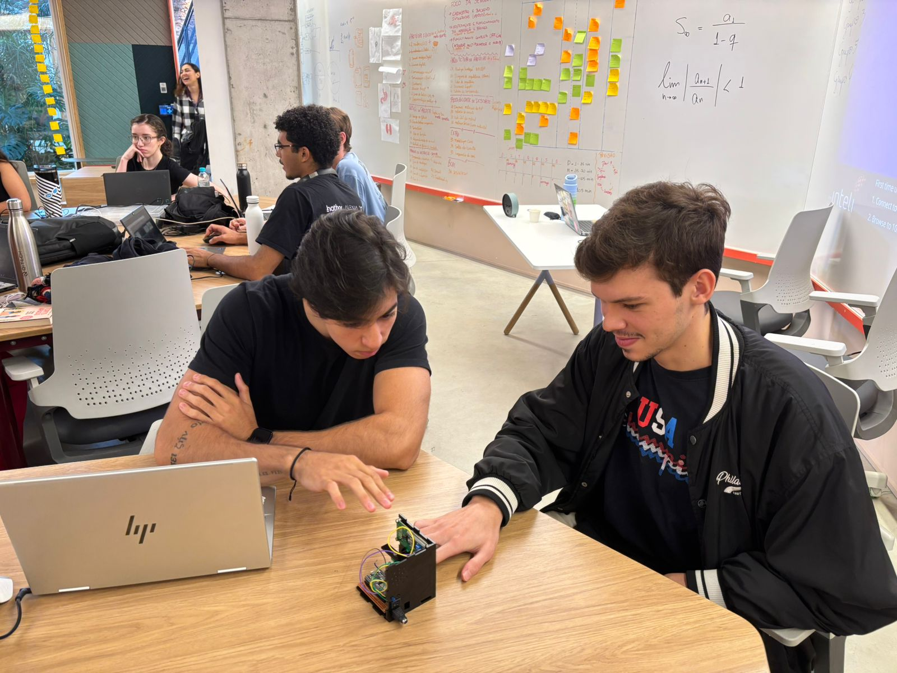
<br>
<sup>Fonte: Material produzido pelos autores (2024)</sup>
</div>

&nbsp;&nbsp;&nbsp;&nbsp;Os testes realizados durante a sprint 4 forneceram informações para o aprimoramento do sistema de acesso desenvolvido para o Instituto Apontar. Apesar dos desafios encontrados em áreas como verificação de energia e conectividade WiFi, o protótipo demonstrou um bom nível de usabilidade geral, com desempenho bom desempenho nas tarefas de liberação e bloqueio de acesso.

&nbsp;&nbsp;&nbsp;&nbsp;As melhorias propostas visam eliminar os principais pontos de dificuldade observados, garantindo que o sistema seja mais intuitivo e eficiente para todos os usuários. Com essas correções, o projeto estará pronto para as etapas finais de desenvolvimento, visando entregar uma solução mais completa e amigável ao usuário.

# <a name="c24"></a>3.4.1.Protótipo Inicial do Projeto usando o Simulador Wokwi

&nbsp;&nbsp;&nbsp;&nbsp;Um protótipo é uma versão preliminar ou modelo experimental de um produto ou sistema desenvolvido com o objetivo de explorar, testar e validar funcionalidades, identificar problemas e aperfeiçoar o design antes da criação da versão final. No contexto de desenvolvimento tecnológico, um protótipo permite simular e visualizar o funcionamento de um projeto, possibilitando que ideias abstratas tomem forma e que os desenvolvedores avaliem a interação entre os componentes, o desempenho e a usabilidade de maneira prática.

&nbsp;&nbsp;&nbsp;&nbsp;O objetivo principal de um protótipo é reduzir riscos e otimizar o processo de desenvolvimento ao identificar e resolver problemas nas fases iniciais, economizando tempo e recursos. Além disso, ele facilita a comunicação e a colaboração entre as equipes, já que oferece uma representação tangível do sistema que pode ser demonstrada para obter feedback de usuários e stakeholders.

**#** | **Bloco** | **Componente de entrada** | **Leitura da entrada** | **Componente de saída** | **Leitura da saída** | **Descrição**
|----------|----------|----------|----------|----------|----------|----------|
|01|Leitura de digital|Leitor Biométrico (Botão azul)|Biometria|LCD|Exibe o texto: "Acesso permitido. Bem-vindo {nome_do_usuario}"|O leitor biométrico lê a biometria do usuário e exibe o nome no LCD.|
|02|Leitura de digital|Leitor Biométrico (Botão azul)|Biometria|LCD|Exibe o texto: "Digital não reconhecida"|O leitor biométrico não reconhece a biometria do usuário e exibe uma mensagem de erro.|
|03|Leitura de digital|Leitor Biométrico (Botão azul)|Biometria|Buzzer|Emite um alerta sonoro de dois "bips" em caso de sucesso|O leitor biométrico lê a biometria do usuário e emite um sinal sonoro via buzzer.|
|04|Leitura de digital|Leitor Biométrico (Botão azul)|Biometria|Buzzer|Emite um alerta sonoro de um "bip" em caso de sucesso|O leitor biométrico não reconhece a biometria do usuário e emite um sinal sonoro de erro.|
|05|Conexão Wifi|Placa de rede Wifi|Rede Wifi com SSID e senha|Led Verde|Piscante em um intervalo de 0.5 segundo|A placa de rede realiza uma varredura de redes pelo SSID e senha e um led pisca durante a busca.|
|06|Conexão Wifi|Placa de rede Wifi|Rede Wifi com SSID e senha|Led Verde|O led fica aceso até que haja uma desconexão de wifi|A placa de rede encontra o wifi com SSID e senha correto e o led wifi fica aceso.|
|07|Inicialização do sistema| -- | -- |Led vermelho|Emite um sinal que acende quando o programa é compilado demonstrando que o sistema está ligado|O led vermelho acende quando o sistema está rodando, isso foi criado com o intuito de visualizamos o estado do sistema.|
|08|Pedido de ajuda| Botão amarelo | = 3.3V |Buzzer|Emite um sinal sonoro enquanto pressiona o botão|Ao clicar no botão o buzzer emite um sinal sonoro como feedback.|
|09|Pedido de ajuda| Botão amarelo | = 3.3V |LCD|Exibe o texto: "Solicitando ajuda. Aguarde..."|Ao clicar no botão amarelo o LCD emite uma mensagem.|
|10|Pedido de ajuda| Botão amarelo | = 3.3V |LCD|Exibe o texto: "Aguarde 15s para solicitar ajuda"|Ao clicar no botão amarelo em menos de 15 segundos após o primeiro clique o LCD emite uma mensagem de que o usuário deve aguardar para realizar a ação.|
|11|Modo de leitura|--|--|LCD|Exibe o texto: "Coloque seu dedo sobre o sensor!"|Ao iniciar o programa o LCD exibe um texto com instruções para o usuário.|
|12|Conexão Wifi|Placa de rede Wifi|Rede Wifi com SSID e senha|LCD|Exibe o texto: "Connecting Wifi: {SSID}"|A placa de rede realiza uma varredura de redes pelo SSID e senha e um o LCD exibe um texto de conexão.|

<br />
<br />

<div align="center">

  <sup>Figura X - Protótipo inicial</sup>

  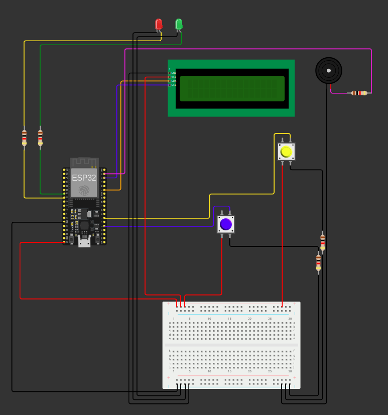

  <sup>Fonte: Material produzido pelos autores (2024)</sup>

</div>

[Protótipo Inicial do Projeto usando o Simulador Wokwi](https://wokwi.com/projects/412394701379694593)

&nbsp;&nbsp;&nbsp;&nbsp;Na imagem acima está disposto o protótipo inicial do projeto, que foi desenvolvido no simulador Wokwi. O protótipo é composto por um leitor biométrico, um buzzer, um LCD, um botão amarelo, um botão azul, um led verde e um led vermelho. O protótipo foi desenvolvido para simular um sistema de controle de acesso por biometria, onde o usuário deve colocar o dedo sobre o sensor biométrico para ser reconhecido. Caso a biometria seja reconhecida, o LCD exibe uma mensagem de boas-vindas ao usuário. Caso a biometria não seja reconhecida, o LCD exibe uma mensagem de erro. Além disso, o buzzer emite um sinal sonoro de dois "bips" em caso de sucesso e um "bip" em caso de erro. O protótipo também possui um botão amarelo que, ao ser pressionado, emite um sinal sonoro e exibe uma mensagem no LCD. O botão amarelo também possui um temporizador que impede o usuário de pressioná-lo novamente em menos de 15 segundos. O protótipo também possui um led verde que pisca durante a busca por redes wifi e fica aceso quando a conexão é estabelecida. Por fim, o protótipo possui um led vermelho que acende quando o sistema é inicializado.

**Observações:**
- O botão azul simula o leitor biométrico.
- O botão amarelo simula um pedido de ajuda.

# <a name="c25"></a>3.4.2. Protótipo Físico do Projeto (offline)	

&nbsp;&nbsp;&nbsp;&nbsp;A tabela a seguir apresenta os principais casos de teste desenvolvidos para a verificação e validação do protótipo físico do projeto (offline). Cada caso de teste descreve a funcionalidade a ser avaliada, os procedimentos necessários para execução, as condições prévias que devem ser atendidas e os resultados esperados após a execução dos testes.

&nbsp;&nbsp;&nbsp;&nbsp;Os testes visam assegurar que o protótipo funcione corretamente em diversos cenários e garanta uma experiência adequada ao usuário, abordando tanto casos de sucesso quanto de possíveis erros. As funcionalidades incluem interações com o sensor biométrico, botões de ajuda, feedback sonoro por meio do buzzer e sinais visuais utilizando LEDs e o LCD.

**#** | **Descrição** | **Pré-condição** | **Procedimento de teste** | **Pós-condição/Resultado esperado** | **Observações** (opcional)
|----------|----------|----------|----------|----------|----------|
|01|Verificação de biometria|O LCD exibe o texto: "Coloque seu dedo sobre o sensor!"|Pressione o botão azul (Botão que simula biometria)|Será exibida a mensagem: "Acesso permitido. Bem-vindo {nome_do_usuario}". Além disso o buzzer irá emitir um sinal sonoro de um único "bip". | Esse caso pode ser considerado um caso de sucesso. O caso de erro ainda não foi implementado|
|02|Solicitar ajuda|O LCD exibe o texto: "Coloque seu dedo sobre o sensor!". Além disso o usuário não pode ter pressionado o botão de ajuda a menos de 15 segundos antes de pressionar novamente|Pressione o botão amarelo|Será exibida a mensagem: "Solicitando ajuda. Aguarde...". Além disso o Buzzer emitirá um sinal sonoro de dois "bips"| Esse caso é de sucesso e está relacionado ao caso de teste #4|
|03|Delay de 15 segundos para solicitar ajuda|O LCD e xibe o texto: "Coloque seu dedo sobre o sensor!". Além disso o usuário deverá ter pressionado o botão de ajuda a menos de 15 segundos|Pressione o botão amarelo|Será exibida a mensagem: "Aguarde 15s para solicitar ajuda"| Esse caso é um espécie de "erro" para evitar que o usuário pressione repetidas vezes o botão de ajuda. Ele está relacionado ao caso de teste #3|
|04|Buscando rede Wi-Fi|O dispositivo deve estar ligado e com o Led Vermelho aceso|---|O Led se manterá piscando em intervalos de 500 ms |
|05|Rede Wi-Fi conectada|O dispositivo deve estar ligado e com o Led Vermelho aceso|---|O Led verde se manterá constantemente aceso indicando que a conexão está estavel|
|06|Modo de leitura|O dispositivo deve estar ligado e com o Led Vermelho aceso|---|O LCD exibirá a mensagem: "Coloque seu dedo sobre o sensor!"|Esse caso de teste se manterá durante todo o uso da aplicação pois demonstra o sistema aguardando uma entrada do usuário|
|07|Buscando rede Wi-Fi|O dispositivo deve estar ligado e com o Led Vermelho aceso|---|O LCD exibirá a mensagem: "Connecting Wi-FI: {nome_da_rede}"|


<br/>

#### Testes do Protótipo Físico
&nbsp;&nbsp;&nbsp;&nbsp;A imagem a seguir mostra o protótipo verificando a Conexão:
<div align="center">
<sub>Figura 7 - Verificando Conexão Wi-Fi</sub>
<br />
<br />

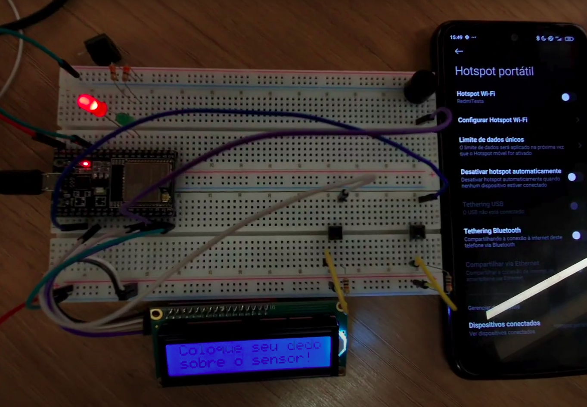

<br />
<br />
<sup>Fonte: Material produzido pelos autores (2024)</sup>
</div>

<br/>
<br />
**[[Vídeo para referência]: https://youtu.be/wAmxgEGVhLE](https://youtu.be/wAmxgEGVhLE)**

<br />
<br />
&nbsp;&nbsp;&nbsp;&nbsp;A imagem a seguir mostra o protótipo verificando a Conexão
&nbsp;&nbsp;&nbsp;&nbsp;A tabela a seguir mostra a tabela do CT sendo demonstrada da imagem:
**CT** = Caso de Teste

**CT Demonstrado** | **Descrição**
|----------|----------|
|#04|Na imagem acima vemos que o Led verde encontra-se apagado pois está piscando em intervalos de 500ms, indicando que o dispositivo está buscando uma rede Wi-Fi.
|#04|O Hotspot está desligado e demonstra que o dispositivo não está conectado a nenhuma rede Wi-Fi.

<br/>
<hr/>
&nbsp;&nbsp;&nbsp;&nbsp;A imagem a seguir mostra o protótipo Conectado ao Wi-Fi
<div align="center">
  <sub>Figura 8 - Conectado ao Wi-Fi</sub>
  <br />
  <br />

  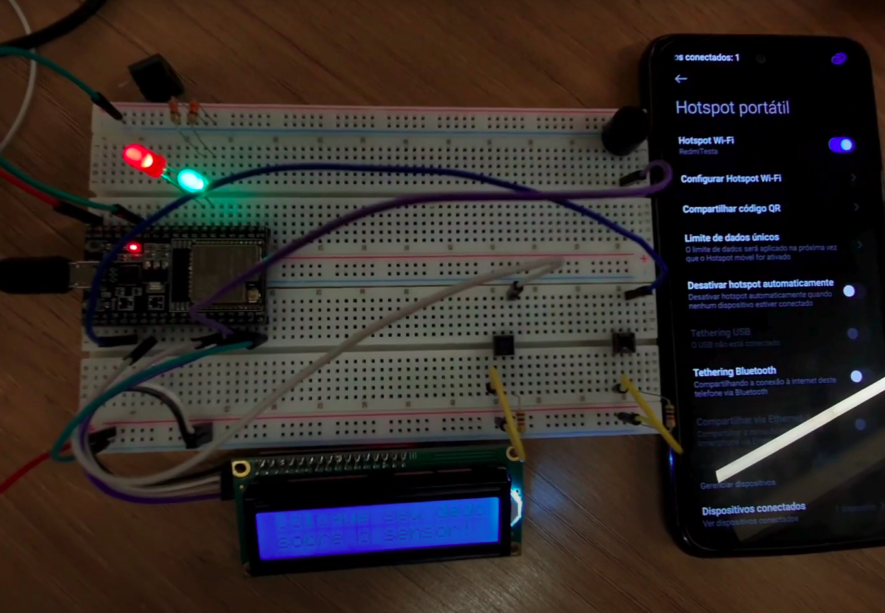

  <br />
  <br />
  <sup>Fonte: Material produzido pelos autores (2024)</sup>
</div>

<br />
<br />

**[[Vídeo para referência]: https://youtu.be/wAmxgEGVhLE](https://youtu.be/wAmxgEGVhLE)**

<br />
<br />

**CT** = Caso de Teste
&nbsp;&nbsp;&nbsp;&nbsp;A imagem a seguir mostra o protótipo Conectado ao Wi-Fi
&nbsp;&nbsp;&nbsp;&nbsp;A tabela a seguir mostra a tabela do CT sendo demonstrada da imagem:
**CT Demonstrado** | **Descrição**
|----------|----------|
|#05|Na imagem acima vemos que o Led verde encontra-se permanentemente aceso, indicando que o dispositivo está conectado a uma rede Wi-Fi.
|#05|O Hotspot está ligado e demonstra que o dispositivo está conectado a uma rede Wi-Fi. Se visualizarmos na barra superior do celular veremos um texto dizendo: "Dispositivos conectados: 1".

<br />
<br />
<hr/>
&nbsp;&nbsp;&nbsp;&nbsp;A imagem a seguir mostra o protótipo Buscando rede Wi-Fi

<div align="center">
  <sub>Figura 9 - Buscando rede Wi-Fi</sub>
  <br />
  <br />

  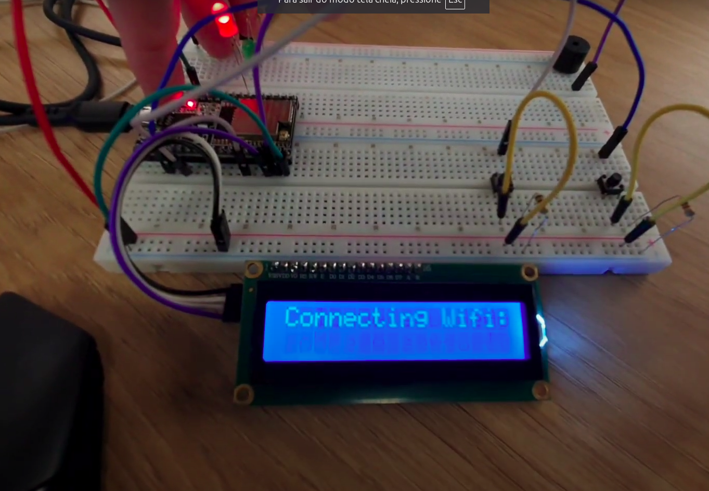

  <br />
  <br />
  <sup>Fonte: Material produzido pelos autores (2024)</sup>
</div>

<br />
<br />

**[[Vídeo para referência]: https://youtu.be/D4JraNlH1qo](https://youtu.be/D4JraNlH1qo)**

<br />
<br />

&nbsp;&nbsp;&nbsp;&nbsp;A tabela a seguir mostra a tabela do CT sendo demonstrada da imagem:
**CT** = Caso de Teste

**CT Demonstrado** | **Descrição**
|----------|----------|
|#04|Na imagem acima vemos que o Led verde encontra-se apagado pois está piscando em intervalos de 500ms, indicando que o dispositivo está buscando uma rede Wi-Fi.
|#07|Vemos também que o LCD exibe a mensagem: "Connecting Wi-Fi:". Esse comportamento é verificado apenas na inicialização do sistema.

<br />
<br />
<hr/>
&nbsp;&nbsp;&nbsp;&nbsp;A imagem a seguir mostra o protótipo Aguardando 

<div align="center">
  <sub>Figura 10 - Aguardando Biometria</sub>
  <br />
  <br />

  

  <br />
  <br />
  <sup>Fonte: Material produzido pelos autores (2024)</sup>
</div>

<br />
<br />

**[[Vídeo para referência]: https://youtu.be/bJVH21eSmIc](https://youtu.be/bJVH21eSmIc)**

<br />
<br />

&nbsp;&nbsp;&nbsp;&nbsp;A tabela a seguir mostra a tabela do CT sendo demonstrada da imagem:
**CT** = Caso de Teste

**CT Demonstrado** | **Descrição**
|----------|----------|
|#01|A mensagem "Coloque seu dedo sobre o sensor!" nos diz que o leitor está pronto para receber a biometria do usuário.
|#06|Na imagem acima podemos ver que o LCD está exibindo a mensagem: "Coloque seu dedo sobre o sensor!". Esse comportamento é verificado durante todo o uso do sistema.
|#06|Vemos ainda que o Led verde está apagado indicando que não há conexão com o Wi-Fi, pois o sistema deve funcionar mesmo sem a conexão com a internet.

<br />
<br />
<hr/>
&nbsp;&nbsp;&nbsp;&nbsp;A imagem a seguir mostra o protótipo Lendo Biometria 

<div align="center">
  <sub>Figura 11 - Lendo Biometria</sub>
  <br />
  <br />

  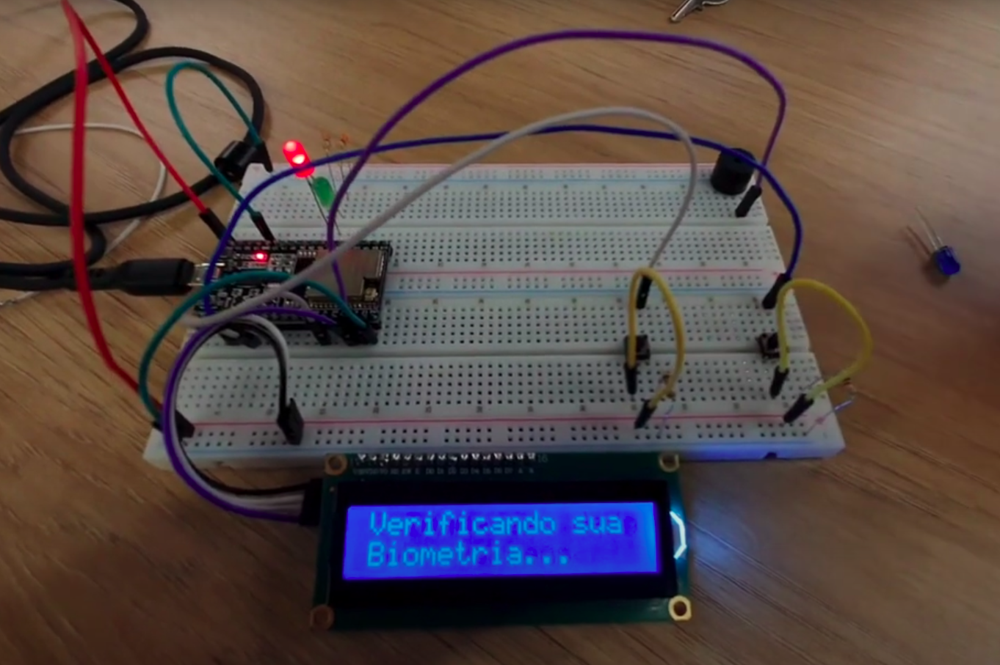

  <br />
  <br />
  <sup>Fonte: Material produzido pelos autores (2024)</sup>
</div>

<br />
<br />

**[[Vídeo para referência]: https://youtu.be/bJVH21eSmIc](https://youtu.be/bJVH21eSmIc)**

<br />
<br />
 
&nbsp;&nbsp;&nbsp;&nbsp;A tabela a seguir mostra a tabela do CT sendo demonstrada da imagem:
**CT** = Caso de Teste

**CT Demonstrado** | **Descrição**
|----------|----------|
|#01|A mensagem "Verificando sua Biometria..." nos diz que o leitor está processando a biometria do usuário.
|#01|A mensagem de acesso liberado aparecera após verificação da digital do usuário.
|#06|Esse processo aparece após o usuário colocar o dedo sobre o sensor biométrico em caso de o modo leitura estar ativo.

<br />
<br />
<hr/>
&nbsp;&nbsp;&nbsp;&nbsp;A imagem a seguir mostra o protótipo liberando o acesso

<div align="center">
  <sub>Figura 12 - Acesso Permitido</sub>
  <br />
  <br />

  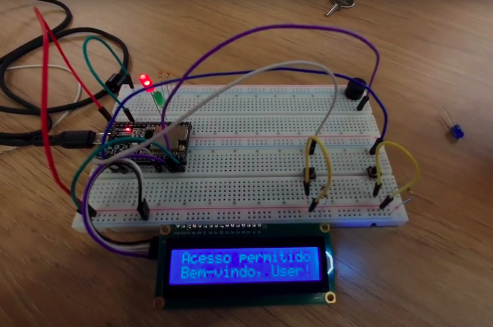

  <br />
  <br />
  <sup>Fonte: Material produzido pelos autores (2024)</sup>
</div>

<br />
<br />

**[[Vídeo para referência]: https://youtu.be/bJVH21eSmIc](https://youtu.be/bJVH21eSmIc)**

<br />
<br />

&nbsp;&nbsp;&nbsp;&nbsp;A tabela a seguir mostra a tabela do CT sendo demonstrada da imagem:
**CT** = Caso de Teste

**CT Demonstrado** | **Descrição**
|----------|----------|
|#01|A mensagem "Acesso permitido Bem-vindo, User" nos mostra que o usuário foi reconhecido e pode acessar o instituto. Assim a tranca será liberada.
|#01|Além disso o buzzer irá reproduzir um som, como mostrado no vídeo de referência.

<br />
<br />
<hr/>
&nbsp;&nbsp;&nbsp;&nbsp;A imagem a seguir mostra o protótipo Solicitando Ajuda

<div align="center">
  <sub>Figura 13 - Solicitando Ajuda</sub>
  <br />
  <br />

  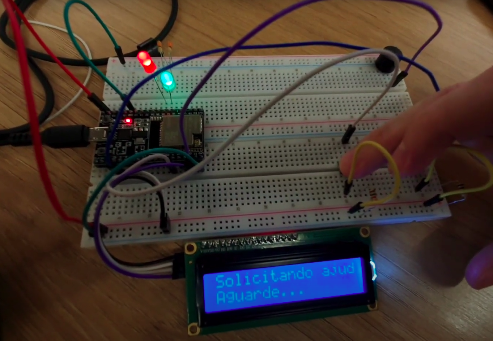

  <br />
  <br />
  <sup>Fonte: Material produzido pelos autores (2024)</sup>
</div>

<br />
<br />

**[[Vídeo para referência]: https://youtu.be/h6UNVt1GEVs](https://youtu.be/h6UNVt1GEVs)**

<br />
<br />

&nbsp;&nbsp;&nbsp;&nbsp;A tabela a seguir mostra a tabela do CT sendo demonstrada da imagem:
**CT** = Caso de Teste

**CT Demonstrado** | **Descrição**
|----------|----------|
|#02|A mensagem "Solicitando ajuda. Aguarde..." nos mostra que o usuário solicitou ajuda e o sistema está processando a solicitação.
|#02|O buzzer irá reproduzir um som, como mostrado no vídeo de referência.

<br />
<br />
<hr/>
&nbsp;&nbsp;&nbsp;&nbsp;A imagem a seguir mostra o protótipo com Delay de 15 segundos

<div align="center">
  <sub>Figura 14 - Delay de 15 segundos</sub>
  <br />
  <br />

  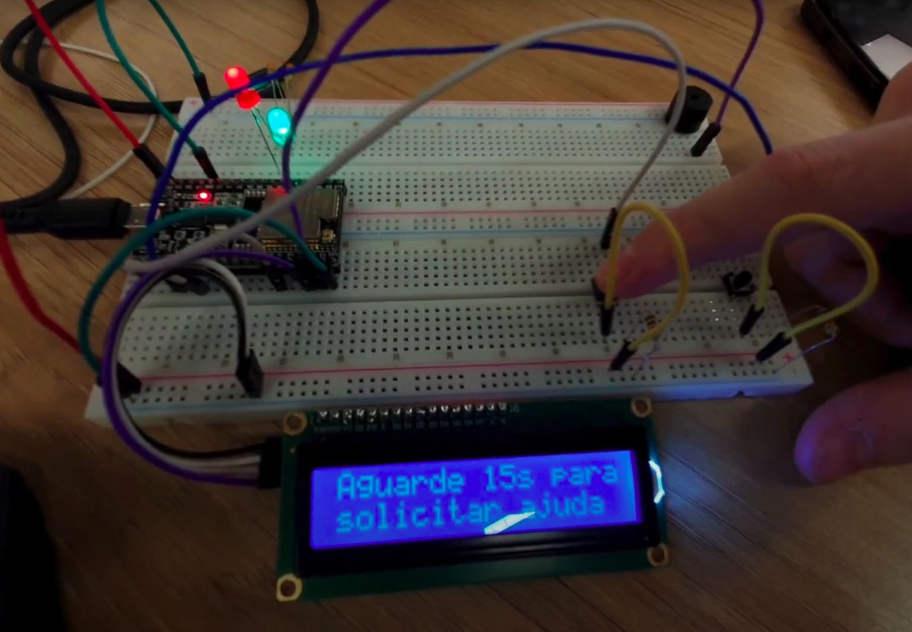

  <br />
  <br />
  <sup>Fonte: Material produzido pelos autores (2024)</sup>
</div>

<br/>

**[[Vídeo para referência]: https://youtu.be/RL8G4V1SNzs](https://youtu.be/RL8G4V1SNzs)**

<br />
<br />

&nbsp;&nbsp;&nbsp;&nbsp;A tabela a seguir mostra a tabela do CT sendo demonstrada da imagem:
**CT** = Caso de Teste

**CT Demonstrado** | **Descrição**
|----------|----------|
|#03|A mensagem "Aguarde 15s para solicitar ajuda" nos mostra que o usuário solicitou ajuda e o sistema está processando a solicitação.

### 3.4.3. Protótipo do Projeto com MQTT e I2C

&nbsp;&nbsp;&nbsp;&nbsp;A seguir há uma imagem do protótipo físico da solução conforme os trabalhos realizados durante a sprint 3 (Figura 15):

<div align="center">
<sub>Figura 15 - Imagem do protótipo físico</sub>
<br />
<br />
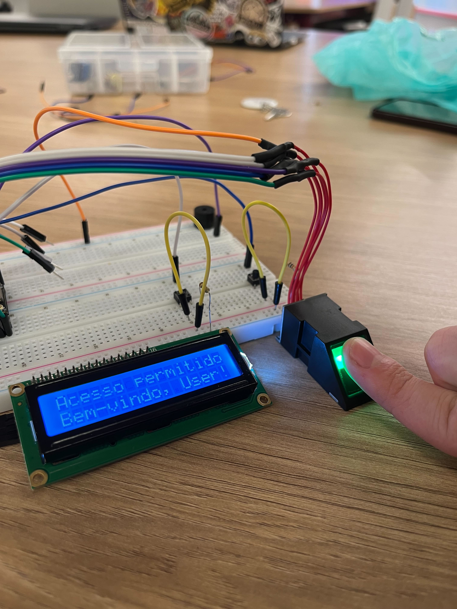
<br />
<br />
<sup>Fonte: Material produzido pelos autores (2024)</sup>
</div>


&nbsp;&nbsp;&nbsp;&nbsp;Os testes descritos devem assegurar que protótipo é capaz de autenticar acessos, restringir usuários não autorizados, registrar eventos de entrada e saída, gerenciar expiração de sessões, além de fornecer relatórios completos de histórico de acessos. As funções de notificação, bem como os backups dos registros, também devem apresentar desempenho satisfatório, garantindo a segurança e a integridade dos dados.

&nbsp;&nbsp;&nbsp;&nbsp;Os casos de falha incluíram situações de desconexão de rede, falhas de energia, e tentativas de uso de biometria incorreta, nos quais o sistema deve responder conforme esperado em cada cenário, fornecendo informações adequadas aos administradores. Essa variedade de testes ajudou a validar os requisitos do projeto e confirmou sua adequação para implementação.

&nbsp;&nbsp;&nbsp;&nbsp;Essa documentação fornece uma base sólida para referência e futuros testes de desempenho, escalabilidade e adaptação do sistema a novos cenários de uso.

&nbsp;&nbsp;&nbsp;&nbsp;A tabela a seguir apresenta um conjunto de procedimentos de teste aplicados ao protótipo físico com ESP32, descrevendo as ações necessárias para validar o funcionamento correto dos principais recursos do sistema. Cada teste é estruturado de forma a permitir uma análise detalhada de como o sistema se comporta em diferentes cenários e configurações.

<br>

| *Ação*                 | *Configuração do Ambiente*                                                                                   | *Procedimento de Teste*                                                                                       | *Resposta Esperada*                                                                                                                                                                                                                                                                                       | *Link do Vídeo de Demonstração*                                 | 
|--------------------------|----------------------------------------------------------------------------------------------------------------|---------------------------------------------------------------------------------------------------------------|-------------------------------------------------------------------------------------------------------------------------------------------------------------------------------------------------------------------------------------------------------------------------------------------------------------|------------------------------------------------------------------|
| *Leitura de Digitais*  | i. ESP32 conectado em alimentação de energia<br>ii. ESP32 conectado à rede Wi-Fi<br>iii. ESP32 conectado com Broker MQTT ativo<br>iv. Display LCD conectado<br>v. O sistema está em modo leitura                                      | O sensor biométrico realiza a captura da digital                                                             | - Se reconhecida:<br>&nbsp;&nbsp;&nbsp;1. Buzzer emite sinal sonoro duas vezes<br>&nbsp;&nbsp;&nbsp;2. Display exibe "Acesso Permitido, Bem-Vindo!"<br>&nbsp;&nbsp;&nbsp;3. Publica mensagem MQTT com detalhes do acesso<br>- Senão reconhecida: buzzer emite sinal único | <a href="https://www.youtube.com/watch?v=90b2Cd7JZvE&ab_channel=ViniciusTestaPassos">Vídeo Demonstrativo</a>            |
| *Ativação do Modo de Cadastro* | i. ESP32 conectado em alimentação de energia<br>ii. ESP32 conectado à rede Wi-Fi<br>iii. ESP32 conectado com Broker MQTT ativo<br>iv. Display LCD conectado<br>v. O sistema está em modo leitura                              | Publicar uma mensagem no tópico MQTT "a-p0rt4l/command" para iniciar o modo de cadastro                     | - Se mensagem válida: inicia o modo de cadastro<br>- Se mensagem inválida: sistema permanece em modo leitura                                                                                                                                                                      | <a href="https://www.youtube.com/watch?v=MGJKehtAnTQ&ab_channel=ViniciusTestaPassos">Vídeo Demonstrativo</a>             |
| *Cadastro de Digitais* | i. ESP32 conectado em alimentação de energia<br>ii. ESP32 conectado à rede Wi-Fi<br>iii. ESP32 conectado com Broker MQTT ativo<br>iv. Display LCD conectado<br>v. O sistema está em modo cadastro                                    | Posicionar o dedo no sensor biométrico para realizar a captura                                               | - Se sucesso:<br>&nbsp;&nbsp;&nbsp;1. Display exibe "Pressione o dedo novamente"<br>&nbsp;&nbsp;&nbsp;2. Após segunda leitura, biometria é armazenada<br>&nbsp;&nbsp;&nbsp;3. Publica mensagem MQTT de sucesso<br>&nbsp;&nbsp;&nbsp;4. Retorna ao modo leitura                  | <a href="https://www.youtube.com/watch?v=MGJKehtAnTQ&ab_channel=ViniciusTestaPassos">Vídeo Demonstrativo</a>            |
| *Conexão WiFi*         | i. ESP32 conectado em alimentação de energia<br>ii. ESP32 conectado com Display LCD<br>iii. LED amarelo configurado para status                                                            | Ligar o ESP32 e monitorar a tentativa de conexão WiFi                                                        | - Durante a tentativa:<br>&nbsp;&nbsp;&nbsp;1. Display exibe "Buscando WiFi: [nome da rede]"<br>&nbsp;&nbsp;&nbsp;2. LED amarelo piscando<br>- Se sucesso: LED amarelo permanece aceso<br/>- Se insucesso: LED amarelo continua piscando                                                                                   | <a href="https://www.youtube.com/watch?v=ZO2ZpowQoYA&ab_channel=ViniciusTestaPassos">i. Vídeo Demonstrativo Insucesso</a> <br/><br/>  <a href="https://www.youtube.com/watch?v=aSmTxCSeHa8&ab_channel=ViniciusTestaPassos">ii. Vídeo Demonstrativo Sucesso</a>          |

# <a name="c26"></a>3.4.4. Protótipo Físico do Projeto (online)


&nbsp;&nbsp;&nbsp;&nbsp;Nesta seção, apresentamos um conjunto de casos de teste 
projetados para avaliar a funcionalidade, confiabilidade e aplicabilidade do sistema de
controle de acesso biométrico desenvolvido. Cada caso de teste foi elaborado para 
representar cenários reais de uso, incluindo autenticações bem-sucedidas, falhas 
esperadas e situações adversas, como problemas de comunicação e falhas de hardware.

&nbsp;&nbsp;&nbsp;&nbsp;O objetivo principal desta abordagem é garantir que o protótipo 
atenda aos requisitos definidos no projeto e seja capaz de superar desafios técnicos 
encontrados em situações práticas. Para isso, foram desenvolvidos casos de teste para 
verificar as funcionalidades, representados em diagramas de sequência UML, acompanhados
por descrições objetivas que detalham os fluxos de eventos e os resultados esperados.

&nbsp;&nbsp;&nbsp;&nbsp;Além disso, foram incluídas ilustrações do protótipo para 
contextualizar o ambiente de teste e apoiar a compreensão dos cenários simulados. 
Por fim, conclusões preliminares são apresentadas, baseadas na análise dos resultados 
dos testes, fornecendo um panorama das capacidades atuais do sistema e orientações para 
ajustes futuros.

### Diagramas de Sequência e Casos de Teste do Protótipo

&nbsp;&nbsp;&nbsp;&nbsp;Os diagramas UML apresentado a seguir ilustram, de forma detalhada, os fluxos de eventos associados aos processos de cadastro biométrico e leitura de digital no sistema de controle de acesso. Esses diagramas representam visualmente as interações entre os componentes principais do sistema, incluindo o dispositivo IoT, o broker MQTT, o backend e o banco de dados. No caso do cadastro, o foco está na comunicação entre o frontend e o backend, garantindo que a digital seja capturada, validada e registrada corretamente. Já no fluxo de leitura, o objetivo é demonstrar o processo de autenticação do usuário, desde a captura da digital no sensor biométrico até a liberação ou bloqueio do acesso. Dessa forma, estão dispostos os diagramas de sequência a seguir:

<div align="center">
<sub>Figura 16- Diagrama UML do Cadastro</sub>
<br />
<br />
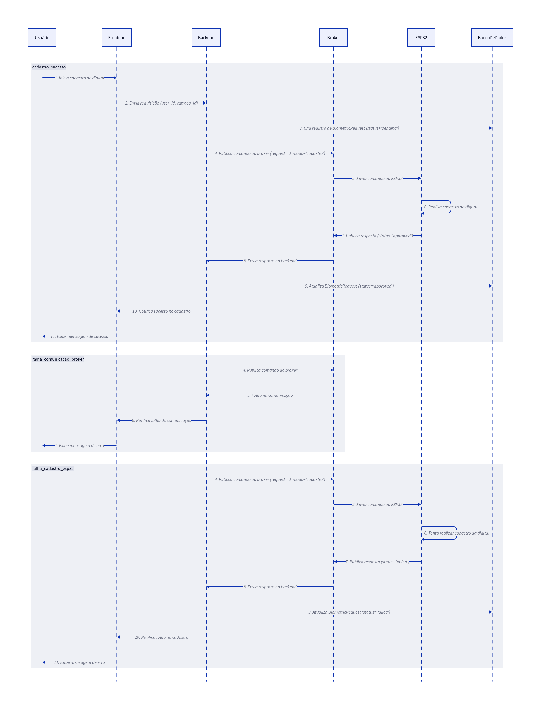
<br />
<br />
<sup>Fonte: Material produzido pelos autores (2024)</sup>
</div>

<div align="center">
<sub>Figura 17-Diagrama UML da Biometria</sub>
<br />
<br />
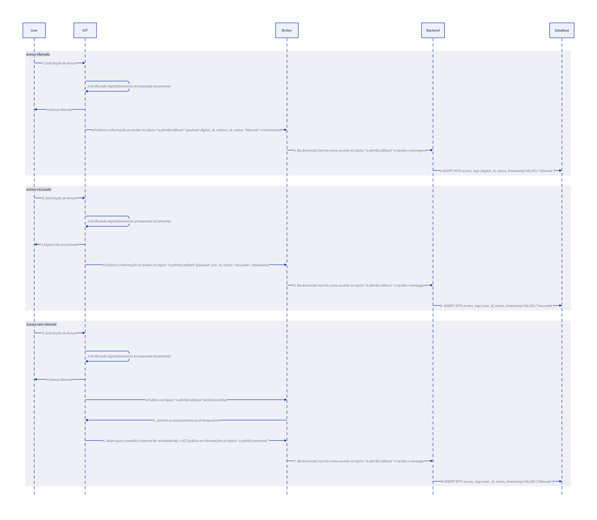
<br />
<br />
<sup>Fonte: Material produzido pelos autores (2024)</sup>
</div>

## Fotos do Protótipo Físico
<br>
&nbsp;&nbsp;&nbsp;&nbsp; A seguir, são apresentadas fotos do protótipo físico, ilustrando as peças e a disposição das entradas e saídas do dispositivo.
<br>
&nbsp;&nbsp;&nbsp;&nbsp;A Figura 18 apresenta uma visão detalhada da parte traseira do protótipo físico. Esta perspectiva permite observar a disposição dos componentes e das conexões, como cabos de alimentação e comunicação, facilitando a compreensão da estrutura interna e das interligações dos módulos utilizados no projeto.
<div align="center">
<sub>Figura 18-Foto de trás do Protótipo Físico</sub>
<br />
<br />
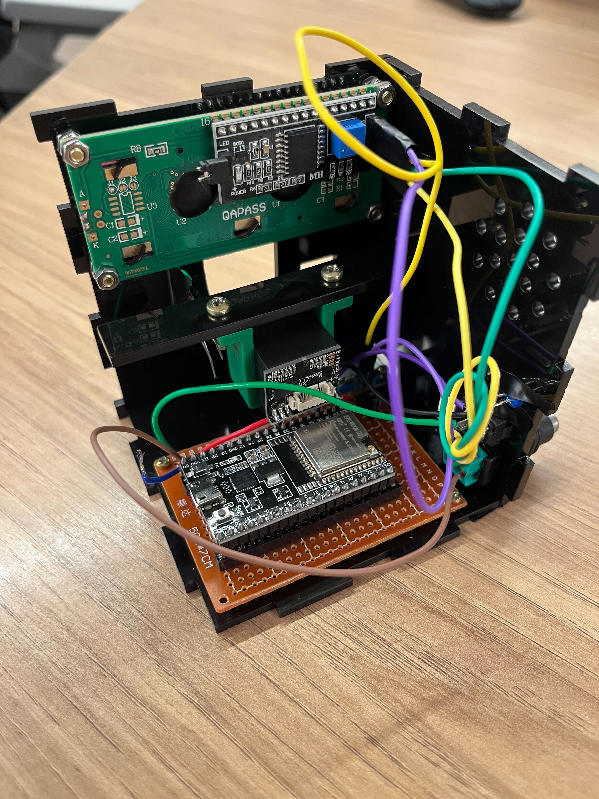
<br />
<sup>Fonte: Material produzido pelos autores (2024)</sup>
</div>

&nbsp;&nbsp;&nbsp;&nbsp;A Figura 19 ilustra a parte frontal do protótipo físico, destacando a interface do usuário, que inclui o display LCD e o sensor biométrico. Esta vista frontal demonstra como os componentes foram posicionados para facilitar a interação e a operação por parte dos usuários durante o uso cotidiano do sistema.
<div align="center">
<sub>Figura 19-Foto de frente do Protótipo Físico</sub>
<br />
<br />
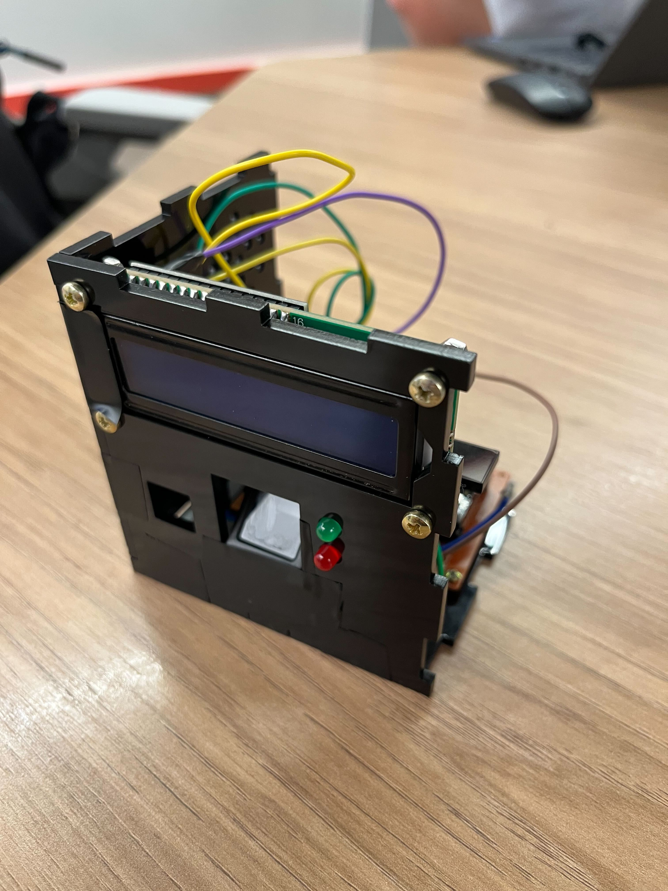
<br />
<br />
<sup>Fonte: Material produzido pelos autores (2024)</sup>
</div>

&nbsp;&nbsp;&nbsp;&nbsp;A Figura 20 mostra uma visão lateral do protótipo físico. Esta perspectiva permite observar o design estrutural, a disposição dos componentes internos e o modo como os elementos foram montados para garantir estabilidade e acessibilidade durante os testes e a operação do sistema.

<div align="center">
<sub>Figura 20-Foto de lado do Protótipo Físico</sub>
<br />
<br />
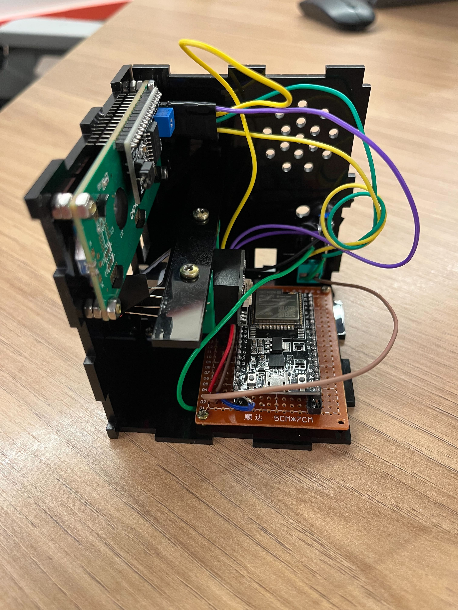
<br />
<br />
<sup>Fonte: Material produzido pelos autores (2024)</sup>
</div>

&nbsp;&nbsp;&nbsp;&nbsp;A Figura 21 apresenta as principais peças utilizadas na construção do protótipo físico, antes de sua montagem final. Nesta imagem, é possível identificar individualmente os componentes eletrônicos e mecânicos, como o ESP32, display LCD, sensor biométrico, LEDs e outros elementos essenciais para o funcionamento do sistema.

<div align="center">
<sub>Figura 21-Foto das peças do Protótipo Físico</sub>
<br />
<br />
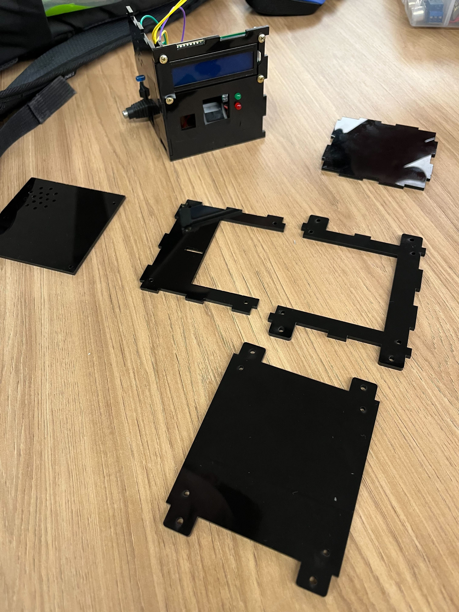
<br />
<br />
<sup>Fonte: Material produzido pelos autores (2024)</sup>
</div>

&nbsp;&nbsp;&nbsp;&nbsp;O desenvolvimento e a documentação do protótipo físico apresentados neste projeto demonstram a integração eficaz de hardware e software para criar um sistema funcional e interativo. As imagens fornecidas mostram diferentes perspectivas do protótipo, detalhando tanto a montagem quanto os componentes individuais utilizados. Isso facilita a compreensão da estrutura e da configuração do sistema, oferecendo uma visão clara dos processos envolvidos na sua implementação.

&nbsp;&nbsp;&nbsp;&nbsp;Os procedimentos de teste realizados e descritos comprovam que o sistema atende aos requisitos especificados, validando funcionalidades essenciais, como leitura biométrica, conectividade Wi-Fi, ativação de comandos via MQTT e feedback visual e sonoro. Cada etapa foi cuidadosamente documentada, garantindo a rastreabilidade e servindo como base para futuras melhorias e expansões.

&nbsp;&nbsp;&nbsp;&nbsp;Em suma, este protótipo representa um passo importante no desenvolvimento de soluções tecnológicas baseadas em IoT, biometria e automação, destacando o potencial da combinação desses recursos para aplicações práticas e inovadoras.


### Vídeo de explicação do projeto

&nbsp;&nbsp;&nbsp;&nbsp;O vídeo oferece uma visão abrangente do projeto, explicando detalhadamente os principais aspectos de sua concepção e funcionamento. Durante a apresentação, são exibidos o diagrama da arquitetura do sistema e os casos de teste realizados no protótipo físico. O vídeo facilita a compreensão das interações entre os componentes, os procedimentos de validação e os resultados obtidos, oferecendo uma abordagem visual e didática para os conceitos discutidos.

&nbsp;&nbsp;&nbsp;&nbsp;Essa explicação auxilia na consolidação do entendimento das funcionalidades e das etapas de desenvolvimento do projeto, permitindo que desenvolvedores, testadores e outros interessados possam acompanhar e replicar o processo com mais facilidade.

**[Video de Explicação do Projeto](https://www.loom.com/share/b27f8641f532408fb4307f122a3e0775?sid=2b45eec8-5f83-4248-9584-c521e62284b9)**
---

### Casos de Teste

&nbsp;&nbsp;&nbsp;&nbsp;A seguir, são apresentados os casos de teste do sistema de controle de acesso biométrico, detalhando diferentes cenários de sucesso e falha. Esses testes são fundamentais para garantir que o sistema funcione de maneira confiável e robusta, atendendo às necessidades de autenticação e segurança.

&nbsp;&nbsp;&nbsp;&nbsp;Esses casos de teste permitem identificar possíveis falhas e inconsistências no sistema, facilitando correções e melhorias. Além disso, garantem que os processos de autenticação, cadastro de digitais e comunicação com os componentes do sistema ocorram de forma segura e eficiente.

### Caso de Teste 1: Acesso Liberado com Leitura de Digital Cadastrada

**Objetivo:**

&nbsp;&nbsp;&nbsp;&nbsp;O objetivo deste caso de teste é validar o fluxo de autenticação bem-sucedida de um usuário no sistema de controle de acesso.

**Configuração do Ambiente:**

&nbsp;&nbsp;&nbsp;&nbsp;Para a realização correta do caso de teste, o usuário deve ter a sua digital cadastrada no sistema de controle de acesso, o dispositivo IoT deve estar conectado à rede WiFi e ao Broker MQTT e a aplicação web deve estar disponível. 

&nbsp;&nbsp;&nbsp;&nbsp;**Fluxo de Eventos**:
Os eventos descritos no diagrama UML estão dispostos, de forma sumarizada, a seguir:  
  1. Usuário solicita acesso ao sistema, imprimindo a sua digital cadastrada no sensor biométrico; 
  2. Dispositivo IoT realiza busca e verificação da digital, dentre as biometrias armazenadas de forma local;
  3. Sistema identifica digital como válida;
  4. O acesso é concedido ao usuário, com a liberação da porta e/ou catraca;
  5. Dispositivo IoT publica as informações do acesso no tópico MQTT "a-p0rt4l/callback", com a identificação do usuário (```user_id```), da requisição (```request_id```), do dispositivo (```catraca_id```) e de data e horário (```timestamp```);
  6. Backend escuta o tópico MQTT "a-p0rt4l/callback" e envia as informações para o banco de dados, hospedado na nuvem, o qual registra as informações do acesso.
  
&nbsp;&nbsp;&nbsp;&nbsp;Esse fluxo representa os eventos principais do caso de teste.

#### Resultado Esperado
&nbsp;&nbsp;&nbsp;&nbsp;Para a validação do fluxo de autenticação bem-sucedido, os seguintes resultados são esperados:

&emsp;&emsp;i. A autenticação bem-sucedida, com a validação da biometria digital cadastrada;<br/>

&emsp;&emsp;ii. As informações do acesso devem ser registradas integralmente no banco de dados;<br/>

&emsp;&emsp;iii. O acesso ao usuário deve ser liberado na portaria da instituição.<br/>

&nbsp;&nbsp;&nbsp;&nbsp;De forma direta, a validação do caso de teste exige a obtenção desses resultados esperados; em caso negativo, cabe ao time de desenvolvimento aplicar as alterações necessárias no sistema para validação do fluxo.

---

### Caso de Teste 2: Acesso Negado com Leitura de Digital Não Cadastrada

**Objetivo**

&nbsp;&nbsp;&nbsp;&nbsp;O objetivo deste caso de teste é validar o fluxo de autenticação malsucedida de um usuário no sistema de controle de acesso.

**Configuração do Ambiente**

&nbsp;&nbsp;&nbsp;&nbsp;Para a realização correta deste caso de teste, o usuário não deve ter a sua digital cadastrada no sistema de controle de acesso, o dispositivo IoT deve estar conectado à rede WiFi e ao Broker MQTT e a aplicação web deve estar disponível.

**Fluxo de Eventos**:

&nbsp;&nbsp;&nbsp;&nbsp;Os eventos descritos no diagrama UML são apresentados, de forma resumida, a seguir: 
  1. O usuário solicita acesso ao sistema, ao imprimir a digital não cadastrada no sensor biométrico;
  2. O dispositivo IoT realiza varredura e verificação da digital;
  3. Sistema identifica a digital como inválida;
  4. Acesso é negado ao usuário não cadastrado;
  5. O dispositivo IoT publica as informações da tentativa de acesso no tópico MQTT "a-p0rt4l/callback", com a identificação do dispositivo (```catraca_id```), da tentativa malsucedida (```message```) e de data e horário (```timestamp```);
  6. Backend escuta o tópico MQTT "a-p0rt4l/callback" e envia as informações da tentativa de acesso para o banco de dados que está hospedado na nuvem.
&nbsp;&nbsp;&nbsp;&nbsp;Desse modo, o fluxo de autenticação malsucedido é descrito por essas etapas.

#### Resultado Esperado:
&nbsp;&nbsp;&nbsp;&nbsp;Para realizar a validação do caso de teste descrito, os seguintes resultados são esperados:<br/>
&emsp;&emsp;i. Autenticação não autorizada, com invalidação da biometria não cadastrada impressa;<br/>
&emsp;&emsp;ii. Registro da tentativa de acesso no banco de dados;<br/> 
&emsp;&emsp;iii. A entrada do usuário na instituição deve ser negada.
&nbsp;&nbsp;&nbsp;&nbsp;Com a conformação dos resultados ao cenário esperado, confirma-se a validação deste caso de teste.


### Caso de Teste 3: Cadastro de Digital com Sucesso

**Objetivo**

&nbsp;&nbsp;&nbsp;&nbsp;O objetivo deste caso de teste é validar o fluxo completo e bem-sucedido de cadastro de uma nova digital no sistema de controle de acesso.

**Configuração do Ambiente**  
&nbsp;&nbsp;&nbsp;&nbsp;Para a realização correta do caso de teste, os seguintes pré-requisitos devem ser atendidos:  
&emsp;&emsp;- O dispositivo IoT deve estar conectado à rede WiFi e ao Broker MQTT;<br/>
&emsp;&emsp;- O banco de dados deve estar acessível e funcional na nuvem;<br/>
&emsp;&emsp;- A aplicação web deve estar disponível para o envio da requisição de cadastro;<br/>
&emsp;&emsp;- O sensor biométrico deve estar conectado ao dispositivo IoT.

**Fluxo de Eventos**: 

&nbsp;&nbsp;&nbsp;&nbsp;Os eventos descritos no diagrama UML estão sumarizados a seguir:  
  1. O usuário inicia o processo de cadastro de digital por meio do frontend;  
  2. O frontend envia uma requisição HTTP ao backend contendo as informações do usuário (`user_id`) e o identificador da catraca (`catraca_id`);  
  3. O backend cria um registro no banco de dados com as informações da requisição (`request_id`, status inicial como `pending`);  
  4. O backend publica uma mensagem no broker MQTT no topico "a-p0rt4l/command" contendo as informações da requisição e o comando para iniciar o cadastro;  
  5. O broker MQTT transmite o comando ao dispositivo IoT (ESP32);  
  6. O dispositivo IoT inicia o processo de cadastro, coletando a digital do usuário por meio do sensor biométrico;  
  7. Após coletar e validar a digital, o dispositivo IoT publica uma mensagem no broker com o status do cadastro (`approved`);  
  8. O broker MQTT encaminha a resposta ao backend pelo topico "a-p0rt4l/callback";  
  9. O backend atualiza o registro da requisição no banco de dados com o status final (`approved`);  
  10. O frontend consulta o backend sobre o sucesso do cadastro;  
  11. O frontend exibe a mensagem de sucesso ao usuário.

#### Resultado Esperado:  
&nbsp;&nbsp;&nbsp;&nbsp;Para validar o fluxo de cadastro de digital, os seguintes resultados são esperados:  
&emsp;&emsp;i. O sistema deve registrar corretamente as informações da requisição no banco de dados com o status inicial como `pending` e atualizar para o status final como `approved`;<br/>
&emsp;&emsp;ii. A digital coletada deve ser armazenada no dispositivo IoT, e o banco de dados deve registrar o evento de cadastro associado ao usuário e à catraca;<br/>
&emsp;&emsp;iii. O sistema deve fornecer feedback claro ao usuário sobre o sucesso do cadastro.

---

### Caso de Teste 4: Falha na Comunicação com o Broker MQTT

**Objetivo**  
&nbsp;&nbsp;&nbsp;&nbsp;O objetivo deste caso de teste é validar o comportamento do sistema em caso de falha na comunicação com o Broker MQTT durante o processo de cadastro.

**Configuração do Ambiente**  
&nbsp;&nbsp;&nbsp;&nbsp;Para a realização correta deste caso de teste, os seguintes pré-requisitos devem ser atendidos:  
&emsp;&emsp;- O dispositivo IoT deve estar conectado ao sistema, mas o broker MQTT deve estar indisponível;<br/>
&emsp;&emsp;- O banco de dados deve estar acessível e funcional na nuvem;<br/>
&emsp;&emsp;- A aplicação web deve estar disponível para o envio da requisição de cadastro.

**Fluxo de Eventos**:  
  1. O usuário inicia o processo de cadastro de digital por meio do frontend;  
  2. O frontend envia uma requisição HTTP ao backend contendo as informações do usuário (`user_id`) e o identificador da catraca (`catraca_id`);  
  3. O backend tenta publicar uma mensagem no topico "a-p0rt4l/command" do broker MQTT com as informações da requisição, mas ocorre uma falha na comunicação;  
  4. O backend notifica o frontend sobre a falha na comunicação;  
  5. O frontend exibe uma mensagem de erro ao usuário, indicando que o sistema está indisponível.  

#### Resultado Esperado  
&nbsp;&nbsp;&nbsp;&nbsp;Para validar este caso de teste, os seguintes resultados são esperados:  
&emsp;&emsp;i. O sistema deve identificar a falha na comunicação e interromper o processo de cadastro;<br/>
&emsp;&emsp;ii. O backend não deve atualizar o banco de dados com o status final até que a comunicação seja restabelecida;<br/>
&emsp;&emsp;iii. O usuário deve ser notificado claramente sobre a falha.

---

### Caso de Teste 5: Falha no Cadastro da Digital pelo ESP32

**Objetivo**  
&nbsp;&nbsp;&nbsp;&nbsp;O objetivo deste caso de teste é validar o comportamento do sistema quando ocorre uma falha no cadastro da digital pelo dispositivo IoT (ESP32).

**Configuração do Ambiente**  
&nbsp;&nbsp;&nbsp;&nbsp;Para a realização correta deste caso de teste, os seguintes pré-requisitos devem ser atendidos:  
&emsp;&emsp;- O dispositivo IoT deve estar conectado à rede WiFi e ao Broker MQTT;<br/>
&emsp;&emsp;- O banco de dados deve estar acessível e funcional na nuvem;<br/>
&emsp;&emsp;- A aplicação web deve estar disponível para o envio da requisição de cadastro;<br/>
&emsp;&emsp;- O sensor biométrico deve estar conectado ao dispositivo IoT.

**Fluxo de Eventos**:  
  1. O backend publica uma mensagem no broker MQTT pelo topico "a-p0rt4l/command" com as informações da requisição;  
  2. O broker MQTT transmite o comando ao ESP32;  
  3. O ESP32 tenta realizar o cadastro da digital, mas ocorre uma falha (exemplo: digital não capturada corretamente ou erro no sensor);  
  4. O ESP32 publica uma mensagem no broker com o status `failed`;  
  5. O broker MQTT encaminha a mensagem pelo topico "a-p0rt4l/callback" ao backend;  
  6. O backend atualiza o registro no banco de dados com o status final como `failed`;  
  7. O backend notifica o frontend sobre a falha no cadastro;  
  8. O frontend exibe uma mensagem de erro ao usuário.  

#### Resultado Esperado  
&nbsp;&nbsp;&nbsp;&nbsp;Para validar este caso de teste, os seguintes resultados são esperados:  
&emsp;&emsp;i. O sistema deve identificar e registrar corretamente a falha no banco de dados, com o status `failed`;<br/>
&emsp;&emsp;ii. O backend deve informar o frontend sobre a falha no processo;<br/>
&emsp;&emsp;iii. O usuário deve ser informado de maneira clara sobre a falha, incluindo a recomendação para tentar novamente.

---

### Caso de Teste 6: Falha na Atualização do Banco de Dados

**Objetivo**  
&nbsp;&nbsp;&nbsp;&nbsp;O objetivo deste caso de teste é validar o comportamento do sistema em caso de falha ao atualizar o registro da requisição no banco de dados após o processo de cadastro.

**Configuração do Ambiente**  
&nbsp;&nbsp;&nbsp;&nbsp;Para a realização correta deste caso de teste, os seguintes pré-requisitos devem ser atendidos:  
&emsp;&emsp;- O dispositivo IoT deve estar conectado à rede WiFi e ao Broker MQTT;<br/>
&emsp;&emsp;- O banco de dados deve simular um erro de conexão ou indisponibilidade durante o teste;<br/>
&emsp;&emsp;- A aplicação web deve estar disponível para o envio da requisição de cadastro.

**Fluxo de Eventos**:  
  1. O ESP32 completa o processo de cadastro e publica o status `approved` no broker;  
  2. O broker MQTT encaminha a mensagem pelo topico "a-p0rt4l/callback" ao backend;  
  3. O backend tenta atualizar o registro da requisição no banco de dados, mas ocorre uma falha (exemplo: erro de conexão com o banco de dados);  
  4. O backend notifica o frontend sobre a falha;  
  5. O frontend exibe uma mensagem de erro ao usuário, indicando que o sistema está indisponível.  

#### Resultado Esperado  
&nbsp;&nbsp;&nbsp;&nbsp;Para validar este caso de teste, os seguintes resultados são esperados:  
&emsp;&emsp;i. O sistema deve registrar o erro de banco de dados no log para análise posterior;<br/>
&emsp;&emsp;ii. O status final da requisição não deve ser atualizado no banco de dados;<br/>
&emsp;&emsp;iii. O usuário deve ser informado que o cadastro não foi concluído devido a um erro interno.

---


### Caso de Teste 7: Acesso Liberado com Leitura de Digital sem Conexão WiFi

**Objetivo**

&nbsp;&nbsp;&nbsp;&nbsp;O objetivo deste caso de teste é validar o fluxo de autenticação bem-sucedida de um usuário no sistema de controle de acesso com o dispositivo desconectado da internet.

**Configuração do Ambiente**

&nbsp;&nbsp;&nbsp;&nbsp;Para a realização deste caso de teste, o usuário deve ter a sua digital cadastrada no sistema de controle de acesso, o dispositivo IoT deve estar desconectado da rede WiFi e, consequentemente, também do Broker MQTT e a aplicação web deve estar disponível. 

**Fluxo de Eventos**:

&nbsp;&nbsp;&nbsp;&nbsp;Os eventos descritos no diagrama UML estão dispostos, resumidamente, a seguir:  
  1. Usuário solicita acesso ao sistema, imprimindo a sua digital cadastrada no sensor biométrico; 
  2. Dispositivo IoT realiza busca e verificação da digital, dentre as biometrias armazenadas de forma local;
  3. Sistema identifica digital como válida;
  4. O acesso é concedido ao usuário, com a liberação da porta e/ou catraca;
  5. O sistema tenta publicar as informações do acesso ao broker MQTT, com a identificação do usuário (user_id), da requisição, do dispositivo (catraca_id) e de data e horário (timestamp);
  6. O broker MQTT envia as informações para o banco de dados, hospedado na nuvem, o qual registra as informações do acesso.
  
&nbsp;&nbsp;&nbsp;&nbsp;Esse fluxo representa os eventos principais do caso de teste.

#### Resultado Esperado
&nbsp;&nbsp;&nbsp;&nbsp;Para a validação do fluxo de autenticação bem-sucedido, os seguintes resultados são esperados:<br/>

&emsp;&emsp;i. A autenticação bem-sucedida, com a validação da biometria digital cadastrada;<br/>

&emsp;&emsp;ii. As informações do acesso devem ser registradas integralmente no banco de dados;<br/>
&emsp;&emsp;iii. O acesso ao usuário deve ser liberado na portaria da instituição.<br/>
&nbsp;&nbsp;&nbsp;&nbsp;De forma direta, a validação do caso de teste exige a obtenção desses resultados esperados; em caso negativo, cabe ao time de desenvolvimento aplicar as alterações necessárias no sistema para validação do fluxo.

---

### Caso de Teste 8: Cadastro Insucedido por Falha na Conexão WiFi

#### **Objetivo**
&nbsp;&nbsp;&nbsp;&nbsp;Validar o comportamento do sistema quando um usuário tenta realizar o cadastro biométrico enquanto o dispositivo IoT está sem conexão à rede WiFi, garantindo que o cadastro não seja realizado e que o usuário seja adequadamente notificado.

#### **Configuração do Ambiente**
- O dispositivo IoT está desconectado da rede WiFi.
- O broker MQTT está disponível e acessível.
- A aplicação web está disponível para gerenciamento de cadastros.

#### **Fluxo de Eventos**
1. Usuário inicia o processo de cadastro no sistema de controle de acesso através da aplicação web;
2. Usuário posiciona seu dedo no sensor biométrico para captura da digital;
3. Dispositivo IoT tenta enviar os dados da digital capturada para o sistema via rede WiFi;
4. A conexão WiFi está indisponível, resultando em falha no envio dos dados;
5. O sistema localmente armazena temporariamente a tentativa de cadastro;
6. O sistema notifica o usuário sobre a falha na conexão WiFi e informa que o cadastro não foi concluído.

#### **Resultado Esperado**
&nbsp;&nbsp;&nbsp;&nbsp;Para a validação deste caso de teste, os seguintes resultados são esperados:

&emsp;&emsp;i. O sistema identifica a falha na conexão WiFi durante o processo de cadastro.

&emsp;&emsp;ii. O cadastro não é finalizado, e a digital do usuário não é registrada no sistema.

&emsp;&emsp;iii. O usuário recebe uma mensagem clara indicando a impossibilidade de concluir o cadastro devido à falta de conexão.

&emsp;&emsp;iv. O sistema pode tentar reprocessar o cadastro automaticamente quando a conexão WiFi for restabelecida ou aguardar intervenção manual.

---

### Caso de Teste 9: Cadastro Insucedido por Falha na Conexão com o Broker MQTT

#### **Objetivo**
&nbsp;&nbsp;&nbsp;&nbsp;Verificar como o sistema reage quando ocorre uma falha ao conectar-se ao broker MQTT durante o processo de cadastro biométrico, assegurando que o cadastro seja interrompido e que medidas adequadas sejam tomadas.

#### **Configuração do Ambiente**
- O dispositivo IoT está conectado à rede WiFi.
- O broker MQTT está indisponível ou inoperante.
- A aplicação web está disponível para gerenciamento de cadastros.

#### **Fluxo de Eventos**
1. Usuário inicia o processo de cadastro no sistema de controle de acesso através da aplicação web;
2. Usuário posiciona seu dedo no sensor biométrico para captura da digital;
3. Dispositivo IoT captura a digital e tenta publicar os dados de cadastro no broker MQTT;
4. A tentativa de conexão com o broker MQTT falha devido à indisponibilidade do serviço;
5. O sistema localmente armazena a tentativa de cadastro e marca-a como não concluída;
6. O sistema notifica o usuário sobre a falha na comunicação com o broker MQTT e informa que o cadastro não foi realizado.

#### **Resultado Esperado**
&nbsp;&nbsp;&nbsp;&nbsp;Para a validação deste caso de teste, os seguintes resultados são esperados:

&emsp;&emsp;i. O sistema detecta a falha ao tentar conectar-se ao broker MQTT durante o cadastro;

&emsp;&emsp;ii. O cadastro não é completado, e a digital do usuário não é registrada no banco de dados;

&emsp;&emsp;iii. O usuário recebe uma notificação clara sobre a impossibilidade de concluir o cadastro devido à falha na comunicação com o broker MQTT;

&emsp;&emsp;iv. O sistema registra a falha para futuras análises e pode tentar reprocessar o cadastro automaticamente quando a conexão com o broker MQTT for restabelecida ou aguardar intervenção manual.

---

### Caso de Teste 10: Leitura Insucedida por Falha na Captura da Imagem no Dispositivo IoT

#### **Objetivo**
&nbsp;&nbsp;&nbsp;&nbsp;Avaliar o comportamento do sistema quando ocorre uma falha na captura da digital pelo sensor biométrico no dispositivo IoT, garantindo que o acesso não seja concedido e que o usuário seja informado sobre o problema.

#### **Configuração do Ambiente**
- O dispositivo IoT está conectado à rede WiFi e ao broker MQTT.
- A aplicação web está disponível para monitoramento de acessos.
- O sensor biométrico está funcional, mas apresenta um defeito que impede a captura correta da digital.

#### **Fluxo de Eventos**
1. Usuário tenta acessar o sistema de controle de acesso, posicionando seu dedo no sensor biométrico;
2. O sensor biométrico tenta capturar a digital do usuário, mas ocorre um erro na captura (por exemplo, sensor defeituoso ou dedo mal posicionado);
3. O dispositivo IoT não consegue processar a digital devido à falha na captura da imagem;
4. O sistema impede o acesso do usuário, mantendo a porta e/ou catraca bloqueadas;
5. O sistema registra a tentativa de acesso falhada e notifica o administrador sobre a falha no sensor biométrico;
6. O usuário recebe uma mensagem informando sobre a falha na leitura biométrica e instruções para tentar novamente ou buscar assistência.

#### **Resultado Esperado**

&nbsp;&nbsp;&nbsp;&nbsp;Para a validação deste caso de teste, os seguintes resultados são esperados:

&emsp;&emsp;i. A falha na captura da digital é detectada pelo sistema;

&emsp;&emsp;ii. O acesso do usuário é negado, mantendo a segurança da portaria da instituição;

&emsp;&emsp;iii. A tentativa de acesso falhada é registrada no sistema para monitoramento e análise;

&emsp;&emsp;iv. O administrador do sistema é notificado sobre a falha no sensor biométrico para que possa realizar manutenção ou substituição do dispositivo;

&emsp;&emsp;v. O usuário recebe uma mensagem clara sobre a falha na leitura biométrica, orientando sobre os próximos passos.

<br>

### Conclusão

&emsp;&emsp;A execução dos casos de teste detalhados nesta seção é muito importante para assegurar a confiabilidade e a integridade do sistema de controle de acesso biométrico. Por meio da simulação de diversos cenários — incluindo situações de sucesso e insucesso, bem como falhas em componentes específicos como conexão WiFi, broker MQTT e sensor biométrico — é possível identificar potenciais vulnerabilidades e inconsistências no funcionamento do sistema.

&emsp;&emsp;Essa abordagem completa permite não apenas a validação das funcionalidades principais, como autenticação e cadastro de usuários por meio do dispositivo de digital em conjunto com a integridade do backend e banco de dados, mas também a avaliação da resiliência do sistema frente a falhas de comunicação e hardware. A documentação precisa dos resultados esperados e obtidos em cada caso de teste fornece um guia fidedigno para o time de desenvolvimento, orientando ajustes e melhorias necessárias.

&emsp;&emsp;Além disso, essa prática contribui significativamente para a elaboração de um manual de instruções detalhado e preciso, que auxiliará os usuários na compreensão e interação com o sistema. Ao antecipar e mitigar possíveis falhas críticas, aprimoramos a experiência do usuário e elevamos o nível de segurança e eficiência do sistema de controle de acesso.

&emsp;&emsp;Em resumo, a realização e documentação dos casos de teste fortalecem o desenvolvimento do projeto, garantindo que o sistema atenda aos mais altos padrões de qualidade e confiabilidade esperados pelos usuários e pela instituição.

---

### Protótipo Físico do Projeto
&emsp;&emsp;Nesta seção, será abordado o desenvolvimento do protótipo físico do projeto, com uma desrição dos componentes presentes na solução e no papel específico de cada um para a criação de valor ao parceiro. Portanto, a seguir são apresentadas a seguir as figuras e a documentação dos avanços no desenvolvimento do protótipo físico:  

**Saídas informacionais em LEDs**<br/>
&emsp;&emsp;O protótipo físico possui duas saídas informacionais em LEDs. Nesse sentido, ao ser conectado a uma fonte de alimentação de energia, um LED azul será aceso, a fim de passar o feedback ao usuário de que o dispositivo está recebendo energia elétrica e ligado, somente.<br/>
&emsp;&emsp;Além disso, ao ser ligado, o dispositivo tenta fazer a conexão com a rede WiFi a partir das credenciais que possui e, durante o processo de conexão, um LED amarelo irá piscar continuamente, até que alguma conexão WiFi seja estabelecida. Nesse caso, enquanto o dispositivo estiver conectado a uma rede WiFI, o LED amarelo permanecerá aceso. Dessa forma, o usuário final terá um feedback direto do status da conexão do dispositivo com a rede WiFi.<br/>
&emsp;&emsp;Desse modo, a seguir, apresenta-se vídeo demonstrativo do protótipo:

<a href="https://www.youtube.com/watch?v=ZO2ZpowQoYA&ab_channel=ViniciusTestaPassos">Vídeo Demonstrativo Insucesso</a> <br/>  <a href="https://www.youtube.com/watch?v=aSmTxCSeHa8&ab_channel=ViniciusTestaPassos">Vídeo Demonstrativo Sucesso</a>

**Entradas de dados booleanos por meio de botões** <br/>
&emsp;&emsp;O dispositivo IoT possui 2 entradas de dados booleanas por meio de botões. Primeiramente, o sistema possui um botão de ajuda, o qual muda a máquina de estado do dispositivo e ativa o modo ajuda. Nesse sentido, espera-se como próximos passos a implementação completa do modo ajuda, na qual, qualquer usuário que tenha dificuldade em autenticar-se com o sistema, pode acionar o modo ajuda. Dessa forma, quando a máquina de estado da aplicação se encontra no modo ajuda, o sistema irá disparar uma notificação para os colaboradores do Instituto Apontar através da aplicação web "A-Portal". Desse modo, incrementa-se valor à solução, ao passo que os colaboradores do Instituto têm um feedback direto e rápido de qualquer dificuldade em um processo de autenticação no dispositivo IoT, de forma remota.<br/>
&emsp;&emsp;Ademais, o sistema permite o acionamento da função Reset (Reiniciar). Nesse sentido, caso haja algum problema aparente no dispostivo, como mau funcionamento do LCD, identificação incorreta da biometria, falha na conexão Wi-Fi, dentre outros, o usuário ou administrador terá a capacidade de rapidamente reiniciar o dispositivo. Dessa forma, ao pressionar o botão de Reset, o dispositivo indica uma mensagem de Reiniciação no LCD (feedback ao usuário), bem como emite um sinal sonoro; assim que o sistema concluir o Reset, o dispositivo voltará para o funcionamento normalmente, o que pode ajudar a resolver problemas como os mencionados anteriormente. Por fim, com essa funcionalidade, o sistema não exige que o usuário acione a manutenção ou procure problemas pequenos no código fonte, mas resolva grande parte destes somente com essa funcionalidade.<br/> 
&emsp;&emsp;Desse modo, a seguir, apresenta-se vídeo demonstrativo do protótipo:

<a href="https://youtube.com/shorts/nnA7_8hOaKI">Vídeo Demonstrativo Botão de Reset</a> <br/>

<a href="https://www.youtube.com/watch?v=h6UNVt1GEVs">Vídeo Demonstrativo Botão de Ajuda</a>

**Sensores analógico e digital** <br/>
&emsp;&emsp;Inicialmente, destacam-se dois sensores utilizados no sistema, um analógico e outro digital. Primeirament, um sensor analógico é utilizado para a coleta do um indicador de intensidade da conexão WiFi recebida pelo dispositivo, o qual é avaliado em decibel-milliwatts (dBm). Nesse caso, em validações prévias com o parceiro, foi descrito que a conexão de internet nas dependências físicas do Instituto Apontar é instável durante o mês. Desse modo, embora o dispositivo tenha o feedback visual (através de LED) da situação de conexão WiFi (conectado ou desconectado), entende-se que um indicador da intensidade do sinal WiFi complementa o valor agregado, permitindo aos usuários avaliarem a intensidade da conexão WiFi e seu impacto, em caso de falha dos casos de uso do dispositivo.<br/>
&emsp;&emsp;Em segundo lugar, como sensor digital, o dispositivo IoT conta um sensor biométrico para a leitura e coleta de biometrias, o qual agrega valor ao parceiro a partir da autenticação dos alunos e colaboradores para permissão de acesso ao Instituto Apontar.<br/>
&emsp;&emsp;Desse modo, a seguir, apresenta-se vídeo demonstrativo do protótipo:

<a href="https://youtu.be/kzGWhZSbIes">Vídeo Demonstrativo Sensor WiFi</a>

**Display LCD 16x2 com comunicação Serial ou I2C** <br/>
&emsp;&emsp;O sistema possui um display LCD com comunicação I2C, com a utilização da biblioteca (`LiquidCrystal_I2C`). Nesse sentido, o display componente do sistema agrega valor ao usuário através da comunicação de feedbacks visuais ao usuário. Nesse sentido, ao estabelecer a conexão WiFi, realizar a autenticação com biometria e o cadastro de digitais, o display exibe mensagens informativas ao usuário, a fim de melhorar a usabilidade geral do sistema.<br/>
&emsp;&emsp;Desse modo, a seguir, apresenta-se vídeo demonstrativo do protótipo:

<a href="https://www.youtube.com/watch?v=90b2Cd7JZvE&ab_channel=ViniciusTestaPassos">Vídeo Demonstrativo</a>

**Comunicação com broker usando MQTT** <br/>
&emsp;&emsp;O sistema utiliza o broker MQTT público do <a href="https://www.emqx.com/en/mqtt/public-mqtt5-broker">EMQX</a> para a publicação e a inscrição em tópicos MQTT. Nesse sentido, a funcionalidade de alteração do modo do dispositivo, de leitura para cadastro de biometrias, é realizado a partir da publicação de uma mensagem com o atributo `mode` com valor `register` no tópico MQTT `a-p0rt4l/command`. Assim, ao receber a mensagem, a máquina de estado do dispositivo muda para modo cadastro. Após o cadastro ser realizado com sucesso, uma mensagem é publicada no tópico `a-p0rt4l/callback` com as informções do ação realizada.<br/>
&emsp;&emsp;Desse modo, a seguir, apresenta-se vídeo demonstrativo do protótipo:

<a href="https://www.youtube.com/watch?v=MGJKehtAnTQ&ab_channel=ViniciusTestaPassos">Vídeo Demonstrativo</a>

**Dashboard para registro dos dados** <br/>
&emsp;&emsp;Para o registro dos dados coletados pelos sensores do dispositivo, foi realizada a integração com o dashboard do Ubidots. Nesse sentido, para verificar a viabilidade e a conexão com a infraestrutura do Ubidots, de forma inicial, realizou-se somente o envio do dado de intensidade do sinal WiFi recebido pelo dispositivo IoT. Nesse ponto, entende-se que, no contexto de negócio e de escopo do projeto, o dado mais relevante para o acompanhamento no dashboard é o registro de frequências dos alunos no Instituto Apontar; porém, a integração inicial dos dados de conectividade WiFi foi uma prova de conceito para analisar a viabilidade e conexão com a infraestrutura do dashboard Ubidots.<br/>
&emsp;&emsp;No entanto, de forma complementar, entende-se que mesmo a integração inicial já incrementa valor para o parceiro, dado que a instabilidade de conexão WiFi pode ser monitorada a partir do dashboard.<br/>
&emsp;&emsp;Desse modo, a seguir, apresenta-se vídeo demonstrativo do protótipo:

<a href="https://youtu.be/kzGWhZSbIes">Vídeo Demonstrativo Dashboard Ubidots</a>

**Atuador e/ou alerta conforme regra de negócio** <br/>
&emsp;&emsp;O sistema possui um buzzer sonoro como atuador, o qual tem a principal função de emitir feedback sonoro ao usuário, ao depender da resposta e da situação de uso. Nesse sentido, conforme o requisito funcional RF02, o sistema deve emitir sinais sonoros e visuais após a identificação, entende-se que a adição do buzzer agrega valor para o parceiro, ao melhorar a experiência do usuário com o dispositivo a partir da geração de feedbacks sonoros, tornando a usabilidade mais intuitiva.<br/>
&emsp;&emsp;Desse modo, a seguir, apresenta-se vídeo demonstrativo do protótipo:

<a href="https://www.youtube.com/watch?v=90b2Cd7JZvE&ab_channel=ViniciusTestaPassos">Vídeo Demonstrativo</a>

&emsp;&emsp;Portanto, considerando os diagramas de sequência construídos, os casos de teste descritos e as funcionalidades do protótipo, é possível afirmar que o protótipo está próximo da definição de mínimo produto viável, o entregável ao final do desenvolvimento do projeto, uma vez que apresenta o seu funcionamento esperado nos principais casos de uso, de leitura e de cadastro de digitais, e integra diferentes tecnologias, como MQTT, I2C, Ubidots, etc, para criação do valor esperado ao parceiro.

---

### Indo Além: Prototipação de Dashboard para registro e adição dos dados em aplicação web própria: 

&nbsp;&nbsp;&nbsp;&nbsp;As telas apresentadas a seguir fazem parte do A-Portal, desenvolvido com o objetivo de implementar uma solução eficiente e tecnológica para o controle de acesso. O projeto utiliza tecnologia IoT e uma interface web intuitiva, permitindo a gestão de usuários e o monitoramento de acessos de maneira prática e segura.

&nbsp;&nbsp;&nbsp;&nbsp;Essas interfaces foram projetadas no Figma, priorizando a experiência do usuário (UX) e a clareza visual. Cada tela representa uma funcionalidade do sistema, detalhando o fluxo de interação esperado dos administradores e usuários. A seguir, destacam-se os principais aspectos de cada uma das telas apresentadas:

&nbsp;&nbsp;&nbsp;&nbsp;A tela de login é a porta de entrada para o sistema, onde administradores ou responsáveis autenticam suas credenciais (e-mail e senha) para acessar a plataforma. Ela foi projetada com simplicidade para garantir um processo rápido e intuitivo.
<div align="center">
<sub>Figura 18-Tela de Login</sub>
<br />
<br />
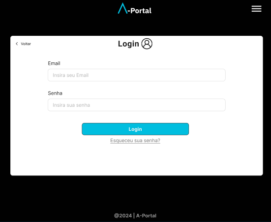
<br />
<br />
<sup>Fonte: Material produzido pelos autores (2024)</sup>
</div>

&nbsp;&nbsp;&nbsp;&nbsp;Esta tela permite aos administradores recuperar suas credenciais caso esqueçam a senha de acesso. O fluxo é otimizado, oferecendo campos claros para inserção do e-mail e envio das instruções de recuperação.

<div align="center">
<sub>Figura 19-Tela de esqueceu a senha</sub>
<br />
<br />
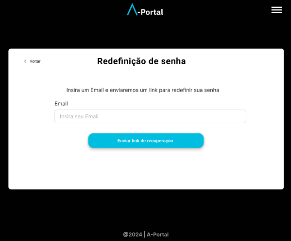
<br />
<br />
<sup>Fonte: Material produzido pelos autores (2024)</sup>
</div>

&nbsp;&nbsp;&nbsp;&nbsp;Nesta tela, os administradores têm uma visão consolidada de todos os usuários cadastrados no sistema. As informações são organizadas de forma clara, permitindo uma gestão eficiente e a busca por usuários específicos.

<div align="center">
<sub>Figura 20-Tela de listagem de usuário</sub>
<br />
<br />
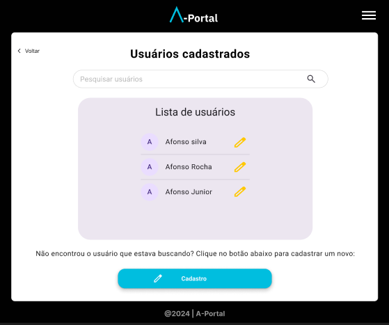
<br />
<br />
<sup>Fonte: Material produzido pelos autores (2024)</sup>
</div>

&nbsp;&nbsp;&nbsp;&nbsp;A tela de dados do usuário exibe informações detalhadas sobre cada pessoa cadastrada, como nome, dados pessoais e status de acesso. Este recurso é essencial para facilitar o gerenciamento individualizado e a verificação de registros.

<div align="center">
<sub>Figura 21-Tela de dados do usuário</sub>
<br />
<br />
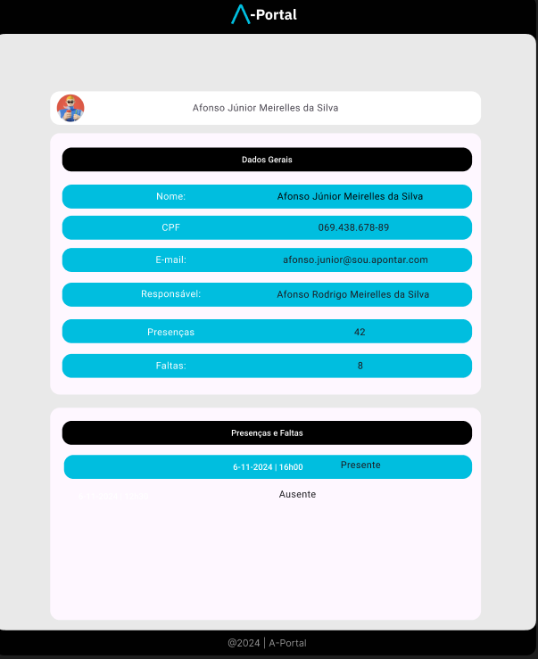
<br />
<br />
<sup>Fonte: Material produzido pelos autores (2024)</sup>
</div>


&nbsp;&nbsp;&nbsp;&nbsp;As telas foram desenvolvidas em conformidade com as melhores práticas de design e usabilidade, garantindo uma experiência agradável para os administradores do sistema e alinhando-se aos objetivos funcionais do A-Portal. A interface visual reforça a proposta de um sistema eficiente e seguro, trazendo inovação para o controle de acesso institucional. Além das telas apresentadas, o grupo também desenvolveu versões adaptadas para dispositivos móveis, garantindo uma experiência otimizada para diferentes tamanhos de tela. Para evitar sobrecarregar a documentação com muitas imagens, as telas para celular podem ser visualizadas diretamente através do seguinte <a href= "https://www.figma.com/design/j8Flbu7ALpbJdxvSZKkNEl/A-Portal?node-id=252-853&node-type=canvas&t=1KFNgacToC4l16ND-0">link</a>. 

---


### 3.4.5. Protótipo Final do Projeto	


### Diagrama de Sequência em Modelagem UML
&emsp;&emsp;Esta seção apresenta os casos de uso do sistema, com o auxílio de digramas de sequência e modelagem UML. Nesse sentido, mapeia-se todos os processos envolvidos no funcionamento do sistema, a fim de compreender-se mais profundamente as relações entre atores externos, objetos (instâncias de classes) e mensagens processadas, de forma temporal, na análise de um caso de uso específico.<br/>
&emsp;&emsp;Nesse sentido, foram apresentados um conjunto de casos de uso, as quais refletem situações de uso reais esperadas pelo sistema, a fim de avaliar o funcionamento adequado do sistema controle de acesso com sensor biométrico e os resultados esperados do sistema em casos de exceção.

<div align="center">
<sub>Figura X - Diagrama UML de Leitura de Digital</sub>
<br />
<br />

<br />
<br />
<sup>Fonte: Material produzido pelos autores (2024)</sup>
</div>

<div align="center">
<sub>Figura X - Diagrama UML de Cadastro de Digital</sub>
<br />
<br />

<br />
<br />
<sup>Fonte: Material produzido pelos autores (2024)</sup>
</div>

### Casos de teste
#### Caso de Teste 1: Acesso Liberado com Leitura de Digital Cadastrada

**Objetivo:**

&nbsp;&nbsp;&nbsp;&nbsp;O objetivo deste caso de teste é validar o fluxo de autenticação bem-sucedida de um usuário no sistema de controle de acesso.

**Configuração do Ambiente:**

&nbsp;&nbsp;&nbsp;&nbsp;Para a realização correta do caso de teste, o usuário deve ter a sua digital cadastrada no sistema de controle de acesso, o dispositivo IoT deve estar conectado à rede WiFi e ao Broker MQTT e a aplicação web deve estar disponível. 

&nbsp;&nbsp;&nbsp;&nbsp;**Fluxo de Eventos**:
Os eventos descritos no diagrama UML estão dispostos, de forma sumarizada, a seguir:  
  1. Usuário solicita acesso ao sistema, imprimindo a sua digital cadastrada no sensor biométrico; 
  2. Dispositivo IoT realiza busca e verificação da digital, dentre as biometrias armazenadas de forma local;
  3. Sistema identifica digital como válida;
  4. O acesso é concedido ao usuário, com a liberação da porta e/ou catraca;
  5. Dispositivo IoT publica as informações do acesso no tópico MQTT "a-p0rt4l/callback", com a identificação do usuário (```user_id```), da requisição (```request_id```), do dispositivo (```catraca_id```) e de data e horário (```timestamp```);
  6. Backend escuta o tópico MQTT "a-p0rt4l/callback" e envia as informações para o banco de dados, hospedado na nuvem, o qual registra as informações do acesso.
  
&nbsp;&nbsp;&nbsp;&nbsp;Esse fluxo representa os eventos principais do caso de teste.

#### Resultado Esperado
&nbsp;&nbsp;&nbsp;&nbsp;Para a validação do fluxo de autenticação bem-sucedido, os seguintes resultados são esperados:

&emsp;&emsp;1. A autenticação bem-sucedida, com a validação da biometria digital cadastrada;<br/>

&emsp;&emsp;2. As informações do acesso devem ser registradas integralmente no banco de dados;<br/>

&emsp;&emsp;3. O acesso ao usuário deve ser liberado na portaria da instituição.<br/>

&nbsp;&nbsp;&nbsp;&nbsp;De forma direta, a validação do caso de teste exige a obtenção desses resultados esperados; em caso negativo, cabe ao time de desenvolvimento aplicar as alterações necessárias no sistema para validação do fluxo.

#### Vídeo Demonstrativo do Caso de Teste 1

&emsp;&emsp;Desse modo, considerando o caso de teste descrito, existe o vídeo demonstrativo a seguir:

<a href="https://youtube.com/shorts/9mJt43MIoz0?feature=share">Vídeo Demonstrativo</a>

&emsp;&emsp;Por fim, a partir desse vídeo demonstrativo, espera-se demonstrar com clareza o caso de teste. 

---

### Caso de Teste 2: Acesso Liberado com Leitura de Digital Cadastrada (sem Conexão WiFi)

**Objetivo**

&nbsp;&nbsp;&nbsp;&nbsp;O objetivo deste caso de teste é validar o fluxo de autenticação bem-sucedida de um usuário no sistema de controle de acesso com o dispositivo desconectado da internet.

**Configuração do Ambiente**

&nbsp;&nbsp;&nbsp;&nbsp;Para a realização deste caso de teste, o usuário deve ter a sua digital cadastrada no sistema de controle de acesso, o dispositivo IoT deve estar desconectado da rede WiFi e, consequentemente, também do Broker MQTT e a aplicação web deve estar disponível. 

**Fluxo de Eventos**:

&nbsp;&nbsp;&nbsp;&nbsp;Os eventos descritos no diagrama UML estão dispostos, resumidamente, a seguir:  
  1. Usuário solicita acesso ao sistema, imprimindo a sua digital cadastrada no sensor biométrico; 
  2. Dispositivo IoT realiza busca e verificação da digital, dentre as biometrias armazenadas de forma local;
  3. Sistema identifica digital como válida;
  4. O acesso é concedido ao usuário, com a liberação da porta e/ou catraca;
  5. O sistema tenta publicar as informações do acesso ao broker MQTT, com a identificação do usuário (user_id), da requisição, do dispositivo (catraca_id) e de data e horário (timestamp);
  6. O broker MQTT envia as informações para o banco de dados, hospedado na nuvem, o qual registra as informações do acesso.
  
&nbsp;&nbsp;&nbsp;&nbsp;Esse fluxo representa os eventos principais do caso de teste.

#### Resultado Esperado
&nbsp;&nbsp;&nbsp;&nbsp;Para a validação do fluxo de autenticação bem-sucedido, os seguintes resultados são esperados:<br/>

&emsp;&emsp;1. A autenticação bem-sucedida, com a validação da biometria digital cadastrada;<br/>
&emsp;&emsp;2. As informações do acesso devem ser registradas integralmente no banco de dados;<br/>
&emsp;&emsp;3. O acesso ao usuário deve ser liberado na portaria da instituição.<br/>

&nbsp;&nbsp;&nbsp;&nbsp;De forma direta, a validação do caso de teste exige a obtenção desses resultados esperados; em caso negativo, cabe ao time de desenvolvimento aplicar as alterações necessárias no sistema para validação do fluxo.

#### Vídeo Demonstrativo do Caso de Teste 2

&emsp;&emsp;Desse modo, considerando o caso de teste descrito, existe o vídeo demonstrativo a seguir:

<a href="https://youtube.com/shorts/9mJt43MIoz0?feature=share">Vídeo Demonstrativo</a>

&emsp;&emsp;Por fim, a partir desse vídeo demonstrativo, espera-se demonstrar com clareza o caso de teste.

---

### Caso de Teste 3: Acesso Negado com Leitura de Digital Não Cadastrada

**Objetivo**

&nbsp;&nbsp;&nbsp;&nbsp;O objetivo deste caso de teste é validar o fluxo de autenticação malsucedida de um usuário no sistema de controle de acesso.

**Configuração do Ambiente**

&nbsp;&nbsp;&nbsp;&nbsp;Para a realização correta deste caso de teste, o usuário não deve ter a sua digital cadastrada no sistema de controle de acesso, o dispositivo IoT deve estar conectado à rede WiFi e ao Broker MQTT e a aplicação web deve estar disponível.

**Fluxo de Eventos**:

&nbsp;&nbsp;&nbsp;&nbsp;Os eventos descritos no diagrama UML são apresentados, de forma resumida, a seguir: 
  1. O usuário solicita acesso ao sistema, ao imprimir a digital não cadastrada no sensor biométrico;
  2. O dispositivo IoT realiza varredura e verificação da digital;
  3. Sistema identifica a digital como inválida;
  4. Acesso é negado ao usuário não cadastrado;
  5. O dispositivo IoT publica as informações da tentativa de acesso no tópico MQTT "a-p0rt4l/callback", com a identificação do dispositivo (```catraca_id```), da tentativa malsucedida (```message```) e de data e horário (```timestamp```);
  6. Backend escuta o tópico MQTT "a-p0rt4l/callback" e envia as informações da tentativa de acesso para o banco de dados que está hospedado na nuvem.

&nbsp;&nbsp;&nbsp;&nbsp;Desse modo, o fluxo de autenticação malsucedido é descrito por essas etapas.

#### Resultado Esperado:
&nbsp;&nbsp;&nbsp;&nbsp;Para realizar a validação do caso de teste descrito, os seguintes resultados são esperados:<br/>
&emsp;&emsp;1. Autenticação não autorizada, com invalidação da biometria não cadastrada impressa;<br/>
&emsp;&emsp;2. Registro da tentativa de acesso no banco de dados;<br/> 
&emsp;&emsp;3. A entrada do usuário na instituição deve ser negada.

&nbsp;&nbsp;&nbsp;&nbsp;Com a conformação dos resultados ao cenário esperado, confirma-se a validação deste caso de teste.

#### Vídeo Demonstrativo do Caso de Teste 3

&emsp;&emsp;Desse modo, considerando o caso de teste descrito, existe o vídeo demonstrativo a seguir:

<a href="https://youtube.com/shorts/qDG-3lP7VDs?feature=share">Vídeo Demonstrativo</a>

&emsp;&emsp;Por fim, a partir desse vídeo demonstrativo, espera-se demonstrar com clareza o caso de teste.

---


### Caso de Teste 4: Leitura Insucedida por Falha na Captura da Imagem no Dispositivo IoT

#### **Objetivo**
&nbsp;&nbsp;&nbsp;&nbsp;Avaliar o comportamento do sistema quando ocorre uma falha na captura da digital pelo sensor biométrico no dispositivo IoT, garantindo que o acesso não seja concedido e que o usuário seja informado sobre o problema.

#### **Configuração do Ambiente**
&emsp;&emsp;O dispositivo IoT está conectado à rede WiFi e ao broker MQTT, enquanto a aplicação web está disponível para o monitoramento de acessos. No entanto, embora o sensor biométrico esteja funcional, ele apresenta um defeito que impede a captura correta da digital.

#### **Fluxo de Eventos**
1. Usuário tenta acessar o sistema de controle de acesso, posicionando seu dedo no sensor biométrico;
2. O sensor biométrico tenta capturar a digital do usuário, mas ocorre um erro na captura (por exemplo, sensor defeituoso ou dedo mal posicionado);
3. O dispositivo IoT não consegue processar a digital devido à falha na captura da imagem;
4. O sistema impede o acesso do usuário, mantendo a porta e/ou catraca bloqueadas;
5. O sistema registra a tentativa de acesso falhada e notifica o administrador sobre a falha no sensor biométrico;
6. O usuário recebe uma mensagem informando sobre a falha na leitura biométrica e instruções para tentar novamente ou buscar assistência.

#### **Resultado Esperado**

&nbsp;&nbsp;&nbsp;&nbsp;Para a validação deste caso de teste, os seguintes resultados são esperados:

1. A falha na captura da digital é detectada pelo sistema;

2. O acesso do usuário é negado, mantendo a segurança da portaria da instituição;

3. A tentativa de acesso falhada é registrada no sistema para monitoramento e análise;

4. O administrador do sistema é notificado sobre a falha no sensor biométrico para que possa realizar manutenção ou substituição do dispositivo;

5. O usuário recebe uma mensagem clara sobre a falha na leitura biométrica, orientando sobre os próximos passos.

#### Vídeo Demonstrativo do Caso de Teste 4

&emsp;&emsp;Desse modo, considerando o caso de teste descrito, existe o vídeo demonstrativo a seguir:

<a href="https://youtube.com/shorts/qDG-3lP7VDs?feature=share">Vídeo Demonstrativo</a> ct_03

&emsp;&emsp;Por fim, a partir desse vídeo demonstrativo, espera-se demonstrar com clareza o caso de teste.

### Caso de Teste 5: Cadastro de Digital com Sucesso

**Objetivo**

&nbsp;&nbsp;&nbsp;&nbsp;O objetivo deste caso de teste é validar o fluxo completo e bem-sucedido de cadastro de uma nova digital no sistema de controle de acesso.

**Configuração do Ambiente**  
&emsp;&emsp;Para a realização correta do caso de teste, é necessário atender aos seguintes pré-requisitos: o dispositivo IoT deve estar conectado à rede WiFi e ao broker MQTT; o banco de dados precisa estar acessível e funcional na nuvem; a aplicação web deve estar disponível para o envio da requisição de cadastro; e o sensor biométrico deve estar conectado ao dispositivo IoT.

**Fluxo de Eventos**: 

&nbsp;&nbsp;&nbsp;&nbsp;Os eventos descritos no diagrama UML estão sumarizados a seguir:  
  1. O usuário inicia o processo de cadastro de digital por meio do frontend;  
  2. O frontend envia uma requisição HTTP ao backend contendo as informações do usuário (`user_id`) e o identificador da catraca (`catraca_id`);  
  3. O backend cria um registro no banco de dados com as informações da requisição (`request_id`, status inicial como `pending`);  
  4. O backend publica uma mensagem no broker MQTT no topico "a-p0rt4l/command" contendo as informações da requisição e o comando para iniciar o cadastro;  
  5. O broker MQTT transmite o comando ao dispositivo IoT (ESP32);  
  6. O dispositivo IoT inicia o processo de cadastro, coletando a digital do usuário por meio do sensor biométrico;  
  7. Após coletar e validar a digital, o dispositivo IoT publica uma mensagem no broker com o status do cadastro (`approved`);  
  8. O broker MQTT encaminha a resposta ao backend pelo topico "a-p0rt4l/callback";  
  9. O backend atualiza o registro da requisição no banco de dados com o status final (`approved`);  
  10. O frontend consulta o backend sobre o sucesso do cadastro;  
  11. O frontend exibe a mensagem de sucesso ao usuário.

#### Resultado Esperado:  
&nbsp;&nbsp;&nbsp;&nbsp;Para validar o fluxo de cadastro de digital, os seguintes resultados são esperados:  
&emsp;&emsp;1. O sistema deve registrar corretamente as informações da requisição no banco de dados com o status inicial como `pending` e atualizar para o status final como `approved`;<br/>
&emsp;&emsp;2. A digital coletada deve ser armazenada no dispositivo IoT, e o banco de dados deve registrar o evento de cadastro associado ao usuário e à catraca;<br/>
&emsp;&emsp;3. O sistema deve fornecer feedback claro ao usuário sobre o sucesso do cadastro.

#### Vídeo Demonstrativo do Caso de Teste 5

&emsp;&emsp;Desse modo, considerando o caso de teste descrito, existe o vídeo demonstrativo a seguir:

<a href="https://www.youtube.com/watch?v=MGJKehtAnTQ&ab_channel=ViniciusTestaPassos">Vídeo Demonstrativo</a>

&emsp;&emsp;Por fim, a partir desse vídeo demonstrativo, espera-se demonstrar com clareza o caso de teste.

---

### Caso de Teste 6: Cadastro Insucedido por Falha na Conexão com o Broker MQTT

**Objetivo**  
&nbsp;&nbsp;&nbsp;&nbsp;O objetivo deste caso de teste é validar o comportamento do sistema em caso de falha na comunicação com o Broker MQTT durante o processo de cadastro.

**Configuração do Ambiente**  
Para a realização correta deste caso de teste, os seguintes pré-requisitos devem ser atendidos: o dispositivo IoT deve estar conectado ao sistema, mas o broker MQTT deve estar indisponível; o banco de dados precisa estar acessível e funcional na nuvem; e a aplicação web deve estar disponível para o envio da requisição de cadastro.

**Fluxo de Eventos**:  
  1. O usuário inicia o processo de cadastro de digital por meio do frontend;  
  2. O frontend envia uma requisição HTTP ao backend contendo as informações do usuário (`user_id`) e o identificador da catraca (`catraca_id`);  
  3. O backend tenta publicar uma mensagem no topico "a-p0rt4l/command" do broker MQTT com as informações da requisição, mas ocorre uma falha na comunicação;  
  4. O backend notifica o frontend sobre a falha na comunicação;  
  5. O frontend exibe uma mensagem de erro ao usuário, indicando que o sistema está indisponível.  

#### Resultado Esperado  
&nbsp;&nbsp;&nbsp;&nbsp;Para validar este caso de teste, os seguintes resultados são esperados:  
&emsp;&emsp;1. O sistema deve identificar a falha na comunicação e interromper o processo de cadastro;<br/>
&emsp;&emsp;2. O backend não deve atualizar o banco de dados com o status final até que a comunicação seja restabelecida;<br/>
&emsp;&emsp;3. O usuário deve ser notificado claramente sobre a falha.

---

### Caso de Teste 7: Cadastro Insucedido por Falha na Captura da Imagem no Dispositivo IoT

**Objetivo**  
&nbsp;&nbsp;&nbsp;&nbsp;O objetivo deste caso de teste é validar o comportamento do sistema quando ocorre uma falha no cadastro da digital pelo dispositivo IoT (ESP32).

**Configuração do Ambiente**  
&nbsp;&nbsp;&nbsp;&nbsp;Para a realização correta deste caso de teste, os seguintes pré-requisitos devem ser atendidos: o dispositivo IoT deve estar conectado à rede WiFi e ao broker MQTT; o banco de dados precisa estar acessível e funcional na nuvem; a aplicação web deve estar disponível para o envio da requisição de cadastro; e o sensor biométrico deve estar conectado ao dispositivo IoT.

**Fluxo de Eventos**:  
  1. O backend publica uma mensagem no broker MQTT pelo topico "a-p0rt4l/command" com as informações da requisição;  
  2. O broker MQTT transmite o comando ao ESP32;  
  3. O sensor biométrico tenta realizar o cadastro da digital, mas ocorre uma falha no dispostivo IoT (exemplo: digital não capturada corretamente ou erro no sensor);  
  4. O ESP32 publica uma mensagem no broker com o status `failed`;  
  5. O broker MQTT encaminha a mensagem pelo topico "a-p0rt4l/callback" ao backend;  
  6. O backend atualiza o registro no banco de dados com o status final como `failed`;  
  7. O backend notifica o frontend sobre a falha no cadastro;  
  8. O frontend exibe uma mensagem de erro ao usuário.  

#### Resultado Esperado  
&nbsp;&nbsp;&nbsp;&nbsp;Para validar este caso de teste, os seguintes resultados são esperados:  
&emsp;&emsp;1. O sistema deve identificar e registrar corretamente a falha no banco de dados, com o status `failed`;<br/>
&emsp;&emsp;2. O backend deve informar o frontend sobre a falha no processo;<br/>
&emsp;&emsp;3. O usuário deve ser informado de maneira clara sobre a falha, incluindo a recomendação para tentar novamente.

---

### Caso de Teste 8: Cadastro Insucedido por Falha na Conexão WiFi

#### **Objetivo**
&nbsp;&nbsp;&nbsp;&nbsp;Validar o comportamento do sistema quando um usuário tenta realizar o cadastro biométrico enquanto o dispositivo IoT está sem conexão à rede WiFi, garantindo que o cadastro não seja realizado e que o usuário seja adequadamente notificado.

#### **Configuração do Ambiente**
&nbsp;&nbsp;&nbsp;&nbsp;O dispositivo IoT está desconectado da rede WiFi, enquanto o broker MQTT está disponível e acessível, e a aplicação web está disponível para o gerenciamento de cadastros.

#### **Fluxo de Eventos**
1. Usuário inicia o processo de cadastro no sistema de controle de acesso através da aplicação web;
2. Usuário posiciona seu dedo no sensor biométrico para captura da digital;
3. Dispositivo IoT tenta enviar os dados da digital capturada para o sistema via rede WiFi;
4. A conexão WiFi está indisponível, resultando em falha no envio dos dados;
5. O sistema localmente armazena temporariamente a tentativa de cadastro;
6. O sistema notifica o usuário sobre a falha na conexão WiFi e informa que o cadastro não foi concluído.

#### **Resultado Esperado**
&nbsp;&nbsp;&nbsp;&nbsp;Para a validação deste caso de teste, os seguintes resultados são esperados:

&emsp;&emsp;1. O sistema identifica a falha na conexão WiFi durante o processo de cadastro.

&emsp;&emsp;2. O cadastro não é finalizado, e a digital do usuário não é registrada no sistema.

&emsp;&emsp;3. O usuário recebe uma mensagem clara indicando a impossibilidade de concluir o cadastro devido à falta de conexão.

&emsp;&emsp;4. O sistema pode tentar reprocessar o cadastro automaticamente quando a conexão WiFi for restabelecida ou aguardar intervenção manual.

---

### Caso de Teste 9: Falha na Atualização do Banco de Dados

**Objetivo**  
&nbsp;&nbsp;&nbsp;&nbsp;O objetivo deste caso de teste é validar o comportamento do sistema em caso de falha ao atualizar o registro da requisição no banco de dados após o processo de cadastro.

**Configuração do Ambiente**  
&nbsp;&nbsp;&nbsp;&nbsp;Para a realização correta deste caso de teste, os seguintes pré-requisitos devem ser atendidos: o dispositivo IoT deve estar conectado à rede WiFi e ao broker MQTT; o banco de dados deve estar desconectado (com erro de conexão) ou indisponível durante o teste; e a aplicação web deve estar disponível para o envio da requisição de cadastro.

**Fluxo de Eventos**:  
  1. O ESP32 completa o processo de cadastro e publica o status `approved` no broker;  
  2. O broker MQTT encaminha a mensagem pelo topico "a-p0rt4l/callback" ao backend;  
  3. O backend tenta atualizar o registro da requisição no banco de dados, mas ocorre uma falha (exemplo: erro de conexão com o banco de dados);  
  4. O backend notifica o frontend sobre a falha;  
  5. O frontend exibe uma mensagem de erro ao usuário, indicando que o sistema está indisponível.  

#### Resultado Esperado  
&nbsp;&nbsp;&nbsp;&nbsp;Para validar este caso de teste, os seguintes resultados são esperados:  
&emsp;&emsp;1. O sistema deve registrar o erro de banco de dados no log para análise posterior;<br/>
&emsp;&emsp;2. O status final da requisição não deve ser atualizado no banco de dados;<br/>
&emsp;&emsp;3. O usuário deve ser informado que o cadastro não foi concluído devido a um erro interno.

---

&emsp;&emsp;Os casos de teste desenvolvidos têm o objetivo de contemplar as principais situações de uso, de sucesso e de insucesso, incluindo casos de falha do sistema.<br/>
&emsp;&emsp;Desse modo, espera-se identificar vulnerabilidades, inconsistências e oportunidades de melhoria do sistema, além de mapear e tratar casos de exceção e erro, nos principais fluxos de uso do sistema. Nesse sentido, os fluxos de uso da aplicação incluem rotinas como autenticação a partir da leitura de digitais, o cadastro de novas biometrias no dispositivo, a persistência das informações na base de dados e a conexão do dispositivo IoT com a plataforma web - abrangendo objetos de classes do sistema, componenentes utilizados e atores externos (como serviços de hospedagem, de banco de dados e de comunicação com broker MQTT).<br/>
&emsp;&emsp;Portanto, os casos de teste elaborados auxiliam na validação das garantias de confiabilidade, de resistência a falhas e de adequado funcionamento do dispositivo, buscando agregar-se o valor esperado ao parceiro com a solução desenvolvida.

### Protótipo Físico do Projeto
&emsp;&emsp;Nesta seção, foram incluídas figuras do protótipo físico e uma tabela de componentes do dispositivo, a fim de contextualizar o ambiente de teste descrito e aprofundar a compreensão acerca dos cenários simulados. Dessa forma, espera-se esclarecer o desenvolvimento sobre a estrutura e o funcionamento do sistema, assim como, entender as capacidades e as limitações do mínimo produto viável contruído, a fim de orientar a implementação do protótipo atual e a continuidade do desenvolvimento no futuro. 

&emsp;&emsp;Dessa forma, a seguir apresenta-se uma tabela de componentes presentes na arquitetura

&emsp;&emsp;Nesse sentido, a fim de demonstrar a versão final do protótipo físico com a case construída, indica-se o seguinte vídeo:

<a href="https://youtube.com/shorts/rd58tc8TJSY?feature=share">Vídeo Demonstrativo da versão final do protótipo físico</a>

&emsp;&emsp;De forma complementar, apresenta-se também a seguinte figura do protótipo:

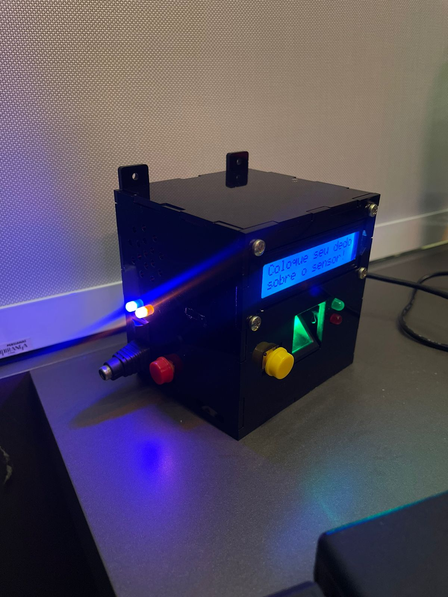

&emsp;&emsp;Por fim, a fim de visualizar dentro da caixa do protótipo, segue-se a última figura:

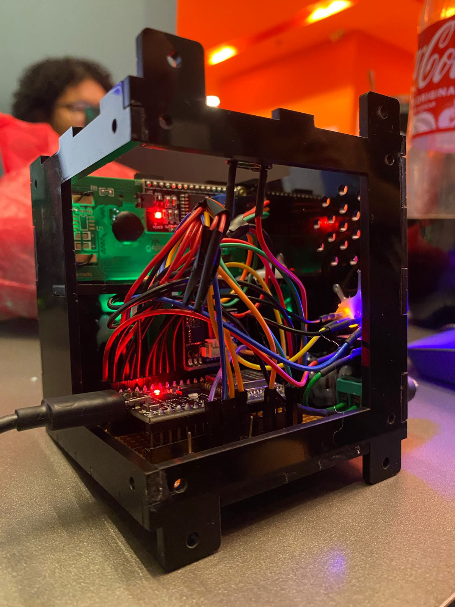

&emsp;&emsp;Portanto, com o vídeo, é possível demonstrar o protótipo final com a case concluída. 

&emsp;&emsp;Desse modo, com as figuras indicadas do protótipo físico no seu estado atual, é possível mensurar o grau de desenvolvimento do projeto, assim como, as funcionalidades disponíveis e limitações do sistema. Portanto, espera-se demonstrar com transparência os avanços obtidos, sobretudo, nos principais fluxos de uso do sistema, para autenticação, cadastro de biometrias, plataforma web centralizada para visualização dos dados e modularidade para manutenção do prótipo. No entanto, espera-se também esclarecer as restrições do protótipo como dependência da conexão WiFi estável para envio dos dados à nuvem e formas complementares de autenticação, exceto biometria digital, para aumentar a acessibilidade do sistema. Portanto, espera-se gerar valor ao parceiro, com o protótipo entregue, de forma direta e clara.

## <a name="c4"></a>4. Conclusões e Recomendações


### Conclusões

&nbsp;&nbsp;&nbsp;&nbsp;O projeto de sistema de controle de acesso biométrico desenvolvido para o Instituto Apontar integrou diferentes tecnologias, como IoT, sensores de leitura biométrica e comunicação via protocolos MQTT e HTTP, a fim de agregar valor real com soluções específicas ao contexto do pareiro. Durante o desenvolvimento e testes, foram validadas as principais funcionalidades, incluindo:

1. **Autenticação biométrica** com leitura e validação de digitais armazenadas localmente, garantindo acesso controlado e seguro.
2. **Interface intuitiva** com **feedback visual (LCD e LEDs)** e **feedback sonoro (buzzer)**, proporcionando uma experiência de uso clara e eficiente.
3. **Cadastro de digitais** remoto através da aplicação web, mediado pelo broker MQTT, o que torna mais eficiente a gestão centralizada dos usuários, das biometrias e dos registros de presença.
4. **Gerenciamento via Dashboard Web**, o qual permite o acompanhamento dos acessos e o cadastro de novas biometrias de maneira remota.
5. **Resiliência em situações adversas**, com capacidade de operar offline para autenticação local, garantindo funcionamento contínuo em caso de falhas na conectividade WiFi.

&nbsp;&nbsp;&nbsp;&nbsp;Os **testes de usabilidade** destacaram a **intuitividade do sistema**, com taxa de sucesso de 100% na execução de tarefas básicas de liberação e bloqueio de acesso, enquanto identificaram melhorias necessárias na **verificação de conectividade WiFi** e no **feedback visual**.

### Recomendações

#### 1. **Melhoria do Feedback Visual no LCD**
- Adicionar informações sobre o status da conexão WiFi diretamente no display LCD para evitar confusão entre os LEDs e o LCD.
- Utilizar ícones e cores padronizados para facilitar a identificação rápida do status do sistema.

#### 2. **Documentação Clara para Usuários Finais**
- Desenvolver um manual do usuário detalhado, com instruções claras para:
  - Utilização do sistema.
  - Solução de problemas comuns.
  - Interpretação dos LEDs e mensagens no LCD.

#### 3. **Melhoria da Sinalização dos LEDs**
- Incluir legendas ou etiquetas próximas aos LEDs indicando suas funções específicas (ex: energia, conectividade WiFi, status de leitura biométrica).
- Diferenciar os padrões de piscar dos LEDs para facilitar a distinção dos estados operacionais.


#### 4. **Novos Testes com Usuários Diversificados**
- Realizar uma nova rodada de testes com usuários de diferentes níveis de familiaridade com tecnologia para identificar possíveis desafios adicionais e melhorar a acessibilidade.

#### 5. **Segurança de Dados**
- Implementar criptografia de dados biométricos para proteger as digitais armazenadas contra acessos não autorizados.


#### 6. **Análise de Impacto Ambiental**
- Melhorar a eficiência energética do dispositivo, implementando modos de economia de energia para os componentes IoT.
- Considerar o uso de materiais sustentáveis nos componentes eletrônicos e estruturas físicas.

#### 7. **Feedback Contínuo dos Usuários**
- Incluir um sistema de feedback integrado no dispositivo e no dashboard web para capturar sugestões e problemas dos usuários em tempo real.
- Realizar pesquisas de satisfação periódicas para identificar áreas de melhoria.


&nbsp;&nbsp;&nbsp;&nbsp;Com essas melhorias, a solução estará ainda mais intuitiva e preparada para atender às necessidades de controle de acesso do Instituto Apontar, promovendo uma maior eficiência operacional.

&nbsp;&nbsp;&nbsp;&nbsp;O desenvolvimento deste sistema foi uma jornada repleta de desafios técnicos, aprendizado contínuo e crescimento pessoal e profissional. Durante todas as etapas do projeto — desde a concepção inicial, passando pelo desenvolvimento, testes e refinamento — adquirimos um entendimento acerca de tecnologias IoT, comunicação via MQTT, interfaces de usuário  e a importância de testes de usabilidade na criação da solução.

&nbsp;&nbsp;&nbsp;&nbsp;Dessa forma, integramos diferentes componentes de hardware e software, como sensores biométricos, microcontroladores ESP32, displays LCD e dashboards web. A implementação de feedback visual e sonoro aprimorou a usabilidade do sistema, enquanto a resiliência do dispositivo frente a falhas de conectividade garantiu uma solução confiável e adaptável às necessidades reais da instituição.

&nbsp;&nbsp;&nbsp;&nbsp;Além do ganho técnico, trabalhamos com conceitos fundamentais de segurança de dados, eficiência energética e impacto ambiental da tecnologia, preparando uma solução não apenas funcional, mas também alinhada com princípios de sustentabilidade e boas práticas de desenvolvimento de sistemas.


&nbsp;&nbsp;&nbsp;&nbsp;Este projeto nos permitiu compreender que, no desenvolvimento de soluções tecnológicas, a interação com os usuários finais e a atenção aos detalhes são tão importantes quanto as funcionalidades técnicas. A usabilidade e a experiência do usuário determinam o sucesso de um sistema, independentemente de quão avançada seja a tecnologia envolvida. Os testes realizados com usuários reais evidenciaram a importância de ouvir o feedback e fazer ajustes iterativos para atender às expectativas e necessidades dos usuários.


&nbsp;&nbsp;&nbsp;&nbsp;Estamos confiantes de que este projeto não apenas atende às necessidades do Instituto Apontar, mas também nos preparou para enfrentar desafios futuros, com um olhar crítico, criativo e focado em soluções tecnológicas de valor e impacto positivo.


## <a name="c5"></a>5. Referências


(1)ROCK CONTENT. As 5 forças de Porter: o que são, como aplicá-las e exemplos. Rock Content, 2023. Disponível em: https://rockcontent.com/br/blog/5-forcas-de-porter/. Acesso em: 23 out. 2024.

(2)FAPESP. Número de pessoas superdotadas é subnotificado no Brasil. Revista Pesquisa FAPESP, 2023. Disponível em: https://revistapesquisa.fapesp.br/numero-de-pessoas-superdotadas-e-subnotificado-no-brasil/. Acesso em: 23 out. 2024.


(3)AGÊNCIA BRASIL. OMS aponta que 5% da população é superdotada e a maioria é invisível. Rádio Agência Nacional, 2022. Disponível em: https://agenciabrasil.ebc.com.br/radioagencia-nacional/educacao/audio/2022-06/oms-aponta-que-5-da-populacao-e-superdotada-e-maioria-e-invisivel. Acesso em: 23 out. 2024.

(4)GUSHIKEN, Amanda. Value Proposition Canvas: o que é e como funciona essa metodologia? G4 Educação, 2023. Disponível em: https://g4educacao.com/portal/value-proposition-canvas. Acesso em: 16 out. 2024.


(5) LUPADOBEM. "Altas habilidades: instituição oferece apoio a alunos de baixa renda." Disponível em: [Lupadobem](https://www.lupadobem.com). Acesso em: 17 out. 2024.
(6) DIÁRIO DO RIO. "Prefeitura do Rio e Stone investem em estudantes da rede pública com altas habilidades." Disponível em: [Diário do Rio](https://diariodorio.com). Acesso em: 17 out. 2024.

(6)ISO - INTERNATIONAL ORGANIZATION FOR STANDARDIZATION. ISO/IEC 10746. ISO, 2009. Disponível em: https://committee.iso.org/sites/jtc1sc7/home/projects/flagship-standards/isoiec-10746.html. Acesso em: 12 nov. 2024.

(7)MOODLE USP. Reference Model of Open Distributed Processing - (RM-ODP). Moodle USP, 2023. Disponível em: https://edisciplinas.usp.br/pluginfile.php/7621933/mod_resource/content/1/8%20RM-ODP%2022-03-2023.pdf#:~:text=um%20sistema%20de%20informa%C3%A7%C3%A3o%20corporativo,Model%20of%20Open%20Distributed%20Processing).&text=corresponde%20ao%20processamento%20distribu%C3%ADdo%20aberto,modelo%20que%20permite%20intera%C3%A7%C3%A3o%20comum. Acesso em: 12 nov. 2024.

(8)Microsserviços e RM-ODP. Autoestudo RM-ODP Hayashi.mp4. Hayashi, 2024. Disponível em: https://drive.google.com/file/d/11aZivxH_0z-Xs-asljj7SV_4xkfmx90K/view. Acesso em: 12 nov. 2024.
